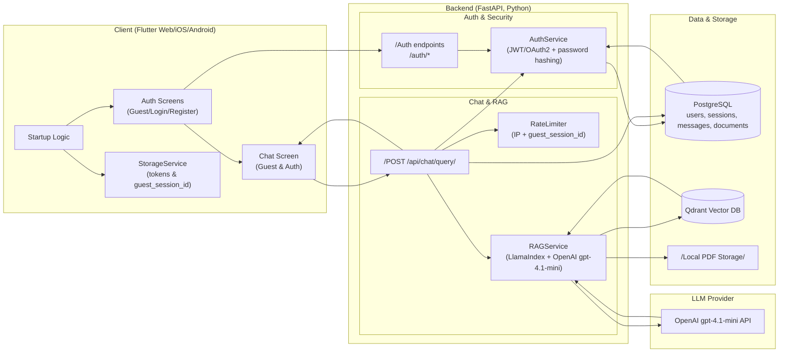
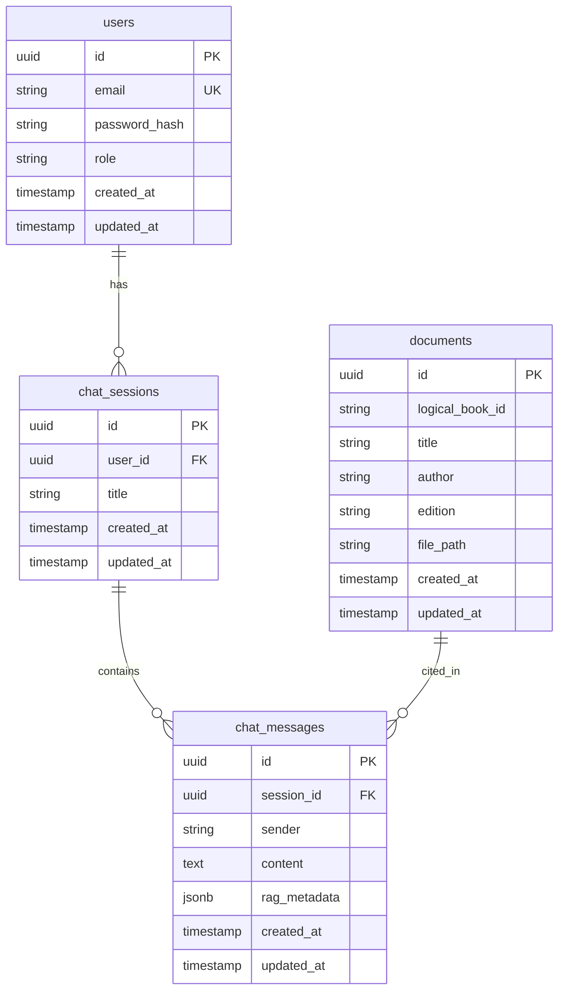
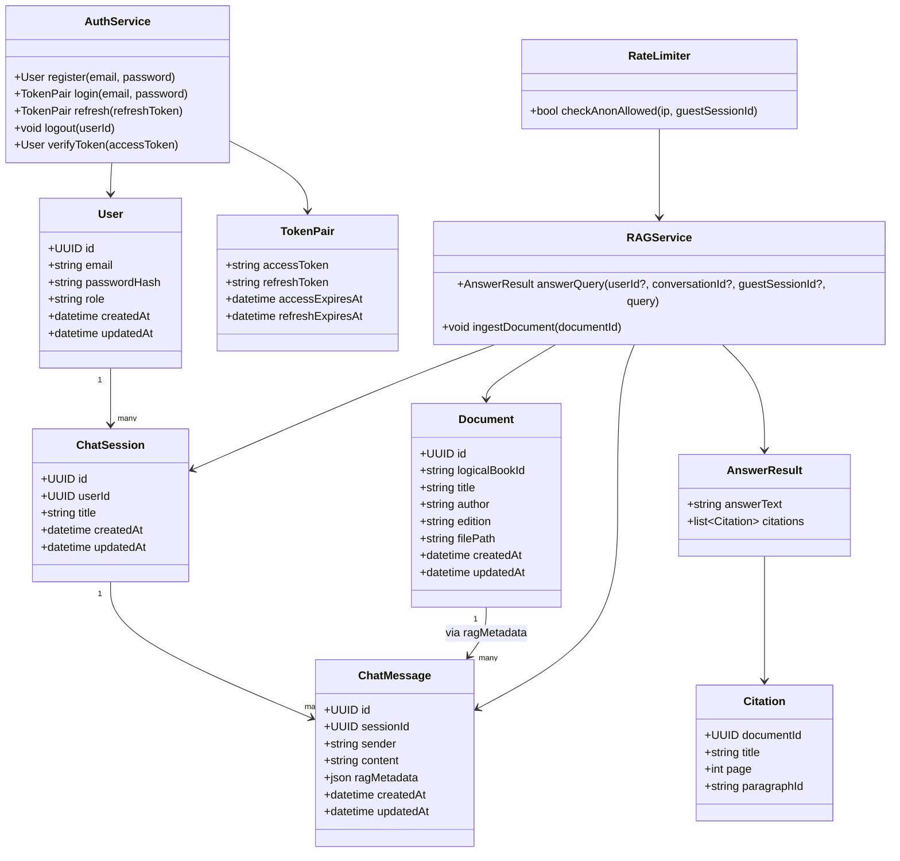
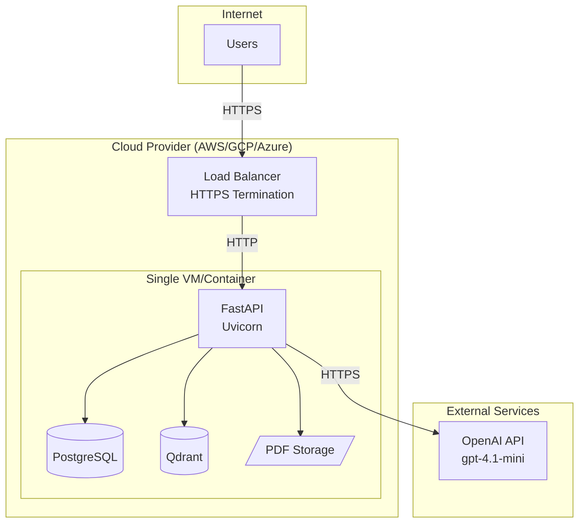
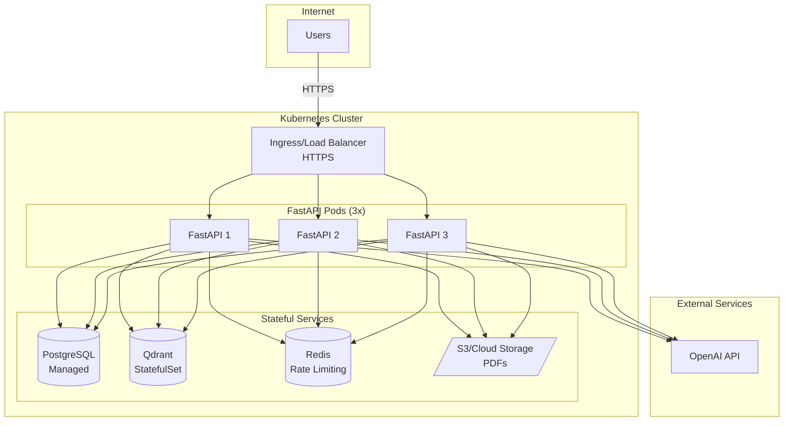

# End-to-End Architecture & Implementation Plan

**Project**: Spiritual Q&A Platform  
**Organization**: Non-Profit Spiritual Organization  
**Last Updated**: February 15, 2026

---

## Table of Contents

1. [Product Overview](#1-product-overview)
2. [Global Architecture](#2-global-architecture)
3. [Data Model & Schemas](#3-data-model--schemas)
4. [Security Model](#4-security-model)
5. [Technology Stack](#5-technology-stack)
6. [Story Specifications](#6-story-specifications)
7. [API Contracts](#7-api-contracts)
8. [Deployment Architecture](#8-deployment-architecture)
9. [Implementation Decisions](#9-implementation-decisions)

---

## 1. Product Overview

### 1.1 Mission
Build a spiritual/philosophical Q&A application that provides answers based strictly on the organization's proprietary texts, ensuring authentic philosophical guidance without internet noise.

### 1.2 Core Features
- **RAG-based Q&A**: Natural language questions answered using proprietary PDF publications
- **Dual Access Modes**:
  - **Guest Mode**: Anonymous, rate-limited access without account
  - **Authenticated Mode**: Full access with persistent conversation history
- **Cross-Platform**: Web, iOS, and Android from single Flutter codebase

### 1.3 MVP Stories
1. **Story 1 - Spiritual Guide Query (Core RAG)**: RAG pipeline + `/api/chat/query` endpoint
2. **Story 2 - User Registration & Onboarding (Auth)**: JWT-based authentication system
3. **Story 3 - Seamless Mobile/Web Access (Interface)**: Flutter UI implementing guest & auth flows

---

## 2. Global Architecture

### 2.1 High-Level System Diagram



### 2.2 Component Deployment

| Component | Deployment Location | Technology |
|-----------|-------------------|------------|
| **Flutter Client** | Browser (Web), iOS Device, Android Device | Flutter/Dart |
| **FastAPI Backend** | Cloud VM/Container (Docker/K8s) | Python 3.11+, FastAPI, Uvicorn |
| **PostgreSQL** | Managed DB or Self-Hosted | PostgreSQL 14+ |
| **Qdrant** | Containerized on Backend Host | Qdrant (Docker) |
| **PDF Storage** | Mounted Filesystem/Volume | Local FS |
| **OpenAI API** | External SaaS | gpt-4.1-mini |
| **Reverse Proxy** | Cloud LB / Nginx | HTTPS Termination |

### 2.3 Information Flows

#### Authentication Flow
1. **Registration/Login**: Flutter → `/auth/register` or `/auth/login`
2. **Backend**: Validates credentials, hashes password, issues JWT tokens
3. **Token Storage**:
   - **Web**: HttpOnly cookies (access + refresh) + CSRF token in header
   - **Mobile**: flutter_secure_storage

#### Guest Chat Flow
1. Flutter generates/stores `guest_session_id` (UUID v4)
2. Sends query to `/api/chat/query` with `guest_session_id`, no JWT
3. Backend checks rate limits (IP + guest_session_id)
4. RAGService processes query and returns answer
5. **No persistence** of guest conversations

#### Authenticated Chat Flow
1. Flutter sends query to `/api/chat/query` with JWT, no `guest_session_id`
2. Backend validates JWT
3. RAGService processes query
4. Backend persists session/messages to PostgreSQL
5. Returns answer with `conversation_id`

---

## 3. Data Model & Schemas

### 3.1 PostgreSQL Tables

#### `users`
```sql
CREATE TABLE users (
    id UUID PRIMARY KEY DEFAULT gen_random_uuid(),
    email VARCHAR(255) UNIQUE NOT NULL,
    password_hash VARCHAR(255) NOT NULL,
    role VARCHAR(50) NOT NULL DEFAULT 'user',
    created_at TIMESTAMPTZ DEFAULT CURRENT_TIMESTAMP,
    updated_at TIMESTAMPTZ DEFAULT CURRENT_TIMESTAMP
);

CREATE INDEX idx_users_email ON users(email);
```

#### `chat_sessions` (Authenticated Users Only)
```sql
CREATE TABLE chat_sessions (
    id UUID PRIMARY KEY DEFAULT gen_random_uuid(),
    user_id UUID NOT NULL REFERENCES users(id) ON DELETE CASCADE,
    title VARCHAR(500),
    created_at TIMESTAMPTZ DEFAULT CURRENT_TIMESTAMP,
    updated_at TIMESTAMPTZ DEFAULT CURRENT_TIMESTAMP
);

CREATE INDEX idx_chat_sessions_user_id ON chat_sessions(user_id);
CREATE INDEX idx_chat_sessions_created_at ON chat_sessions(created_at DESC);
```

#### `chat_messages`
```sql
CREATE TABLE chat_messages (
    id UUID PRIMARY KEY DEFAULT gen_random_uuid(),
    session_id UUID NOT NULL REFERENCES chat_sessions(id) ON DELETE CASCADE,
    sender VARCHAR(20) NOT NULL CHECK (sender IN ('user', 'assistant')),
    content TEXT NOT NULL,
    rag_metadata JSONB,
    created_at TIMESTAMPTZ DEFAULT CURRENT_TIMESTAMP,
    updated_at TIMESTAMPTZ DEFAULT CURRENT_TIMESTAMP
);

CREATE INDEX idx_chat_messages_session_id ON chat_messages(session_id);
CREATE INDEX idx_chat_messages_created_at ON chat_messages(created_at);
```

**`rag_metadata` JSONB Structure**:
```json
{
  "citations": [
    {
      "document_id": "uuid",
      "title": "Book Title",
      "page": 42,
      "paragraph_id": "p3"
    }
  ],
  "retrieval_time_ms": 123,
  "llm_time_ms": 456
}
```

#### `documents`
```sql
CREATE TABLE documents (
    id UUID PRIMARY KEY DEFAULT gen_random_uuid(),
    logical_book_id VARCHAR(100) NOT NULL,
    title VARCHAR(500) NOT NULL,
    author VARCHAR(255),
    edition VARCHAR(100),
    file_path VARCHAR(1000) NOT NULL,
    created_at TIMESTAMPTZ DEFAULT CURRENT_TIMESTAMP,
    updated_at TIMESTAMPTZ DEFAULT CURRENT_TIMESTAMP
);

CREATE INDEX idx_documents_logical_book_id ON documents(logical_book_id);
```

### 3.2 Qdrant Collection

**Collection Name**: `spiritual_docs`

**Vector Configuration**:
- Dimension: 1536 (OpenAI text-embedding-ada-002) or as per embedding model
- Distance: Cosine

**Payload Schema**:
```json
{
  "document_id": "uuid",
  "logical_book_id": "string",
  "page": 42,
  "paragraph_id": "p3",
  "chunk_id": "uuid",
  "text": "chunk content...",
  "title": "Book Title"
}
```

### 3.3 Entity Relationship Diagram



### 3.4 Class Diagram (Backend)



---

## 4. Security Model

### 4.1 Authentication & Authorization

#### JWT Token Strategy
- **Access Token**: 
  - TTL: 15 minutes
  - Contains: user_id, role, exp
  - Signing: HS256 or RS256
- **Refresh Token**:
  - TTL: 7 days
  - Rotation: Issue new refresh token on each refresh
  - Storage: See platform-specific below

#### Token Storage by Platform

| Platform | Access Token | Refresh Token | CSRF Token |
|----------|-------------|---------------|------------|
| **Web** | HttpOnly Cookie | HttpOnly Cookie | Non-HttpOnly Cookie/Header |
| **iOS** | flutter_secure_storage (Keychain) | flutter_secure_storage | N/A |
| **Android** | flutter_secure_storage (KeyStore) | flutter_secure_storage | N/A |

#### Authorization Rules
- All `/admin/*` endpoints: `role == 'admin'`
- `/api/chat/query` with `conversation_id`: Must own the conversation
- Guest mode: No authorization, rate-limited only

### 4.2 Rate Limiting

#### Guest Rate Limits
- **Key**: `IP address + guest_session_id`
- **Limit**: 10 queries per day (configurable)
- **Backing Store**:
  - **MVP**: In-process dictionary (single instance)
  - **Production**: Redis with TTL

#### Authentication Rate Limits
- **Login**: 5 attempts per 15 minutes per IP
- **Registration**: 3 attempts per hour per IP

### 4.3 Input Validation

| Input | Validation |
|-------|-----------|
| **Email** | RFC 5322 format, max 255 chars |
| **Password** | Min 8 chars, must include uppercase, lowercase, digit, special char |
| **Query** | Min 1 char, max 2000 chars, sanitize for XSS |
| **conversation_id** | Valid UUID v4 format |
| **guest_session_id** | Valid UUID v4 format |

### 4.4 Global Error Response Format

All API errors return:
```json
{
  "error_code": "ENUM_VALUE",
  "message": "Human-readable message",
  "details": null
}
```

**Standard Error Codes**:
- `UNAUTHORIZED`: Missing or invalid JWT
- `INVALID_CREDENTIALS`: Wrong email/password
- `RATE_LIMIT_EXCEEDED`: Guest query limit reached
- `VALIDATION_ERROR`: Invalid input
- `INTERNAL_ERROR`: Server error
- `EMAIL_ALREADY_EXISTS`: Registration conflict
- `INVALID_REFRESH_TOKEN`: Expired/invalid refresh token
- `RESOURCE_NOT_FOUND`: Conversation/document not found
- `FORBIDDEN`: Insufficient permissions

### 4.5 HTTPS & Transport Security
- **All traffic**: HTTPS only (TLS 1.2+)
- **Certificate**: Valid SSL/TLS certificate
- **HSTS**: Enabled with max-age=31536000
- **Web**: CORS restricted to allowed origins

---

## 5. Technology Stack

### 5.1 Backend

| Layer | Technology | Purpose |
|-------|-----------|---------|
| **Framework** | FastAPI + Uvicorn | REST API server |
| **Language** | Python 3.11+ | Backend logic |
| **Auth** | python-jose, passlib | JWT, password hashing (Argon2) |
| **RAG** | LlamaIndex | Orchestration framework |
| **Vector DB** | Qdrant | Semantic search |
| **LLM** | OpenAI gpt-4.1-mini | Answer generation |
| **RDBMS** | PostgreSQL 14+ | Structured data |
| **Rate Limiting** | In-memory (MVP) → Redis | Guest rate limits |
| **HTTP Client** | httpx | OpenAI API calls |

### 5.2 Frontend

| Layer | Technology | Purpose |
|-------|-----------|---------|
| **Framework** | Flutter (Dart) | Cross-platform UI |
| **Platforms** | Web, iOS, Android | Target platforms |
| **State Mgmt** | Riverpod or Bloc | State management |
| **HTTP Client** | dio | API communication |
| **Storage (Mobile)** | flutter_secure_storage | Token storage (Keychain/KeyStore) |
| **Storage (Web)** | HttpOnly Cookies | Token storage |
| **Local Prefs** | shared_preferences | Non-sensitive data |

### 5.3 LLM Configuration

**Model**: `gpt-4.1-mini`

**Limits**:
- Max response tokens: 1024
- Context window: ~8k tokens (verify with OpenAI docs)
- Temperature: 0.7 (configurable)
- Top-p: 0.9

**Prompt Template**:
```
You are a spiritual guide assistant. Answer the user's question based ONLY on the provided context from our organization's texts. If the context doesn't contain enough information, say so.

Context:
{retrieved_chunks}

Question: {user_query}

Answer:
```

---

## 6. Story Specifications

### 6.1 Story 1 - Spiritual Guide Query (Core RAG)

**Objective**: Implement RAG pipeline that answers questions using proprietary texts.

**Key Components**:
- `RAGService`: LlamaIndex + Qdrant + OpenAI integration
- `RateLimiter`: IP + guest_session_id tracking
- `/api/chat/query` endpoint

**Behavior**:
- **Guest**: Rate-limited, no history persistence
- **Authenticated**: Full access, history saved to PostgreSQL

**API**: See [Section 7.2](#72-post-apichatquery)

**Risks**:
- RAG retrieval quality/doctrinal alignment
- OpenAI rate limits or outages
- Cost spikes from long queries

---

### 6.2 Story 2 - User Registration & Onboarding (Auth)

**Objective**: Secure JWT-based authentication system.

**Key Components**:
- `AuthService`: Registration, login, token management
- Password hashing with Argon2
- JWT access + refresh tokens

**Endpoints**:
- `POST /auth/register`
- `POST /auth/login`
- `POST /auth/refresh`
- `POST /auth/logout`

**Token Handling**:
- **Web**: HttpOnly cookies + CSRF protection
- **Mobile**: flutter_secure_storage

**Risks**:
- Token rotation/refresh logic errors
- CSRF/CORS misconfiguration
- Weak password enforcement

---

### 6.3 Story 3 - Seamless Mobile/Web Access (Interface)

**Objective**: Flutter UI supporting guest and authenticated modes across web/iOS/Android.

**Key Components**:
- `StartupScreen`: Token validation, mode selection
- `AuthScreen`: Login/Register UI
- `ChatScreen`: Q&A interface
- `StorageService`: Platform-specific token/guest_session_id storage

**Behavior**:
- **Guest Mode**: Shows banner, generates guest_session_id, limited queries
- **Authenticated Mode**: Full access, conversation history

**State Management**: Riverpod or Bloc

**Risks**:
- UI/UX inconsistencies across platforms
- Token refresh during app lifecycle events
- Guest-to-auth transition handling

---

## 7. API Contracts

### 7.1 Authentication APIs

#### POST `/auth/register`

**Request**:
```json
{
  "email": "user@example.com",
  "password": "SecurePass123!"
}
```

**Success Response** (200):
```json
{
  "user_id": "550e8400-e29b-41d4-a716-446655440000",
  "access_token": "eyJhbGc...",
  "refresh_token": "eyJhbGc...",
  "expires_in": 900
}
```
- **Web**: Tokens set as HttpOnly cookies; minimal JSON returned
- **Mobile**: Tokens in response body

**Error Response** (400):
```json
{
  "error_code": "EMAIL_ALREADY_EXISTS",
  "message": "An account with this email already exists.",
  "details": null
}
```

---

#### POST `/auth/login`

**Request**:
```json
{
  "email": "user@example.com",
  "password": "SecurePass123!"
}
```

**Success Response** (200): Same as `/auth/register`

**Error Response** (401):
```json
{
  "error_code": "INVALID_CREDENTIALS",
  "message": "Email or password is incorrect.",
  "details": null
}
```

---

#### POST `/auth/refresh`

**Request** (Mobile):
```json
{
  "refresh_token": "eyJhbGc..."
}
```

**Request** (Web): Refresh token read from HttpOnly cookie

**Success Response** (200):
```json
{
  "access_token": "eyJhbGc...",
  "refresh_token": "eyJhbGc...",
  "expires_in": 900
}
```

**Error Response** (401):
```json
{
  "error_code": "INVALID_REFRESH_TOKEN",
  "message": "Refresh token is invalid or expired.",
  "details": null
}
```

---

#### POST `/auth/logout`

**Headers**:
```
Authorization: Bearer <access_token>
```

**Success Response** (200):
```json
{
  "message": "Logged out successfully"
}
```

---

### 7.2 POST `/api/chat/query`

#### Headers
- **Authorization** (optional): `Bearer <access_token>` (authenticated users)
- **X-CSRF-Token** (web only): CSRF token value

#### Request Body (Guest)
```json
{
  "query": "What is karma according to our texts?",
  "conversation_id": null,
  "guest_session_id": "550e8400-e29b-41d4-a716-446655440000"
}
```

#### Request Body (Authenticated)
```json
{
  "query": "What is karma according to our texts?",
  "conversation_id": "660e8400-e29b-41d4-a716-446655440000",
  "guest_session_id": null
}
```

#### Success Response (200)
```json
{
  "answer": "Karma, according to our spiritual texts, refers to the law of cause and effect...",
  "citations": [
    {
      "document_id": "770e8400-e29b-41d4-a716-446655440000",
      "title": "The Path of Light",
      "page": 42,
      "paragraph_id": "p3"
    }
  ],
  "conversation_id": "660e8400-e29b-41d4-a716-446655440000"
}
```

#### Error Responses

**Rate Limit Exceeded** (429):
```json
{
  "error_code": "RATE_LIMIT_EXCEEDED",
  "message": "Too many requests. Please try again later.",
  "details": {
    "retry_after": 3600
  }
}
```

**Validation Error** (400):
```json
{
  "error_code": "VALIDATION_ERROR",
  "message": "Query must be between 1 and 2000 characters.",
  "details": {
    "field": "query",
    "provided_length": 2500
  }
}
```

**Unauthorized** (401):
```json
{
  "error_code": "UNAUTHORIZED",
  "message": "Invalid or expired access token.",
  "details": null
}
```

---

## 8. Deployment Architecture

### 8.1 MVP Deployment (Single Instance)



**Components**:
- **Load Balancer**: HTTPS termination, SSL certificate management
- **VM/Container**: Single instance running FastAPI, PostgreSQL, Qdrant
- **Storage**: Mounted volume for PDFs

**Limitations**:
- Single point of failure
- No horizontal scaling
- In-memory rate limiting

---

### 8.2 Production Deployment (Scaled)



**Enhancements**:
- Multiple FastAPI instances behind load balancer
- Managed PostgreSQL (RDS/Cloud SQL)
- Redis for shared rate limiting
- Object storage (S3/GCS) for PDFs
- Horizontal pod autoscaling

---

## 9. Implementation Decisions

### 9.1 Confirmed Decisions

| Decision Area | Choice | Rationale |
|---------------|--------|-----------|
| **Guest Session Persistence** | **Option A**: Do not persist guest chat history | Simpler MVP; guest_session_id only for rate limiting |
| **Web Token Storage** | **HttpOnly Cookies + CSRF** | More secure than localStorage (XSS protection) |
| **Rate Limiter Store (MVP)** | **In-process dictionary** | Sufficient for single instance; migrate to Redis for scale |
| **Rate Limiter Store (Prod)** | **Redis** | Shared state across multiple instances |
| **LLM Model** | **gpt-4.1-mini** | Cost-effective, sufficient quality for MVP |
| **Max Response Tokens** | **1024** | Balance between completeness and cost |
| **Max Query Length** | **2000 characters** | Prevents abuse and cost spikes |
| **Guest Query Limit** | **10 per day** | Encourages registration while allowing trial |
| **Access Token TTL** | **15 minutes** | Security vs UX balance |
| **Refresh Token TTL** | **7 days** | User convenience with rotation |
| **Password Hashing** | **Argon2** | OWASP recommended, resistant to attacks |
| **State Management** | **Riverpod or Bloc** | Both acceptable; team decides |

### 9.2 Open Questions for Implementation

| Question | Options | Recommendation |
|----------|---------|----------------|
| **Conversation Title Generation** | Manual user input vs auto-generated from first query | Auto-generate from first 50 chars of first query |
| **Email Verification** | Required vs optional | Optional for MVP, add later |
| **Document Chunking Strategy** | Fixed size vs sentence-based | Sentence-based with 500-token target |
| **Embedding Model** | OpenAI ada-002 vs open-source | OpenAI ada-002 for simplicity |
| **Observability** | Logging only vs full APM | Start with structured logging + basic metrics |

### 9.3 Future Enhancements (Post-MVP)

- **Admin Dashboard**: Document management, user analytics
- **Conversation Sharing**: Public links to authenticated conversations
- **Multi-language Support**: i18n for UI and queries
- **Advanced RAG**: Re-ranking, query expansion, multi-hop reasoning
- **Push Notifications**: New document alerts
- **Offline Mode**: Mobile app with cached responses
- **Voice Input**: Speech-to-text for queries

---

## 10. Development Workflow

### 10.1 Repository Structure
```
cs698-repo/
├── backend/
│   ├── app/
│   │   ├── api/
│   │   │   ├── auth.py
│   │   │   └── chat.py
│   │   ├── services/
│   │   │   ├── auth_service.py
│   │   │   ├── rag_service.py
│   │   │   └── rate_limiter.py
│   │   ├── models/
│   │   │   └── schemas.py
│   │   └── main.py
│   ├── tests/
│   ├── requirements.txt
│   └── Dockerfile
├── frontend/
│   ├── lib/
│   │   ├── screens/
│   │   ├── controllers/
│   │   ├── repositories/
│   │   ├── services/
│   │   └── main.dart
│   ├── test/
│   └── pubspec.yaml
├── docs/
│   └── pdfs/
├── .github/
│   └── workflows/
├── ARCHITECTURE.md (this file)
└── README.md
```

### 10.2 Testing Strategy

| Layer | Testing Approach |
|-------|-----------------|
| **Backend Unit** | pytest for services, mocked dependencies |
| **Backend Integration** | TestClient for API endpoints |
| **Frontend Unit** | flutter test for widgets/controllers |
| **Frontend Integration** | flutter_test with mocked HTTP |
| **E2E** | Manual testing initially; Selenium/Appium later |

### 10.3 CI/CD Pipeline

1. **On PR**:
   - Lint (pylint, dart analyze)
   - Unit tests
   - Security scan (bandit, dart pub audit)

2. **On Merge to Main**:
   - Build Docker image (backend)
   - Build Flutter web/mobile
   - Deploy to staging
   - Run smoke tests

3. **On Release Tag**:
   - Deploy to production
   - Run full E2E tests

---

## Appendix A: References

- **Story 1 (Core RAG)**: [Issue #1](https://github.com/shashigemini/cs698-repo/issues/1)
- **Story 2 (Auth)**: [Issue #2](https://github.com/shashigemini/cs698-repo/issues/2)
- **Story 3 (Interface)**: [Issue #3](https://github.com/shashigemini/cs698-repo/issues/3)

---

## Appendix B: Glossary

- **RAG**: Retrieval-Augmented Generation
- **JWT**: JSON Web Token
- **CSRF**: Cross-Site Request Forgery
- **TTL**: Time To Live
- **RBAC**: Role-Based Access Control
- **OWASP**: Open Web Application Security Project
- **CORS**: Cross-Origin Resource Sharing
- **APM**: Application Performance Monitoring

---

**Document Version**: 1.0  
**Approval**: Pending Team Review  
**Next Review**: After MVP Completion
