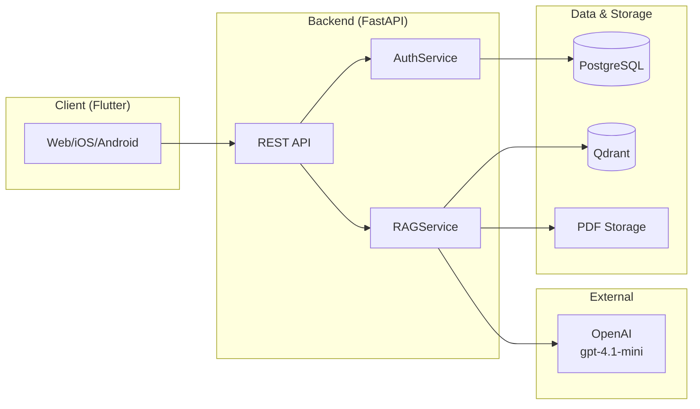

# Spiritual Q&A Platform

**Course**: CS 698 - Software Engineering  
**Organization**: Non-Profit Spiritual Organization  
**Last Updated**: February 15, 2026

---

## 🎯 Project Overview

A spiritual/philosophical Q&A application that provides answers based strictly on the organization's proprietary texts using Retrieval-Augmented Generation (RAG).

### Key Features

- **🧠 RAG-based Q&A**: Natural language questions answered using proprietary PDF publications
- **👤 Dual Access Modes**:
  - **Guest Mode**: Anonymous, rate-limited access (10 queries/day)
  - **Authenticated Mode**: Full access with persistent conversation history
- **📱 Cross-Platform**: Single Flutter codebase for Web, iOS, and Android
- **✅ Citations**: Every answer includes source document references with page numbers

---

## 📚 Documentation

### Core Documentation

| Document | Description | Link |
|----------|-------------|------|
| **ARCHITECTURE.md** | Complete system architecture and design | [📖 View](./ARCHITECTURE.md) |
| **Story 1 (RAG)** | Core RAG pipeline implementation | [📝 Issue #1](https://github.com/shashigemini/cs698-repo/issues/1) |
| **Story 2 (Auth)** | JWT authentication system | [📝 Issue #2](https://github.com/shashigemini/cs698-repo/issues/2) |
| **Story 3 (Flutter)** | Cross-platform UI implementation | [📝 Issue #3](https://github.com/shashigemini/cs698-repo/issues/3) |

### API Documentation

| Document | Description | Link |
|----------|-------------|------|
| **OpenAPI Spec** | Machine-readable API specification (OpenAPI 3.1) | [🔗 openapi.yaml](./openapi.yaml) |
| **OpenAPI Guide** | How to use the spec (validation, client generation, testing) | [📖 OPENAPI_GUIDE.md](./docs/OPENAPI_GUIDE.md) |

---

## 🏭 Architecture

### High-Level System Diagram



### Technology Stack

**Backend**:
- FastAPI (Python 3.11+)
- LlamaIndex (RAG orchestration)
- Qdrant (vector database)
- PostgreSQL (structured data)
- OpenAI gpt-4.1-mini (LLM)
- JWT authentication (python-jose)
- Argon2 password hashing

**Frontend**:
- Flutter 3.19+ (Dart)
- Riverpod (state management)
- dio (HTTP client)
- flutter_secure_storage (token storage)

---

## 🚀 Quick Start

### View API Documentation

**Option 1: Swagger UI (Docker)**
```bash
docker run -p 8080:8080 \
  -e SWAGGER_JSON=/openapi.yaml \
  -v $(pwd)/openapi.yaml:/openapi.yaml \
  swaggerapi/swagger-ui

# Visit: http://localhost:8080
```

**Option 2: Online Swagger Editor**
1. Go to [editor.swagger.io](https://editor.swagger.io)
2. Import [`openapi.yaml`](./openapi.yaml)
3. Explore interactive documentation

### Generate Client SDK (Flutter)

```bash
# Install generator
brew install openapi-generator

# Generate Dart client
openapi-generator generate \
  -i openapi.yaml \
  -g dart \
  -o frontend/lib/generated/api_client \
  --additional-properties=pubName=spiritual_qa_api
```

See [OpenAPI Guide](./docs/OPENAPI_GUIDE.md) for detailed instructions.

---

## 📦 API Endpoints

### Authentication

| Endpoint | Method | Description | Auth Required |
|----------|--------|-------------|---------------|
| `/auth/register` | POST | Register new user | No |
| `/auth/login` | POST | Login user | No |
| `/auth/refresh` | POST | Refresh access token | Refresh token |
| `/auth/logout` | POST | Logout user | Yes |

### Chat

| Endpoint | Method | Description | Auth Required |
|----------|--------|-------------|---------------|
| `/api/chat/query` | POST | Submit query and get answer | Optional* |

*Guest users can query without auth (rate-limited to 10/day)

### Health

| Endpoint | Method | Description | Auth Required |
|----------|--------|-------------|---------------|
| `/health` | GET | System health check | No |

---

## 🔒 Authentication Flow

### JWT Token Strategy

- **Access Token**: 15-minute TTL, used for API requests
- **Refresh Token**: 7-day TTL, used to obtain new access tokens
- **Token Rotation**: New refresh token issued on each refresh (old one revoked)

### Platform-Specific Storage

| Platform | Access Token | Refresh Token | CSRF Token |
|----------|-------------|---------------|------------|
| **Web** | HttpOnly Cookie | HttpOnly Cookie | Non-HttpOnly Cookie |
| **iOS** | Keychain (flutter_secure_storage) | Keychain | N/A |
| **Android** | KeyStore (flutter_secure_storage) | KeyStore | N/A |

---

## 📏 Rate Limiting

### Guest Users
- **Limit**: 10 queries per 24-hour rolling window
- **Key**: IP address + `guest_session_id`
- **Reset**: Rolling 24 hours from first query

### Authentication Endpoints
- **Login**: 5 attempts per 15 minutes per IP
- **Registration**: 3 attempts per hour per IP

---

## 🛠️ Development Setup

### Prerequisites
- Python 3.11+
- PostgreSQL 14+
- Docker & Docker Compose
- Flutter 3.19+
- OpenAI API key

### Backend Setup

```bash
# Clone repository
git clone https://github.com/shashigemini/cs698-repo.git
cd cs698-repo

# Start services (PostgreSQL, Qdrant, Redis)
docker-compose up -d

# Install Python dependencies
cd backend
pip install -r requirements.txt

# Set up environment variables
cp .env.example .env
# Edit .env with your OpenAI API key and database credentials

# Run database migrations
alembic upgrade head

# Start backend
uvicorn app.main:app --reload

# Visit: http://localhost:8000/docs (auto-generated API docs)
```

### Frontend Setup

```bash
# Navigate to frontend
cd frontend

# Install dependencies
flutter pub get

# Run on web
flutter run -d chrome

# Run on iOS (requires macOS)
flutter run -d ios

# Run on Android
flutter run -d android
```

---

## 🧪 Testing

### Backend Tests

```bash
cd backend
pytest

# With coverage
pytest --cov=app --cov-report=html
```

### Frontend Tests

```bash
cd frontend
flutter test

# Integration tests
flutter test integration_test/
```

### API Contract Testing

```bash
# Install Dredd
npm install -g dredd

# Test API against OpenAPI spec
dredd openapi.yaml http://localhost:8000
```

---

## 📡 Deployment

### MVP Deployment (Single Instance)
- Single VM/container running FastAPI, PostgreSQL, Qdrant
- HTTPS termination via load balancer
- In-memory rate limiting

### Production Deployment (Scaled)
- Multiple FastAPI instances (Kubernetes)
- Managed PostgreSQL (RDS/Cloud SQL)
- Redis for shared rate limiting
- Object storage (S3/GCS) for PDFs
- Horizontal pod autoscaling

See [ARCHITECTURE.md](./ARCHITECTURE.md) for detailed deployment diagrams.

---

## 📈 Project Timeline

| Story | Duration | Developer | Status |
|-------|----------|-----------|--------|
| **Story 1 (RAG)** | 5 weeks | 1 backend | ✅ Planned |
| **Story 2 (Auth)** | 4 weeks | 1 backend | ✅ Planned |
| **Story 3 (Flutter)** | 6 weeks | 1 frontend | ✅ Planned |

**Total**: 11 weeks (backend parallel, then frontend)

---

## 🔐 Security

### Authentication
- Argon2id password hashing
- JWT access + refresh tokens
- HttpOnly cookies for web (XSS protection)
- Secure storage for mobile (Keychain/KeyStore)
- Token rotation on refresh

### Input Validation
- Query length: 1-2000 characters
- Email format: RFC 5322
- Password complexity: 8+ chars, mixed case, digit, special char
- UUID validation for all IDs

### API Security
- HTTPS only (TLS 1.2+)
- CSRF protection for web
- CORS whitelist
- Rate limiting per IP and session
- No PII in logs

---

## 📊 Error Codes

All API errors follow consistent format:

```json
{
  "error_code": "RATE_LIMIT_EXCEEDED",
  "message": "Human-readable message",
  "details": {
    "retry_after": 3600,
    "remaining": 0,
    "limit": 10
  }
}
```

### Standard Error Codes

| Code | HTTP | Description |
|------|------|-------------|
| `UNAUTHORIZED` | 401 | Invalid/expired JWT |
| `INVALID_CREDENTIALS` | 401 | Wrong email/password |
| `RATE_LIMIT_EXCEEDED` | 429 | Query limit reached |
| `VALIDATION_ERROR` | 400 | Invalid input format |
| `QUERY_TOO_LONG` | 400 | Query > 2000 chars |
| `EMAIL_ALREADY_EXISTS` | 400 | Registration conflict |
| `INVALID_REFRESH_TOKEN` | 401 | Expired refresh token |
| `CONVERSATION_NOT_FOUND` | 404 | Invalid conversation ID |
| `LLM_ERROR` | 503 | OpenAI API failure |
| `RETRIEVAL_ERROR` | 503 | Qdrant query failure |

See [openapi.yaml](./openapi.yaml) for complete error documentation.

---

## 👥 Contributing

### Code Style
- **Python**: PEP 8, use Black formatter
- **Dart**: Effective Dart, use `dart format`

### Git Workflow
1. Create feature branch: `feature/story-1-rag-service`
2. Make changes, commit with [conventional commits](https://www.conventionalcommits.org/)
3. Open PR with description referencing issue
4. Wait for CI to pass (linting, tests)
5. Get 1 approval from reviewer
6. Squash and merge

### Commit Format
```
type(scope): subject

body (optional)

Fixes #123
```

Types: `feat`, `fix`, `docs`, `style`, `refactor`, `test`, `chore`

---

## 📝 License

Proprietary - All rights reserved by the Non-Profit Spiritual Organization.

---

## 📧 Contact

- **Course**: CS 698 - Software Engineering
- **Institution**: NJIT
- **Project Team**: See GitHub contributors

---

## 🔗 Quick Links

- [📖 Architecture Document](./ARCHITECTURE.md)
- [🔗 OpenAPI Specification](./openapi.yaml)
- [📝 Story 1 - Core RAG](https://github.com/shashigemini/cs698-repo/issues/1)
- [📝 Story 2 - Authentication](https://github.com/shashigemini/cs698-repo/issues/2)
- [📝 Story 3 - Flutter Interface](https://github.com/shashigemini/cs698-repo/issues/3)
- [📖 OpenAPI Usage Guide](./docs/OPENAPI_GUIDE.md)

---

**Built with ❤️ for spiritual seekers worldwide**
