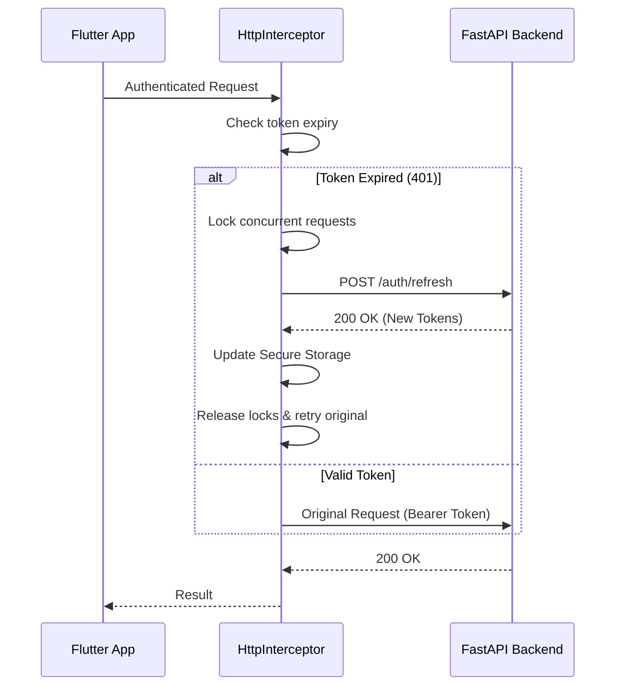

# API Client & Integration

The frontend communicates with the FastAPI backend through a structured, interceptor-based layer using the **Dio** HTTP client.

## Network Interceptor

The `HttpInterceptor` is the central hub for handling cross-cutting concerns in our network layer.

### Token Refresh Sequence
We implement automatic silent token refresh to ensure a seamless user experience.



## Authentication Protocol

The platform uses standard secure authentication over HTTPS:
1. **Transmission**: Credentials (Email/Password) are sent over a secure TLS 1.2+ channel.
2. **Backend Protection**: Passwords are never stored in plain text; they are hashed using **Argon2** before storage.
3. **JWT Exchange**: Upon successful login, the backend issues an Access Token (15m) and a Refresh Token (7d).
4. **Web Security**: For web clients, the backend sets `HttpOnly` cookies to protect against XSS-based token theft.

## Error Mapping

We map backend `error_code` strings to Dart `Exceptions` to ensure the UI can react appropriately.

| API Error Code | Dart Exception | UI Action |
|----------------|----------------|-----------|
| `RATE_LIMIT_EXCEEDED` | `RateLimitException` | Show rate limit bottom sheet |
| `INVALID_CREDENTIALS` | `AuthException` | Show "Invalid email or password" |
| `EMAIL_ALREADY_EXISTS` | `AuthException` | Show "Email is already in use" |
| `UNAUTHORIZED` | `SessionExpiredException` | Trigger logout and redirect to login |
| `INTERNAL_ERROR` | `ServerException` | Show generic "Something went wrong" |

## Configuration

Standardized network settings are configured via `BaseOptions`:
```dart
final dioOptions = BaseOptions(
  baseUrl: AppStrings.apiBaseUrl,
  connectTimeout: const Duration(seconds: 10),
  receiveTimeout: const Duration(seconds: 30),
  headers: {
    'Accept': 'application/json',
    'Content-Type': 'application/json',
  },
);
```
