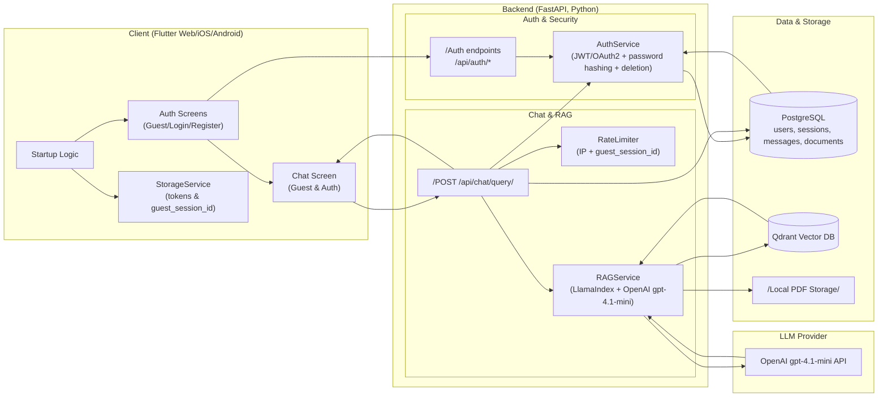

# End-to-End Architecture

This document provides a high-level overview of the Spiritual Q&A Platform's architecture, including its components, data flow, and technology stack.

## High-Level System Diagram

## Component Deployment

| Component | Technology | Purpose |
|-----------|------------|---------|
| **Flutter Client** | Dart / Flutter | Cross-platform UI (Web, iOS, Android) |
| **FastAPI Backend** | Python / FastAPI | REST API, Auth, and RAG orchestration |
| **PostgreSQL** | Relational DB | User data, session persistence, document metadata |
| **Qdrant** | Vector DB | Semantic search and document chunk storage |
| **LlamaIndex** | RAG Framework | Orchestrating retrieval and LLM response |
| **OpenAI API** | gpt-4.1-mini | Natural language generation |

## Frontend Layered Architecture

The application follows a feature-based, layered architecture designed for testability and maintainability.

### 1. Presentation Layer (`lib/features/*/presentation`)
- **Widgets**: Reusable UI components.
- **Screens**: Orchestrate multiple widgets and watch application state via Riverpod.

### 2. Application Layer (`lib/features/*/application`)
- **Controllers**: (Riverpod `AsyncNotifier`) Orchestrate business logic and maintain UI state.

### 3. Domain Layer (`lib/features/*/domain`)
- **Models**: Immutable data structures (Freezed).
- **Interfaces**: Abstract definitions for repositories.

### 4. Data Layer (`lib/features/*/data`)
- **Repositories**: Implementation of domain interfaces making network calls.
- **Services**: Platform-specific abstractions (Storage, Security).

## Entry Points

- **Production (`lib/main.dart`)**: Initializes core services and starts the app.
- **Development (`lib/main_dev.dart`)**: Includes mock overrides and **Marionette** integration for automated testing.
