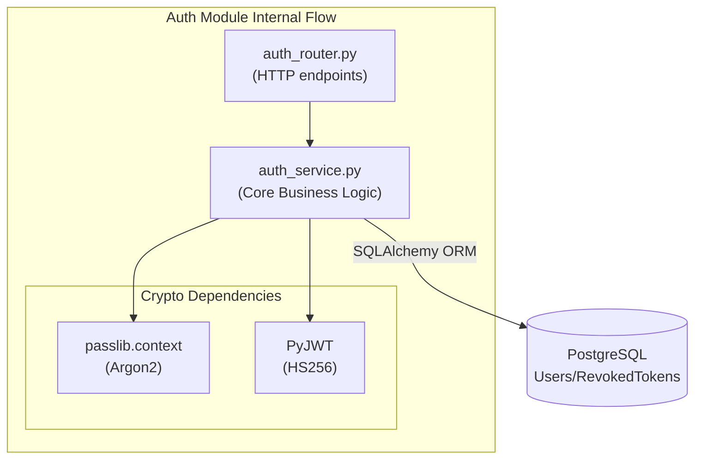

# Authentication (`AuthService`)

## Overview
The Authentication module (`AuthService`) is responsible for managing user identities securely. It implements a robust End-to-End Encrypted (E2EE) key derivation system where the backend never sees a plaintext password.

## Features
- **Registration**: Securely creates users with client-derived E2EE authentication tokens.
- **Login Challenge/Verify**: Implements a two-step E2EE authentication process.
- **Stateless Tokens**: Issues short-lived (15 min) Access Tokens (JWTs).
- **Token Rotation**: Issues long-lived (7 days) Refresh Tokens and records usage in PostgreSQL to prevent replay attacks.
- **FastAPI Dependencies**: Provides a `get_current_user` dependency for simple route protection.

## Internal Architecture

The `AuthService` abstracts cryptography and database transactions away from the FastAPI router.

## E2EE Login Flow

The login process prevents the backend from knowing the master password:
1. **Challenge Request**: The client sends their email to `/api/auth/login`.
2. **Challenge Response**: The server looks up the user and returns their unique cryptographic `salt`. (If the user doesn't exist, a fake deterministic salt is returned to prevent enumeration attacks).
3. **Key Derivation**: The client uses the raw password and the returned `salt` to derive a `client_auth_token` locally via HKDF.
4. **Verification Request**: The client sends the derived `client_auth_token` to `/api/auth/login/verify`.
5. **Verification Response**: The server hashes the `client_auth_token` using Argon2 and compares it to the stored hash. If successful, JWTs are returned.

## Data Schemas

### `users`
Core user entity capturing email, hashed auth token, and E2EE enrollment state.

### `user_e2ee_keys`
Stores the metadata required for E2EE decryption:
- `salt`: Used for client-side HKDF key derivation.
- `wrapped_account_key`: The target symmetric key, wrapped by the derived master key.
- `recovery_wrapped_ak`: The target symmetric key, wrapped by a recovery key.

### `revoked_tokens`
Stores the JWT IDs (`jti`) of refresh tokens that have been rotated during sequence renewals, preventing token theft replays.
