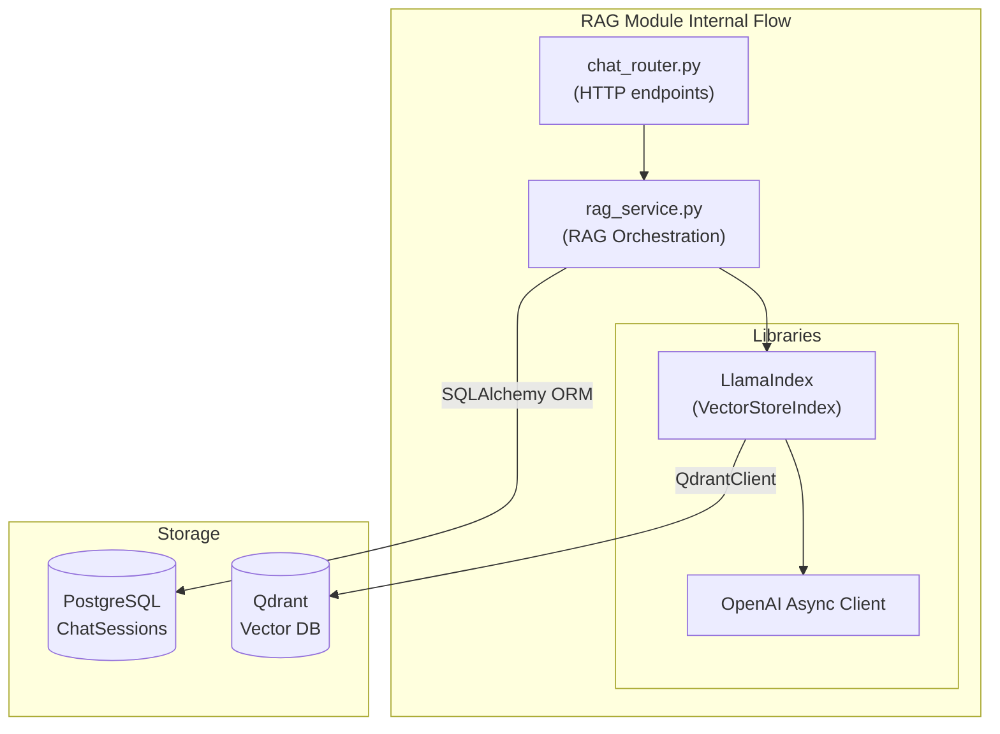

# RAG & Chat (`RAGService`)

## Overview
The RAG (Retrieval-Augmented Generation) module orchestrates the inference engine. It is responsible for parsing organizational texts into vector embeddings and utilizing OpenAI's language models to answer user queries backed by exact citations.

## Features
- **Document Ingestion**: Chunks PDFs, preserves meta-information (page, title), generates embeddings (`text-embedding-ada-002`), and stores them in Qdrant.
- **Inference Pipeline**: Finds semantically similar passages and injects them into a strict system prompt.
- **Citation Extraction**: Accurately formats citations from retrieved LlamaIndex nodes.
- **Conversation State**: Persists chat history for authenticated users into PostgreSQL.
- **Rate-Limited Guest Access**: Secures `/api/chat/query` for anonymous users via a Redis-backed `RateLimiter`.

## Internal Architecture

The `RAGService` abstracts external AI and database calls. The FastAPI router (`chat_router.py`) handles HTTP concerns, while `rag_service.py` manages the LlamaIndex orchestration.



## Prompt Configuration Framework

The service uses `gpt-4.1-mini` with a specialized prompt to enforce strict answering guidelines:

```text
You are a knowledgeable spiritual guide assistant for [Organization Name]. 
Your role is to provide accurate answers based STRICTLY on the provided context 
from our organization's sacred texts and publications.

Guidelines:
1. Answer ONLY based on the provided context
2. If the context doesn't contain sufficient information, say: "I don't have enough information in our texts to answer that question fully."
3. Maintain a respectful, contemplative tone
4. Do not speculate or add information not present in the context
5. Reference specific passages when possible

Context:
{context_str}

Question: {query_str}

Answer:
```

## Data Abstraction

### Relational Storage (PostgreSQL)
- **`chat_sessions`**: Links conversations to a unique `user_id`, tracks an auto-generated title.
- **`chat_messages`**: Stores individual exchanges (sender can be `user` or `ai`). The AI messages include a JSONB column `rag_metadata` that archives citations, retrieval times, and chunk references.

### Vector Storage (Qdrant)
The `spiritual_docs` collection tracks 1536-dimensional vectors using Cosine similarity. Its payload schema tracks crucial page boundary data:
- `document_id`
- `logical_book_id`
- `title`
- `page`
- `paragraph_id`
