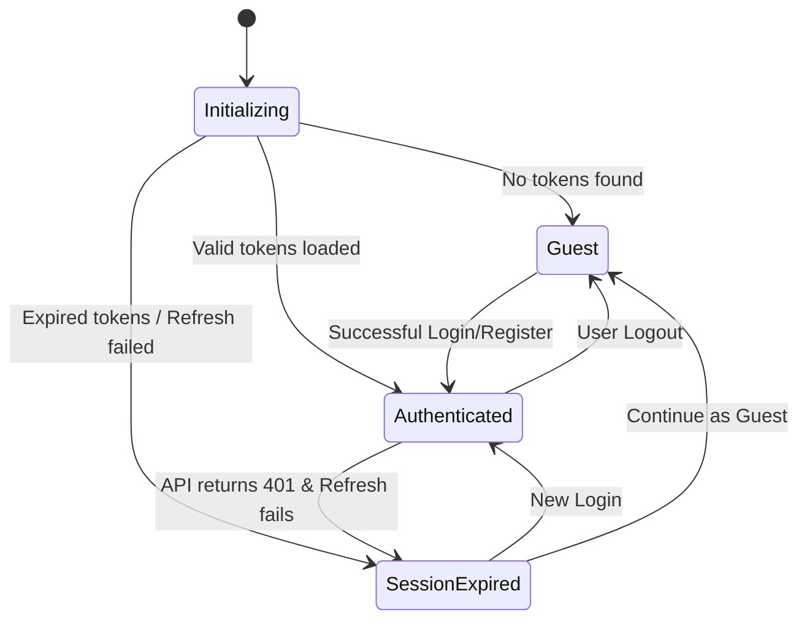
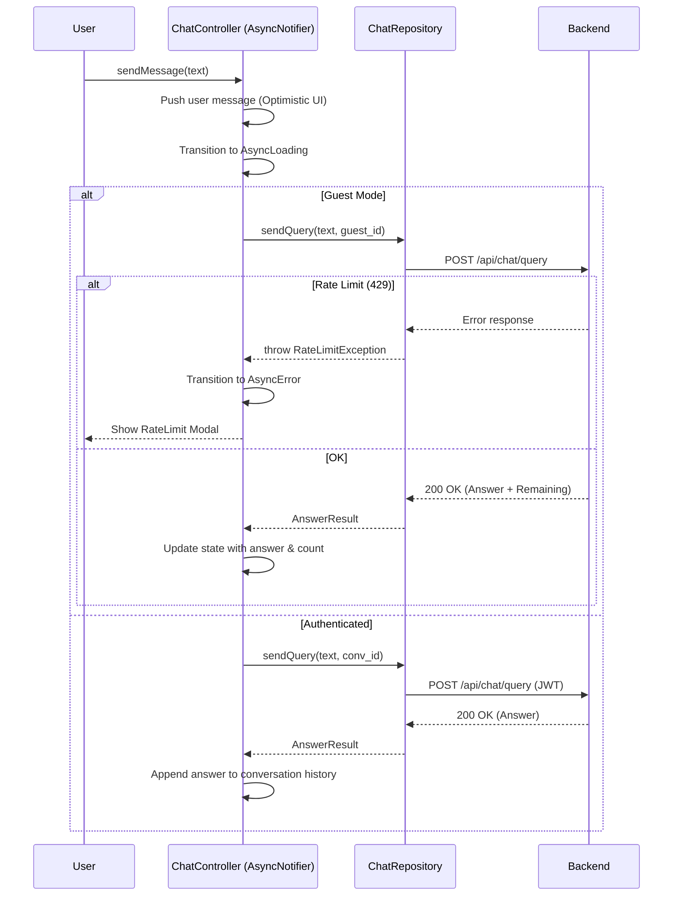
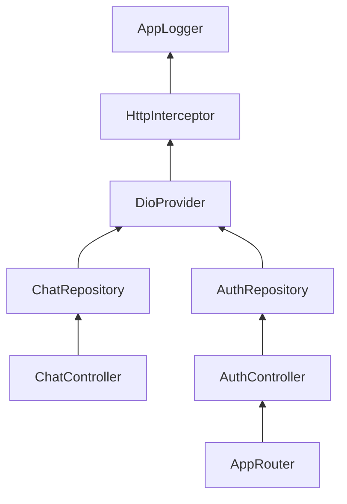

# State Management & Flows

Our application uses **Riverpod** for state management, leveraging the **AsyncNotifier** pattern to handle asynchronous data and side effects with built-in loading and error states.

## Authentication State Machine

The `AuthController` manages the global authentication lifecycle using an `AsyncNotifier<AuthState>`.

### State Definitions
- **Initializing**: The app is checking local storage for valid JWTs.
- **Guest**: Anonymous mode with local usage tracking.
- **Authenticated**: User is logged in with access to history and profile management.
- **SessionExpired**: A specialized state where the user must re-authenticate or continue as guest after a refresh failure.

## Chat Query Flow

The following diagram illustrates the lifecycle of a single query, including guest rate limiting and error handling logic.

## Provider Dependency Graph

Riverpod enforces a clear dependency directional flow to ensure predictable state updates:

## Key Architectural Constraints
1. **Unidirectional Data Flow**: UI triggers actions in Controllers -> Controllers call Repositories -> Repositories call API -> State updates -> UI rebuilds.
2. **Immutable State**: Use `@freezed` for all state classes to prevent accidental side effects.
3. **Optimistic Updates**: Use optimistic UI patterns for chat messages to maintain a "snappy" feel despite network latency.
