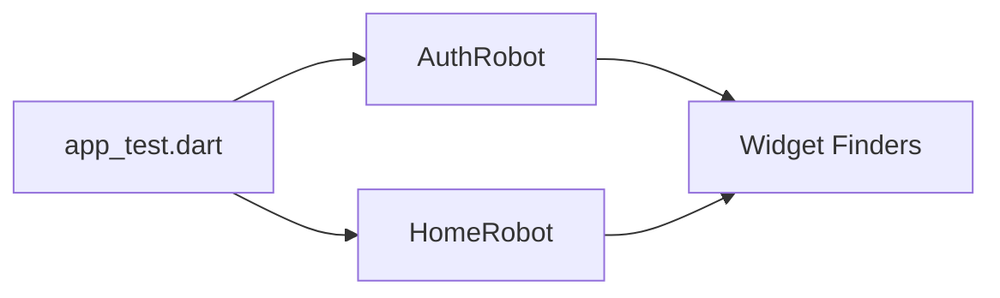

# Testing Strategy

We follow a strict quality assurance process combining fast unit tests with robust integration tests and AI-driven automation.

## Entry Points for Testing

The platform supports two distinct entry points to facilitate different testing environments:

### 1. Production Entry (`lib/main.dart`)
Standard entry point used for manual testing and production builds.

### 2. Development & Automation Entry (`lib/main_dev.dart`)
A specialized entry point for automated testing and CI.
- **Mock Overrides**: Allows the integration test runner to inject mock repositories (e.g., `mockAuthRepositoryProvider`) using `ProviderScope` overrides.
- **Marionette Integration**: Automatically binds the **Marionette SDK**, allowing AI agents to interact with the UI, capture logs, and take screenshots via a specialized JSON-RPC bridge.

## Automation with Marionette

For advanced UI automation, look for the `MarionetteBinding.ensureInitialized()` call in `main_dev.dart`. This allows external tools to:
- Read the widget tree as a JSON structure.
- Execute TAP and ENTER_TEXT commands programmatically.
- Wait for specific UI states without manually adding `pump()` calls in the test script.

## The Robot Pattern

For integration testing, we use the **Robot Pattern** to separate *what* is being tested from *how* the UI is manipulated.



### Example Usage
```dart
testWidgets('User can login successfully', (tester) async {
  final authRobot = AuthRobot(tester);
  
  await authRobot.enterEmail('test@example.com');
  await authRobot.enterPassword('Password123!');
  await authRobot.tapLogin();
  
  authRobot.expectHomeScreen();
});
```

## Windows Test Stability

Testing on Windows desktop introduces specific challenges (resource locks, UTF-16 encoding) addressed by our custom tooling.

### Recommended Execution
Avoid running `flutter test` directly on Windows for integration suites. Use the dedicated runner:

```bash
dart run tool/run_integration_tests.dart
```

This script natively handles:
- **Sequential Execution**: Prevents file system and debug port resource locks.
- **Encoding Normalization**: Converts Windows UTF-16LE output to standard UTF-8 for reliable log parsing.
- **Diagnostic Capture**: Automatically parses `test_results.json` to identify failed finders.

### The Focus-First Rule
On Windows, `enterText()` can fail silently if the field isn't explicitly focused.
- **Rule**: Always call `await tester.tap(finder)` before any `await tester.enterText(finder, text)` call.

## Best Practices

### 1. Avoid `pumpAndSettle` with Infinite Animations
Infinite spinners (like `CircularProgressIndicator` or the typing indicator) will cause `pumpAndSettle` to timeout.
- **Solution**: Use `await tester.pump(Duration(seconds: 1))` to step forward manually.

### 2. Snackbar Races
Snackbars can obscure UI elements or steal focus in tests.
- **Rule**: Call `ScaffoldMessenger.of(context).clearSnackBars()` before executing finders if a snackbar transition is expected.

### 3. Mocktail Fallbacks
Always register fallback values for custom types in `setUpAll` to avoid opaque errors with `any()` matchers:
```dart
setUpAll(() {
  registerFallbackValue(TokenPair.empty());
});
```

### 4. Mandatory Mock Overrides
Always override platform-dependent services in `ProviderScope` to avoid `MissingPluginException` or hangs in the CLI environment:
- `storageServiceProvider` -> `MockStorageService`
- `cryptographyServiceProvider` -> `FakeCryptographyService`
- `freeraspProvider` -> (Disabled via mock config)
