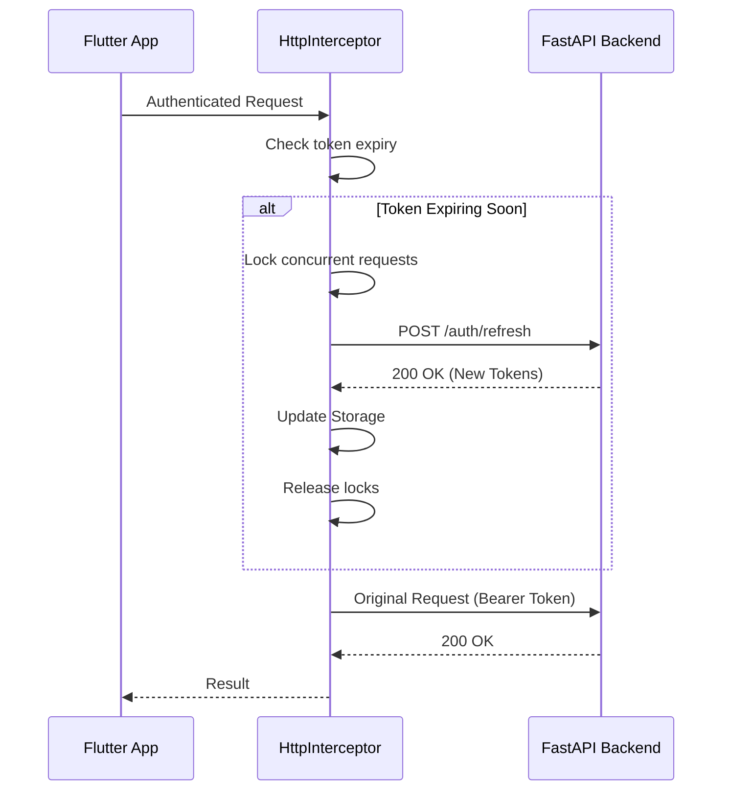

# API Client & Integration

The frontend communicates with the FastAPI backend through a structured, interceptor-based layer.

## Network Interceptor

The `HttpInterceptor` is the "brain" of our network layer. It handles cross-cutting concerns transparently.

### Token Refresh Sequence



## Authentication Protocol

The platform implements a "Secret-Free" authentication protocol. Raw passwords are **never** transmitted to the backend.

1. **Client-Side Derivation**: The client derives a `ClientAuthToken` from the user's password using Argon2id and HKDF.
2. **Transmission**: Only the derived token is sent to the `/auth/login` or `/auth/register` endpoints.
3. **JWT Exchange**: Upon successful validation of the token, the backend issues a standard JWT `TokenPair` (Access + Refresh).

## Error Mapping

We map backend `error_code` strings to Dart `Exceptions` to ensure the UI can react appropriately.

| API Error Code | Dart Exception | UI Action |
|----------------|----------------|-----------|
| `RATE_LIMIT_EXCEEDED` | `RateLimitException` | Show rate limit modal |
| `INVALID_CREDENTIALS` | `AuthException` | Inline form error (Invalid email/password) |
| `EMAIL_ALREADY_EXISTS` | `AuthException` | Inline form error (Email taken) |
| `UNAUTHORIZED` | `SessionExpiredException` | Redirect to login |

## Configuration

Our base network configuration is centralized:
```dart
final dioOptions = BaseOptions(
  baseUrl: AppStrings.apiBaseUrl,
  connectTimeout: const Duration(seconds: 10),
  receiveTimeout: const Duration(seconds: 30),
);
```
