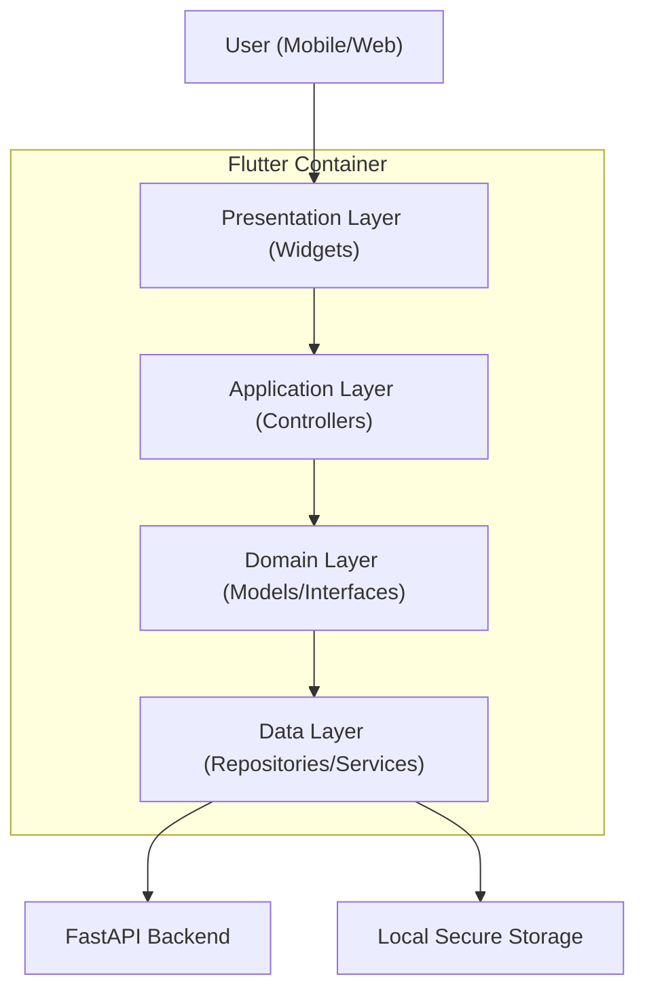

# Frontend Architecture

This document outlines the architectural patterns and layered structure of the Spiritual Q&A Platform's frontend.

## Overview

The application is built using Flutter and follows a feature-based, layered architecture designed for testability, maintainability, and clear separation of concerns.

### C4 Model - System Container

## Layered Architecture

### 1. Presentation Layer (`lib/features/*/presentation`)
Responsible for building the user interface.
- **Widgets**: Pure UI components.
- **Screens**: Orchestrate multiple widgets and watch application state.
- **Rule**: Presentation should never touch Repositories directly. It interacts only with Controllers/Providers.

### 2. Application Layer (`lib/features/*/application`)
Orchestrates business logic and maintains UI state.
- **Controllers**: (Riverpod `AsyncNotifier` or `StateNotifier`) respond to user actions and update state.
- **Providers**: Expose controllers to the UI layer.

### 3. Domain Layer (`lib/features/*/domain`)
The core "truth" of the application.
- **Models**: Immutable data structures (using `@freezed`).
- **Interfaces**: Abstract definitions of repositories to facilitate mocking in tests.

### 4. Data Layer (`lib/features/*/data`)
Handles external data sources.
- **Repositories**: Implementation of domain interfaces that make HTTP calls.
- **Services**: Platform-specific abstractions (Storage, Security).

## Core Abstractions

### Network Interop
We use **Dio** with a custom `HttpInterceptor` to handle:
- Automatic token refresh logic.
- Standardized error mapping from API codes to Dart exceptions.
- Global loading/error states.

### Persistence
The `StorageService` abstracts platform differences:
- **Mobile**: `flutter_secure_storage` (Keychain/KeyStore).
- **Web**: HttpOnly Cookies (handled by browser) + localStorage for CSRF.

## Security Hardening

### Zero-Log Policy
We implement a global sensitive data scrubber in `AppLogger.scrub()` that redacts passwords, tokens, and API keys before they reach the logs. This is integrated into the `HttpInterceptor`.

### Certificate Pinning
To mitigate Man-in-the-Middle (MitM) attacks, the frontend uses strict certificate pinning via the `http_certificate_pinning` package, validating the server's SHA-256 fingerprint during connection.

