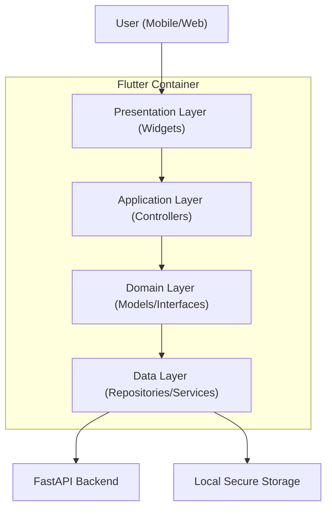

# Frontend Architecture

This document outlines the architectural patterns and layered structure of the Spiritual Q&A Platform's frontend.

## Overview

The application is built using Flutter and follows a feature-based, layered architecture designed for testability, maintainability, and clear separation of concerns.

### C4 Model - System Container

## Layered Architecture

### 1. Presentation Layer (`lib/features/*/presentation`)
Responsible for building the user interface.
- **Widgets**: Pure UI components.
- **Screens**: Orchestrate multiple widgets and watch application state.
- **Rule**: Presentation should never touch Repositories directly. It interacts only with Controllers/Providers.

### 2. Application Layer (`lib/features/*/application`)
Orchestrates business logic and maintains UI state.
- **Controllers**: (Riverpod `AsyncNotifier` or `StateNotifier`) respond to user actions and update state.
- **Providers**: Expose controllers to the UI layer.

### 3. Domain Layer (`lib/features/*/domain`)
The core "truth" of the application.
- **Models**: Immutable data structures (using `@freezed`).
- **Interfaces**: Abstract definitions of repositories to facilitate mocking in tests.

### 4. Data Layer (`lib/features/*/data`)
Handles external data sources.
- **Repositories**: Implementation of domain interfaces that make HTTP calls.
- **Services**: Platform-specific abstractions (Storage, Security).

## Core Abstractions

### Security & Cryptography
We implement a zero-trust model for user data:
- **CryptographyService**: Manages Argon2id key derivation, AES-GCM wrapping, and message encryption.
- **SecurityService**: Orchestrates **freeRASP** for runtime application self-protection.
- **Rule**: All sensitive user data must be encrypted before persistence or transmission.

### Network Interop
We use **Dio** with a custom `HttpInterceptor` to handle:
- Automatic token refresh logic.
- Standardized error mapping from API codes to Dart exceptions.
- Global loading/error states.
- Redaction of sensitive fields in diagnostics via `AppLogger.scrub()`.

## Entry Points

### Production (`lib/main.dart`)
The standard entry point for regular users. Initializes core services with production configurations and starts the application.

### Developer/Automation (`lib/main_dev.dart`)
A specialized entry point for development and test automation.
- **Mock Overrides**: Allows overriding repositories (e.g., `mockAuthRepositoryProvider`) for isolated testing.
- **Marionette Integration**: Includes `MarionetteBinding` to facilitate AI-driven UI testing and automation.
- **High Verbosity**: Configures `AppLogger` to trace level for detailed diagnostics.

## Resilience
The platform uses strict certificate pinning and platform-specific secure storage to ensure resilience against advanced attack vectors.

