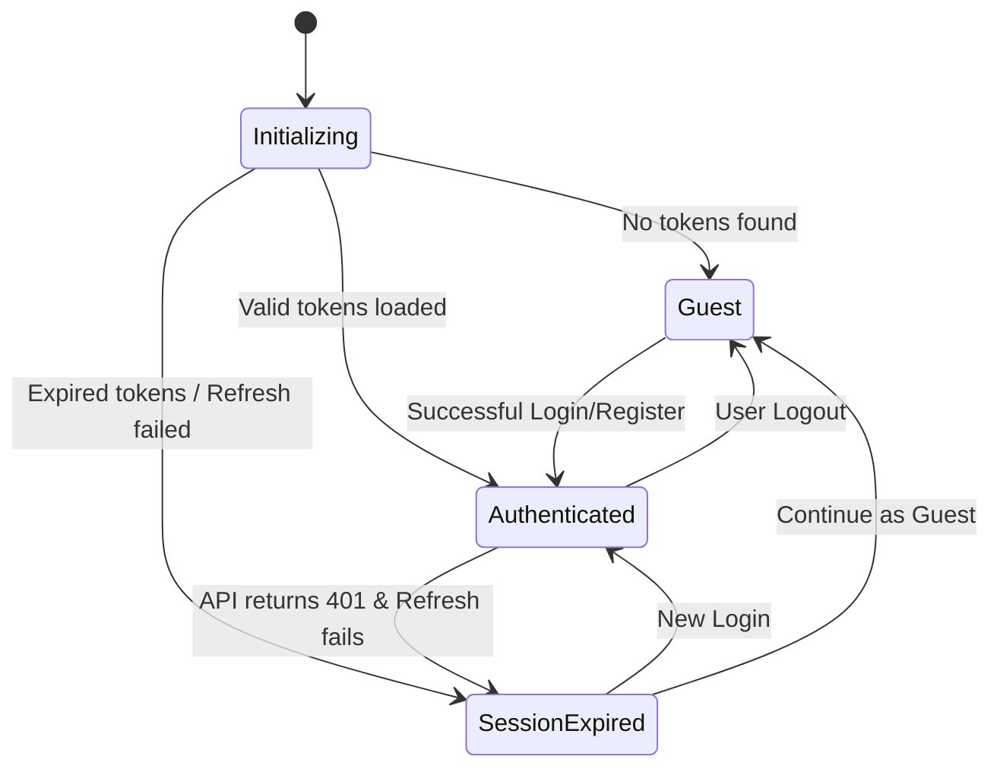
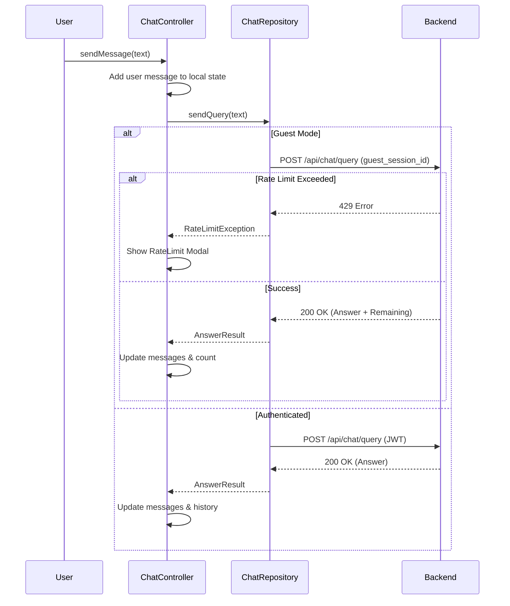
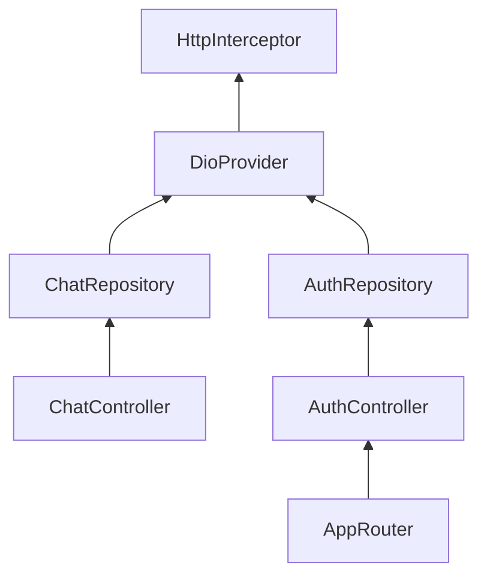

# State Management & Flows

Our application uses **Riverpod** for state management, following an asynchronous, notifier-based pattern.

## Authentication State Machine

The `AuthController` manages the global authentication lifecycle.

## Chat Query Flow

The following diagram illustrates the lifecycle of a single query, including guest rate limiting logic.

## Provider Dependency Graph

Riverpod enforces a clear dependency directional flow:

