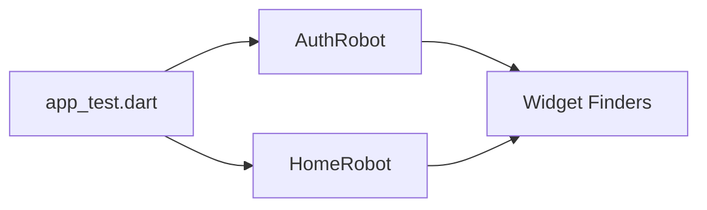

# Testing Strategy

We follow a strict quality assurance process combining fast unit tests with robust integration tests.

## The Robot Pattern

For integration testing, we use the **Robot Pattern** to separate *what* is being tested from *how* the UI is manipulated.



### Example Usage
```dart
testWidgets('User can login successfully', (tester) async {
  final authRobot = AuthRobot(tester);
  
  await authRobot.enterEmail('test@example.com');
  await authRobot.enterPassword('Password123!');
  await authRobot.tapLogin();
  
  authRobot.expectHomeScreen();
});
```

## Windows Test Stability

Testing on Windows introduces specific challenges addressed by our custom tooling.

### Resource Locks & Encoding
Windows terminals often use UTF-16LE, which breaks standard JSON parsing.
- **Solution**: Use `dart run tool/run_integration_tests.dart`.
- This script handles:
    - Sequential execution (to avoid port/file locks).
    - Encoding conversion to UTF-8.
    - Automated failure reporting.

## Best Practices

### 1. Avoid `pumpAndSettle` with Infinite Animations
Infinite spinners (like `CircularProgressIndicator`) will cause `pumpAndSettle` to timeout.
- **Better**: `await tester.pump(Duration(seconds: 1))` or targeting specific semantics.

### 2. Mocktail Fallbacks
Always register fallback values for custom types in `setUpAll`:
```dart
setUpAll(() {
  registerFallbackValue(TokenPair.empty());
});
```

### 3. Storage Overrides
Always override `storageServiceProvider` with a mock in widget tests to avoid platform channel errors.
