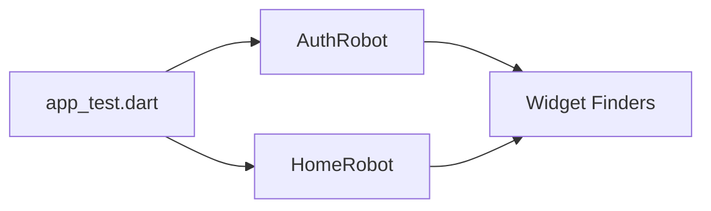

# Testing Strategy

We follow a strict quality assurance process combining fast unit tests with robust integration tests.

## The Robot Pattern

For integration testing, we use the **Robot Pattern** to separate *what* is being tested from *how* the UI is manipulated.



### Example Usage
```dart
testWidgets('User can login successfully', (tester) async {
  final authRobot = AuthRobot(tester);
  
  await authRobot.enterEmail('test@example.com');
  await authRobot.enterPassword('Password123!');
  await authRobot.tapLogin();
  
  authRobot.expectHomeScreen();
});
```

## Windows Test Stability

Testing on Windows introduces specific challenges addressed by our custom tooling.

### Resource Locks & Encoding
Windows terminals often use UTF-16LE, which breaks standard JSON parsing.
- **Solution**: Use `dart run tool/run_integration_tests.dart`.
- This script handles:
    - Sequential execution (to avoid port/file locks).
    - Encoding conversion to UTF-8.
    - Automated failure reporting using `tool/parse_test_errors.dart`.

### Focus-First Rule
On Windows desktop, `enterText()` can fail if the field isn't explicitly focused.
- **Always**: Call `await tester.tap(finder)` before any `enterText()` call.

## Best Practices

### 1. Avoid `pumpAndSettle` with Infinite Animations
Infinite spinners (like `_TypingIndicator` or `CircularProgressIndicator`) will cause `pumpAndSettle` to timeout.
- **Better**: Use `await tester.pump(Duration(seconds: 1))` or `await tester.pumpAndSettle(Duration(milliseconds: 100), EnginePhase.sendSemanticsUpdate, Duration(seconds: 5))`.

### 2. Snackbar Races
Snackbars can obscure UI elements or cause "found 0 matches" errors during transitions.
- **Always**: Call `ScaffoldMessenger.of(context).clearSnackBars()` before finding other elements if a snackbar might be present.

### 2. Mocktail Fallbacks
Always register fallback values for custom types in `setUpAll`:
```dart
setUpAll(() {
  registerFallbackValue(TokenPair.empty());
});
```

### 4. Mandatory Mock Overrides
Always override platform-dependent services to avoid `MissingPluginException` or hangs.
- `storageServiceProvider` -> `MockStorageService`
- `cryptographyServiceProvider` -> `FakeCryptographyService` (to disable slow JIT key-gen in tests)
- `freeraspProvider` (Ensure initialization is wrapped in `try-catch` and disabled in tests if needed).
