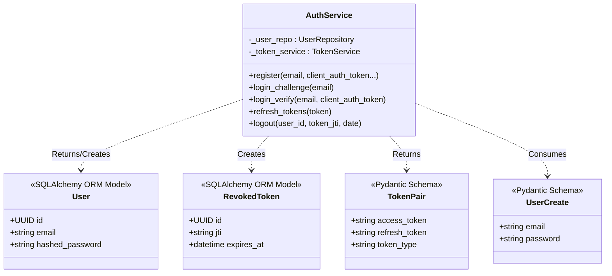

# Module Specification: Authentication (`AuthService`)

## Features
- **What it does:**
  - Registers new users, securely validating client-derived E2EE authentication tokens.
  - Authenticates existing users via a two-step challenge/verify mechanism (E2EE).
  - Generates secure stateless Access Tokens (JWTs) with a short lifespan (15 minutes).
  - Generates secure Refresh Tokens (JWTs) with a long lifespan (7 days).
  - Manages Token Rotation by recording used refresh tokens into a Postgres database to prevent replay attacks.
  - Provides a Python dependency (`get_current_user`) for other FastAPI routes to verify JWTs and extract the current user context.
- **What it does NOT do:**
  - Does not manage any user roles or dynamic permissions (authorization). Only basic authentication (verifying identity).
  - Does not handle session rate-limiting directly (handled by `RateLimiter`).

## Internal Architecture & Justification

The `AuthService` follows a clean architecture pattern separating the API routing layer (`auth_router.py`) from the business logic layer (`auth_service.py`). The router handles HTTP requests (e.g., extracting JSON bodies and cookies), while the service handles the cryptography and database transactions.

**Justification:**
This separation ensures that the core hashing logic and token generation are completely decoupled from FastAPI. This makes the `AuthService` highly testable via unit tests without needing to mock HTTP requests via `TestClient`. We implemented **End-to-End Encryption (E2EE)**, meaning the backend never sees plain passwords. Instead, it issues a `salt` challenge, verifies an HKDF-derived `client_auth_token` (hashed again on the server with Argon2 for storage), and returns a `wrapped_account_key`. We chose **JWTs** (JSON Web Tokens) instead of stateful server sessions so that the backend can scale horizontally without needing to sync a centralized session store. Token Rotation was implemented to mitigate the risks of refresh token theft.

```mermaid
flowchart TD
    %% Internal Auth Architecture
    subgraph AuthModule ["Auth Module Internal Flow"]
        direction TB
        
        Router["auth_router.py\n(HTTP endpoints)"]
        Service["auth_service.py\n(Core Business Logic)"]
        
        subgraph Crypto ["Crypto Dependencies"]
            Argon2["passlib.context\n(Argon2)"]
            PyJWT["PyJWT\n(HS256)"]
        end
        
        Router --> Service
        Service --> Argon2
        Service --> PyJWT
    end
    
    DB[("PostgreSQL\nUsers/RevokedTokens")]
    Service --> |"SQLAlchemy ORM"| DB
```



## Data Abstraction & Stable Storage

The module relies on a relational database (PostgreSQL) accessed via SQLAlchemy ORM.

**Schemas (Database Tables):**
1.  **`users`**:
    *   `id` (UUID, Primary Key)
    *   `email` (String, Unique, Indexed)
    *   `password_hash` (String)
    *   `role` (String, default "user")
    *   `is_e2ee` (Boolean, default True)
    *   `created_at` (DateTime)
    *   `updated_at` (DateTime)
2.  **`user_e2ee_keys`**:
    *   `user_id` (UUID, Primary Key)
    *   `salt` (LargeBinary / Base64 String)
    *   `wrapped_account_key` (String)
    *   `recovery_wrapped_ak` (String)
    *   `created_at` (DateTime)
    *   `updated_at` (DateTime)
3.  **`revoked_tokens`**:
    *   `id` (UUID, Primary Key)
    *   `jti` (String, Unique, Indexed) - The unique JWT ID for the refresh token.
    *   `expires_at` (DateTime) - Used to automatically drop rows after the token naturally expires.

## Class & Method Declarations

### `AuthService` Layer (`backend/app/services/auth_service.py`)

*   **State / Fields**:
    *   `_settings : Settings`: Private instance for configuring.
    *   `_session : AsyncSession`: SQLAlchemy async session.
    *   `_user_repo : UserRepository`: Repo for User entities.
    *   `_token_service : TokenService`: Service for JWT logic.
*   **Public Methods**:
    *   `+register(...) -> dict`: Creates a user, saves E2EE keys, returns tokens.
    *   `+login_challenge(email: str) -> dict`: Returns salt for E2EE key derivation.
    *   `+login_verify(...) -> dict`: Validates user derived token, returns new tokens.
    *   `+refresh_tokens(refresh_token: str) -> dict`: Validates old refresh token, blacklists it, returns new tokens.
    *   `+logout(...)`: Blacklists the provided refresh token.

### Class Hierarchy Diagram



## API REST Contract

All routes are mounted under `/api/auth`.

*   **`POST /api/auth/register`**: Expects JSON `{"email", "client_auth_token", "salt", "wrapped_account_key", "recovery_wrapped_ak"}`. Returns 200 OK with `Tokens` in body (plus cookies for web).
*   **`POST /api/auth/login`**: (Challenge) Expects JSON `{"email"}`. Returns 200 OK with `salt` and `recovery_wrapped_ak`.
*   **`POST /api/auth/login/verify`**: (Verify) Expects JSON `{"email", "client_auth_token"}`. Returns 200 OK with `Tokens` and `wrapped_account_key`.
*   **`POST /api/auth/refresh`**: Accepts `refresh_token`. Returns 200 OK with new `Tokens`.
*   **`POST /api/auth/logout`**: Expects Authorization header. Returns 200 OK.


## LLM-Generated Source Code

Below is the LLM-generated code for the classes defined in this module.

### `auth_service.py`
```python
"""Auth service — E2EE-aware registration, login, and account management.

This is the core business logic for authentication. It orchestrates
the UserRepository, TokenService, and RateLimiter.
"""

import base64
import uuid
from typing import Optional

from sqlalchemy.ext.asyncio import AsyncSession

from app.config import Settings
from app.core.exceptions import (
    AccountNotFoundError,
    AuthError,
    EmailExistsError,
    KeysNotFoundError,
)
from app.core.logging import get_logger
from app.core.security import hash_password, verify_password
from app.repositories.user_repo import UserRepository
from app.services.token_service import TokenService

logger = get_logger(__name__)


class AuthService:
    """Handles all authentication operations."""

    def __init__(
        self,
        settings: Settings,
        session: AsyncSession,
    ) -> None:
        self._settings = settings
        self._session = session
        self._user_repo = UserRepository(session)
        self._token_service = TokenService(settings, session)

    async def register(
        self,
        *,
        email: str,
        client_auth_token: str,
        salt: str,
        wrapped_account_key: str,
        recovery_wrapped_ak: str,
    ) -> dict:
        """Register a new user with E2EE key material.

        Args:
            email: User's email address.
            client_auth_token: Base64 HKDF-derived auth token from LMK.
            salt: Base64-encoded Argon2id salt.
            wrapped_account_key: Base64 AES-GCM wrapped AccountKey.
            recovery_wrapped_ak: Base64 RecoveryKey-wrapped AccountKey.

        Returns:
            Dict with user_id, access_token, refresh_token, access_expires_at.

        Raises:
            EmailExistsError: If email is already registered.
        """
        existing = await self._user_repo.get_by_email(email)
        if existing:
            raise EmailExistsError()

        # Hash the client auth token (server never sees raw password)
        password_hash = hash_password(client_auth_token)

        # Decode salt from base64 to bytes
        try:
            salt_bytes = base64.urlsafe_b64decode(salt)
        except Exception:
            salt_bytes = base64.b64decode(salt)

        # Create user
        user = await self._user_repo.create(
            email=email,
            password_hash=password_hash,
            is_e2ee=True,
        )

        # Store E2EE keys
        await self._user_repo.create_e2ee_keys(
            user_id=user.id,
            salt=salt_bytes,
            wrapped_account_key=wrapped_account_key,
            recovery_wrapped_ak=recovery_wrapped_ak,
        )

        # Generate tokens
        token_pair = self._token_service.generate_token_pair(
            user_id=str(user.id),
            role=user.role,
        )

        await self._session.commit()
        logger.info("User registered successfully")

        return {
            "user_id": str(user.id),
            "access_token": token_pair["access_token"],
            "refresh_token": token_pair["refresh_token"],
            "access_expires_at": token_pair["access_expires_at"],
        }

    async def login_challenge(self, *, email: str) -> dict:
        """Step 1 of E2EE login: return user's salt.

        Uses constant-time behavior to avoid email enumeration:
        returns a fake salt if user doesn't exist.

        Args:
            email: User's email address.

        Returns:
            Dict with salt (base64-encoded).
        """
        user = await self._user_repo.get_by_email(email)

        if not user:
            # Return a deterministic fake salt to prevent enumeration
            # Hash the email to produce consistent salt per email
            import hashlib
            fake_salt = hashlib.sha256(email.encode()).digest()[:16]
            # Fake recovery string to match length/format
            fake_recovery = base64.urlsafe_b64encode(hashlib.sha512(email.encode()).digest()[:64]).decode()
            return {
                "salt": base64.urlsafe_b64encode(fake_salt).decode(),
                "recovery_wrapped_ak": fake_recovery
            }

        keys = await self._user_repo.get_e2ee_keys(user.id)
        if not keys:
            raise KeysNotFoundError()

        return {
            "salt": base64.urlsafe_b64encode(keys.salt).decode(),
            "recovery_wrapped_ak": keys.recovery_wrapped_ak
        }

    async def login_verify(
        self,
        *,
        email: str,
        client_auth_token: str,
    ) -> dict:
        """Step 2 of E2EE login: verify auth token.

        Args:
            email: User's email address.
            client_auth_token: Base64 HKDF-derived auth token from LMK.

        Returns:
            Dict with user_id, tokens, and wrapped_account_key.

        Raises:
            AuthError: If credentials are invalid.
        """
        user = await self._user_repo.get_by_email(email)
        if not user:
            # Run hash anyway to avoid timing side-channel
            hash_password("dummy-token-for-timing")
            raise AuthError()

        if not verify_password(client_auth_token, user.password_hash):
            raise AuthError()

        keys = await self._user_repo.get_e2ee_keys(user.id)
        if not keys:
            raise KeysNotFoundError()

        token_pair = self._token_service.generate_token_pair(
            user_id=str(user.id),
            role=user.role,
        )

        logger.info("User logged in successfully")

        return {
            "user_id": str(user.id),
            "access_token": token_pair["access_token"],
            "refresh_token": token_pair["refresh_token"],
            "access_expires_at": token_pair["access_expires_at"],
            "wrapped_account_key": keys.wrapped_account_key,
        }

    async def refresh_tokens(self, *, refresh_token: str) -> dict:
        """Rotate refresh token and issue new pair.

        Args:
            refresh_token: The current refresh token.

        Returns:
            New token pair dict.
        """
        result = await self._token_service.rotate_refresh_token(
            refresh_token
        )
        return {
            "access_token": result["access_token"],
            "refresh_token": result["refresh_token"],
            "access_expires_at": result["access_expires_at"],
        }

    async def logout(
        self,
        *,
        user_id: str,
        token_jti: str,
        token_exp: float,
    ) -> None:
        """Revoke the user's current refresh token.

        Args:
            user_id: The authenticated user's ID.
            token_jti: JTI of the token to revoke.
            token_exp: Expiry timestamp of the token.
        """
        from datetime import datetime, timezone

        await self._token_service.revoke_refresh_token(
            token_jti=token_jti,
            user_id=user_id,
            expires_at=datetime.fromtimestamp(token_exp, tz=timezone.utc),
        )
        logger.info("User logged out")

    async def delete_account(self, *, user_id: str) -> bool:
        """Permanently delete user and all associated data.

        Cascade deletes handle sessions, messages, keys, and tokens.
        """
        deleted = await self._user_repo.delete(uuid.UUID(user_id))
        if deleted:
            await self._session.commit()
            logger.info("User account deleted")
        return deleted

    async def change_password(
        self,
        *,
        user_id: str,
        new_auth_token: str,
        new_wrapped_account_key: str,
    ) -> None:
        """Update auth credentials after client-side password change.

        The client derives NewLMK, new ClientAuthToken, and re-wraps AK.
        Server just stores the new hash and wrapped key.
        """
        new_hash = hash_password(new_auth_token)
        await self._user_repo.update_e2ee_keys(
            uuid.UUID(user_id),
            password_hash=new_hash,
            wrapped_account_key=new_wrapped_account_key,
        )
        await self._session.commit()
        logger.info("User password changed")

    async def recover_account(
        self,
        *,
        email: str,
        new_auth_token: str,
        new_wrapped_account_key: str,
    ) -> dict:
        """Recover account with new credentials (after mnemonic verification on client).

        The client has already used the RecoveryKey to unwrap AK,
        derived NewLMK + new ClientAuthToken, and re-wrapped AK.
        """
        user = await self._user_repo.get_by_email(email)
        if not user:
            raise AccountNotFoundError()

        new_hash = hash_password(new_auth_token)
        await self._user_repo.update_e2ee_keys(
            user.id,
            password_hash=new_hash,
            wrapped_account_key=new_wrapped_account_key,
        )

        token_pair = self._token_service.generate_token_pair(
            user_id=str(user.id),
            role=user.role,
        )

        await self._session.commit()
        logger.info("Account recovered successfully")

        return {
            "user_id": str(user.id),
            "access_token": token_pair["access_token"],
            "refresh_token": token_pair["refresh_token"],
            "access_expires_at": token_pair["access_expires_at"],
            "wrapped_account_key": new_wrapped_account_key,
        }
```

### `user.py`
```python
"""User ORM model."""

import uuid
from datetime import datetime, timezone

from sqlalchemy import Boolean, DateTime, String
from sqlalchemy.dialects.postgresql import UUID
from sqlalchemy.orm import Mapped, mapped_column, relationship

from app.core.database import Base


class User(Base):
    """Represents a registered user."""

    __tablename__ = "users"

    id: Mapped[uuid.UUID] = mapped_column(
        UUID(as_uuid=True),
        primary_key=True,
        default=uuid.uuid4,
    )
    email: Mapped[str] = mapped_column(
        String(255), unique=True, nullable=False, index=True
    )
    password_hash: Mapped[str] = mapped_column(
        String(255), nullable=False
    )
    role: Mapped[str] = mapped_column(
        String(50), nullable=False, default="user"
    )
    is_e2ee: Mapped[bool] = mapped_column(
        Boolean, nullable=False, default=True
    )
    created_at: Mapped[datetime] = mapped_column(
        DateTime(timezone=True),
        nullable=False,
        default=lambda: datetime.now(timezone.utc),
    )
    updated_at: Mapped[datetime] = mapped_column(
        DateTime(timezone=True),
        nullable=False,
        default=lambda: datetime.now(timezone.utc),
        onupdate=lambda: datetime.now(timezone.utc),
    )

    # Relationships
    e2ee_keys = relationship(
        "E2EEKey", back_populates="user", uselist=False, cascade="all, delete-orphan"
    )
    sessions = relationship(
        "ChatSession", back_populates="user", cascade="all, delete-orphan"
    )
    revoked_tokens = relationship(
        "RevokedToken", back_populates="user", cascade="all, delete-orphan"
    )
```

### `revoked_token.py`
```python
"""Revoked token ORM model for JWT blacklisting."""

import uuid
from datetime import datetime, timezone

from sqlalchemy import DateTime, ForeignKey, String
from sqlalchemy.dialects.postgresql import UUID
from sqlalchemy.orm import Mapped, mapped_column, relationship

from app.core.database import Base


class RevokedToken(Base):
    """Tracks revoked JWT refresh tokens.

    On logout or token rotation, the old refresh token's jti
    is stored here. Expired entries can be periodically purged
    via: DELETE FROM revoked_tokens WHERE expires_at < NOW().
    """

    __tablename__ = "revoked_tokens"

    id: Mapped[uuid.UUID] = mapped_column(
        UUID(as_uuid=True),
        primary_key=True,
        default=uuid.uuid4,
    )
    token_jti: Mapped[str] = mapped_column(
        String(255), unique=True, nullable=False, index=True
    )
    user_id: Mapped[uuid.UUID] = mapped_column(
        UUID(as_uuid=True),
        ForeignKey("users.id", ondelete="CASCADE"),
        nullable=False,
    )
    revoked_at: Mapped[datetime] = mapped_column(
        DateTime(timezone=True),
        nullable=False,
        default=lambda: datetime.now(timezone.utc),
    )
    expires_at: Mapped[datetime] = mapped_column(
        DateTime(timezone=True),
        nullable=False,
        index=True,
    )

    # Relationships
    user = relationship("User", back_populates="revoked_tokens")
```

### `auth_schemas.py`
```python
"""Auth Pydantic schemas — request and response models.

These are the wire-format contracts the frontend depends on.
"""

import base64
import re
from datetime import datetime
from typing import Optional

from pydantic import BaseModel, EmailStr, Field, field_validator


# --- Validators ---
_PASSWORD_MIN_LENGTH = 8
_PASSWORD_PATTERN = re.compile(
    r"^(?=.*[a-z])(?=.*[A-Z])(?=.*\d)(?=.*[\W_]).{8,}$"
)


def _validate_password(v: str) -> str:
    """Enforce password complexity rules."""
    if len(v) < _PASSWORD_MIN_LENGTH:
        raise ValueError(
            f"Password must be at least {_PASSWORD_MIN_LENGTH} characters"
        )
    if not _PASSWORD_PATTERN.match(v):
        raise ValueError(
            "Password must include uppercase, lowercase, digit, "
            "and special character"
        )
    return v


# --- E2EE Registration (client sends derived keys, not raw password) ---


class RegisterRequest(BaseModel):
    """E2EE registration: client sends derived auth token + wrapped keys."""

    email: EmailStr = Field(max_length=255)
    client_auth_token: str = Field(
        min_length=1,
        description="Base64-encoded HKDF-derived auth token from LMK",
    )
    salt: str = Field(
        min_length=1,
        description="Base64-encoded Argon2id salt (16 bytes)",
    )
    wrapped_account_key: str = Field(
        min_length=1,
        description="Base64-encoded AES-GCM wrapped AccountKey",
    )
    recovery_wrapped_ak: str = Field(
        min_length=1,
        description="Base64-encoded RecoveryKey-wrapped AccountKey",
    )

    @field_validator("salt")
    @classmethod
    def validate_salt(cls, v: str) -> str:
        """Ensure salt is valid base64 and expected length."""
        try:
            decoded = base64.b64decode(v)
        except Exception:
            # Try URL-safe base64
            try:
                decoded = base64.urlsafe_b64decode(v)
            except Exception as e:
                raise ValueError("Salt must be valid base64") from e
        if len(decoded) < 8:
            raise ValueError("Salt must be at least 8 bytes")
        return v


# --- Login Challenge/Verify ---


class LoginChallengeRequest(BaseModel):
    """Step 1 of E2EE login: client sends email to get salt."""

    email: EmailStr = Field(max_length=255)


class LoginChallengeResponse(BaseModel):
    """Server returns the user's salt for key derivation."""

    salt: str = Field(description="Base64-encoded Argon2id salt")
    recovery_wrapped_ak: Optional[str] = Field(
        default=None,
        description="Base64-encoded RecoveryKey-wrapped AccountKey (used for recovery)",
    )


class LoginVerifyRequest(BaseModel):
    """Step 2: client sends derived auth token for verification."""

    email: EmailStr = Field(max_length=255)
    client_auth_token: str = Field(
        min_length=1,
        description="Base64-encoded HKDF-derived auth token from LMK",
    )


class LoginVerifyResponse(BaseModel):
    """Successful login returns JWT pair + wrapped AK."""

    user_id: str
    access_token: str
    refresh_token: str
    access_expires_at: datetime = Field(
        description="ISO 8601 datetime when the access token expires",
    )
    wrapped_account_key: str = Field(
        description="Client uses this to unwrap AK with LMK",
    )


# --- Auth Responses ---


class AuthResponse(BaseModel):
    """Response for registration (no wrapped AK return needed)."""

    user_id: str
    access_token: str
    refresh_token: str
    access_expires_at: datetime


# --- Token Refresh ---


class RefreshRequest(BaseModel):
    """Refresh token request (mobile sends in body, web via cookie)."""

    refresh_token: str = Field(min_length=1)


class RefreshResponse(BaseModel):
    """New token pair after refresh."""

    access_token: str
    refresh_token: str
    access_expires_at: datetime


# --- Password Change (E2EE) ---


class ChangePasswordRequest(BaseModel):
    """E2EE password change: client re-wraps AK with new LMK."""

    new_auth_token: str = Field(min_length=1)
    new_wrapped_account_key: str = Field(min_length=1)


# --- Account Recovery (E2EE) ---


class RecoverAccountRequest(BaseModel):
    """E2EE account recovery: client unwraps AK with RK, re-wraps with new LMK."""

    email: EmailStr = Field(max_length=255)
    new_auth_token: str = Field(min_length=1)
    new_wrapped_account_key: str = Field(min_length=1)


class RecoverAccountResponse(BaseModel):
    """Successful recovery auto-logs in and returns new tokens."""

    user_id: str
    access_token: str
    refresh_token: str
    access_expires_at: datetime
    wrapped_account_key: str
```
