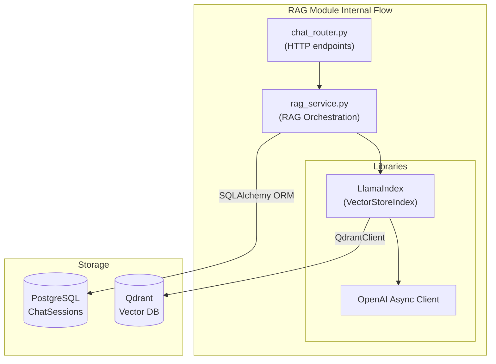
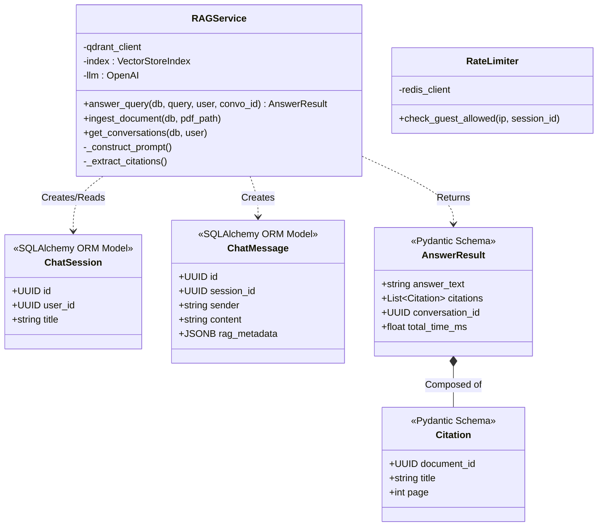

# Module Specification: RAG & Chat (`RAGService`)

## Features
- **What it does:**
  - Ingests PDF documents by chunking their text, preserving metadata (page numbers, titles), generating embeddings via SentenceTransformers, and storing them in Qdrant.
  - Answers user queries by finding semantically similar chunks in Qdrant and injecting them into a strict prompt template for an LLM (OpenAI `gpt-4.1-mini`).
  - Automatically extracts and formats exact citations (document title, page number) directly from the retrieved LlamaIndex nodes.
  - Persists entire chat conversations (Summarized Title, User history, AI history) into PostgreSQL if the user is authenticated.
  - Protects the `/api/chat/query` endpoint for guest users via a fast Redis-backed `RateLimiter`.
- **What it does NOT do:**
  - It does not generate or validate JWTs itself (it relies on `AuthService` dependencies).
  - It does not allow users to perform general-purpose chitchat (strict prompt framing forces the LLM to only answer from context).

## Internal Architecture & Justification

The `RAGService` encapsulates all interactions with vector databases and Large Language Models behind a clean, asynchronous service interface. It relies heavily on `LlamaIndex` to orchestrate the RAG pipeline.

**Justification:**
By abstracting the retrieval logic into `RAGService`, the FastAPI router (`chat_router.py`) only deals with HTTP requests and responses. We chose **LlamaIndex** because it is built specifically for document-centric external data ingestion, unlike LangChain which is more generic. LlamaIndex seamlessly handles the chunking, node creation, and metadata attachment required for our strict citation requirements. We utilize `async` calls for all LLM interactions (`llm.acomplete`) because network I/O to OpenAI is the single slowest part of the application, and async prevents worker thread starvation.



## Data Abstraction & Stable Storage

The module interacts with two distinct databases: Postgres for relational data, and Qdrant for spatial vector data.

**PostgreSQL Schemas:**
1.  **`chat_sessions`**:
    *   `id` (UUID, Primary Key)
    *   `user_id` (UUID, Foreign Key) - Links the session to a specific user.
    *   `title` (String) - Automatically generated by the LLM based on the first query.
    *   `wrapped_conversation_key` (Text) - Encrypted symmetric key used for E2EE chats.
    *   `created_at` (DateTime)
    *   `updated_at` (DateTime)
2.  **`chat_messages`**:
    *   `id` (UUID, Primary Key)
    *   `session_id` (UUID, Foreign Key)
    *   `sender` (String) - Either 'user' or 'ai'.
    *   `content` (String) - The raw text message (encrypted on client-side).
    *   `rag_metadata` (JSONB) - Stores the serialized citations, retrieval times, and chunk counts for AI messages.

**Qdrant Schema (Collection: `spiritual_docs`):**
*   **Vector**: 1536 dimensions (matching the default embedding model). Distance metric: Cosine.
*   **Payload (LlamaIndex Node metadata)**:
    *   `document_id` (UUID)
    *   `title` (String)
    *   `page` (Integer)
    *   `paragraph_id` (String)

## Class & Method Declarations

### `RAGService` Layer (`backend/app/services/rag_service.py`)

*   **State / Fields**:
    *   `-qdrant_client : QdrantClient`: Connection to Qdrant vector database.
    *   `-llm : OpenAI`: The configured async LLM client for answering.
    *   `-embed_model : BaseEmbedding`: The model used to vectorize chunks.
    *   `-vector_store : QdrantVectorStore`: The LlamaIndex abstraction over Qdrant.
    *   `-index : VectorStoreIndex`: The core index used for querying.
*   **Public Methods**:
    *   `+answer_query(db: Session, query: str, user_id: UUID, conversation_id: UUID) -> AnswerResult`: Main entry point. Retrieves context, calls LLM, saves to DB.
    *   `+ingest_document(db: Session, pdf_path: str, logical_book_id: str) -> None`: Reads PDF, chunks, embeds, stores in Qdrant, marks as ingested in Postgres.
    *   `+get_conversations(db: Session, user_id: UUID) -> List[ChatSession]`
*   **Private Methods**:
    *   `-_verify_authorization(...)`
    *   `-_construct_prompt(query: str, nodes: List[NodeWithScore], history: List[ChatMessage]) -> str`
    *   `-_extract_citations(nodes: List[NodeWithScore]) -> List[Citation]`
    *   `-_generate_conversation_title(query: str) -> str`

### `RateLimiter` Layer (`backend/app/services/rate_limiter.py`)
*   **State**: `-redis_client : Redis`
*   **Public Methods**:
    *   `+check_guest_allowed(ip_address: str, session_id: str) -> bool`: Verifies limits. Raises HTTP 429 if exceeded.

### Class Hierarchy Diagram



## API REST Contract

All operational routes are mounted under `/api/chat`. Ingestion is under `/admin`.

*   **`POST /api/chat/query`**: 
    *   Accepts `{"query": "...", "conversation_id": "...", "guest_session_id": "..."}`.
    *   Requires JWT Authorization header if attempting to save history.
    *   Returns 200 OK with `AnswerResult` (containing `answer_text`, `citations`, `conversation_id`).
*   **`GET /api/chat/conversations`**:
    *   Requires JWT Authorization header.
    *   Returns 200 OK with a list of `[{"id": "...", "title": "...", "created_at": "..."}]` sorted descending.
*   **`GET /api/chat/conversations/{conversation_id}`**:
    *   Requires JWT Authorization header. Checks ownership.
    *   Returns 200 OK with an ordered list of `ChatMessage` objects for the given session.
*   **`DELETE /api/chat/conversations/{conversation_id}`**:
    *   Requires JWT Authorization header. Checks ownership.
    *   Returns 200 OK with success message. Deletes conversation and all linked messages.
*   **`POST /api/chat/conversations/{conversation_id}/export`**:
    *   Requires JWT Authorization header. Checks ownership.
    *   Returns 200 OK with formatted Markdown text of the conversation.
*   **`POST /admin/documents`**:
    *   Requires Admin-level JWT Authorization.
    *   Accepts `multipart/form-data` with a PDF file upload.
    *   Returns 202 Accepted.


## LLM-Generated Source Code

Below is the LLM-generated code for the classes defined in this module.

### `rag_service.py`
```python
"""RAG service — orchestrates the full query pipeline.

Retrieves relevant passages from Qdrant, generates an answer
via OpenAI, persists messages, and returns citations.
"""

import time
import uuid
from typing import Optional

from sqlalchemy.ext.asyncio import AsyncSession

from app.config import Settings
from app.core.exceptions import ValidationError
from app.core.logging import get_logger
from app.rag.embedder import Embedder
from app.rag.llm_client import LLMClient
from app.rag.retriever import Retriever
from app.repositories.session_repo import MessageRepository, SessionRepository
from app.schemas.chat_schemas import (
    CitationResponse,
    QueryMetadata,
    QueryResponse,
)

logger = get_logger(__name__)


class RAGService:
    """Full RAG pipeline: validate → embed → retrieve → generate → persist."""

    def __init__(
        self,
        settings: Settings,
        session: AsyncSession,
    ) -> None:
        self._settings = settings
        self._session = session
        self._embedder = Embedder(settings)
        self._retriever = Retriever(settings)
        self._llm = LLMClient(settings)
        self._session_repo = SessionRepository(session)
        self._message_repo = MessageRepository(session)

    async def query(
        self,
        *,
        query_text: str,
        user_id: Optional[str] = None,
        conversation_id: Optional[str] = None,
    ) -> QueryResponse:
        """Process a user query through the full RAG pipeline.

        Args:
            query_text: The user's question (already validated for length).
            user_id: Authenticated user's ID, or None for guest.
            conversation_id: Existing conversation to continue, or None.

        Returns:
            QueryResponse with answer, citations, and metadata.
        """
        # --- Validate ---
        query_text = query_text.strip()
        if len(query_text) < 3:
            raise ValidationError(
                "Query too short",
                error_code="QUERY_TOO_SHORT",
            )
        if len(query_text) > self._settings.max_query_length:
            raise ValidationError(
                "Query too long",
                error_code="QUERY_TOO_LONG",
            )

        # --- Load conversation history (for authenticated users) ---
        history: list[dict] = []
        session_obj = None

        if user_id and conversation_id:
            try:
                recent = await self._message_repo.get_recent_pairs(
                    uuid.UUID(conversation_id),
                    limit=self._settings.rag_max_history_pairs,
                )
                history = [
                    {"sender": m.sender, "content": m.content}
                    for m in recent
                ]
            except Exception:
                logger.warning(
                    "Failed to load history for conversation"
                )

        # --- Embed query ---
        t_start = time.monotonic()
        query_vector = await self._embedder.embed_text(query_text)
        t_embed = time.monotonic()

        # --- Retrieve ---
        passages = await self._retriever.search(query_vector)
        t_retrieve = time.monotonic()

        # --- Generate answer ---
        answer = await self._llm.generate_answer(
            query=query_text,
            passages=passages,
            history=history,
        )
        t_generate = time.monotonic()

        # --- Citations ---
        citations = [
            CitationResponse(
                document_id=p["document_id"],
                title=p["title"],
                page=p["page"],
                paragraph_id=p["paragraph_id"],
                relevance_score=p.get("relevance_score"),
                passage_text=p.get("text"),
            )
            for p in passages
        ]

        # --- Persist for authenticated users ---
        result_conversation_id = conversation_id

        if user_id:
            if not conversation_id:
                # Create new conversation
                title = query_text[:100] + (
                    "..." if len(query_text) > 100 else ""
                )
                session_obj = await self._session_repo.create(
                    user_id=uuid.UUID(user_id),
                    title=title,
                )
                result_conversation_id = str(session_obj.id)

            session_uuid = uuid.UUID(result_conversation_id)

            # Save user message
            await self._message_repo.create(
                session_id=session_uuid,
                sender="user",
                content=query_text,
            )

            # Save assistant message with citation metadata
            await self._message_repo.create(
                session_id=session_uuid,
                sender="assistant",
                content=answer,
                rag_metadata={
                    "citations": [c.model_dump() for c in citations],
                },
            )
            await self._session.commit()

        # --- Metadata ---
        retrieval_ms = (t_retrieve - t_embed) * 1000
        llm_ms = (t_generate - t_retrieve) * 1000

        metadata = QueryMetadata(
            retrieval_time_ms=round(retrieval_ms, 1),
            llm_time_ms=round(llm_ms, 1),
            total_chunks_retrieved=len(passages),
        )

        logger.info(
            "RAG query completed (retrieval=%.0fms, llm=%.0fms, chunks=%d)",
            retrieval_ms, llm_ms, len(passages),
        )

        return QueryResponse(
            answer=answer,
            conversation_id=result_conversation_id,
            citations=citations,
            metadata=metadata,
        )
```

### `rate_limiter.py`
```python
"""Redis-backed rate limiter.

Uses INCR + EXPIRE for atomic, race-condition-free counters.
Each rate limit rule has its own key pattern and thresholds.
"""

import hashlib
from typing import Optional

from redis.asyncio import Redis

from app.config import Settings
from app.core.exceptions import RateLimitError
from app.core.logging import get_logger

logger = get_logger(__name__)


def _hash(value: str) -> str:
    """Hash a value for use in Redis keys (privacy + key-length safety)."""
    return hashlib.sha256(value.encode()).hexdigest()[:16]


class RateLimiter:
    """Redis-backed rate limiting for various actions."""

    def __init__(self, redis: Redis, settings: Settings) -> None:
        self._redis = redis
        self._settings = settings

    async def check_login(
        self, *, ip: str, email: str
    ) -> dict[str, str]:
        """Check and increment login attempt counter.

        Raises RateLimitError if limit exceeded.
        """
        key = f"rate:login:{_hash(ip)}:{_hash(email)}"
        return await self._check_and_increment(
            key=key,
            max_count=self._settings.rate_limit_login_max,
            window_seconds=self._settings.rate_limit_login_window_minutes * 60,
            action="login",
        )

    async def reset_login(self, *, ip: str, email: str) -> None:
        """Reset login attempts on successful login."""
        key = f"rate:login:{_hash(ip)}:{_hash(email)}"
        await self._redis.delete(key)

    async def check_register(self, *, ip: str) -> dict[str, str]:
        """Check and increment registration attempt counter."""
        key = f"rate:register:{_hash(ip)}"
        return await self._check_and_increment(
            key=key,
            max_count=self._settings.rate_limit_register_max,
            window_seconds=self._settings.rate_limit_register_window_minutes * 60,
            action="registration",
        )

    async def check_guest_query(
        self, *, ip: str, session_id: str
    ) -> dict[str, str]:
        """Check and increment guest query counter."""
        key = f"rate:guest:{_hash(ip)}:{_hash(session_id)}"
        return await self._check_and_increment(
            key=key,
            max_count=self._settings.rate_limit_guest_query_max,
            window_seconds=self._settings.rate_limit_guest_query_window_hours * 3600,
            action="guest query",
        )

    async def check_global(self, *, ip: str) -> dict[str, str]:
        """Check global per-IP rate limit."""
        key = f"rate:global:{_hash(ip)}"
        return await self._check_and_increment(
            key=key,
            max_count=self._settings.rate_limit_global_max,
            window_seconds=self._settings.rate_limit_global_window_seconds,
            action="request",
        )

    async def get_guest_remaining(
        self, *, ip: str, session_id: str
    ) -> int:
        """Get remaining guest queries."""
        key = f"rate:guest:{_hash(ip)}:{_hash(session_id)}"
        count = await self._redis.get(key)
        current = int(count) if count else 0
        return max(0, self._settings.rate_limit_guest_query_max - current)

    async def _check_and_increment(
        self,
        *,
        key: str,
        max_count: int,
        window_seconds: int,
        action: str,
    ) -> dict[str, str]:
        """Atomic check-and-increment via INCR + EXPIRE.

        Raises RateLimitError if the counter exceeds max_count.
        """
        count = await self._redis.incr(key)

        # Set TTL on first increment only
        if count == 1:
            await self._redis.expire(key, window_seconds)

        ttl = await self._redis.ttl(key)

        if count > max_count:
            logger.warning(
                "Rate limit exceeded: %s (key=%s, count=%d, max=%d)",
                action, key[:20], count, max_count,
            )
            raise RateLimitError(
                f"Too many {action} attempts. Please try again later.",
                details={
                    "retry_after": max(ttl, 0),
                    "remaining": 0,
                    "limit": max_count,
                },
            )

        return {
            "X-RateLimit-Limit": str(max_count),
            "X-RateLimit-Remaining": str(max(0, max_count - count)),
            "X-RateLimit-Reset": str(max(ttl, 0)),
        }
```

### `chat_session.py`
```python
"""Chat session ORM model."""

import uuid
from datetime import datetime, timezone

from sqlalchemy import DateTime, ForeignKey, String, Text
from sqlalchemy.dialects.postgresql import UUID
from sqlalchemy.orm import Mapped, mapped_column, relationship

from app.core.database import Base


class ChatSession(Base):
    """Represents a conversation. Authenticated users only."""

    __tablename__ = "chat_sessions"

    id: Mapped[uuid.UUID] = mapped_column(
        UUID(as_uuid=True),
        primary_key=True,
        default=uuid.uuid4,
    )
    user_id: Mapped[uuid.UUID] = mapped_column(
        UUID(as_uuid=True),
        ForeignKey("users.id", ondelete="CASCADE"),
        nullable=False,
        index=True,
    )
    title: Mapped[str | None] = mapped_column(
        String(500), nullable=True
    )
    wrapped_conversation_key: Mapped[str | None] = mapped_column(
        Text, nullable=True
    )
    created_at: Mapped[datetime] = mapped_column(
        DateTime(timezone=True),
        nullable=False,
        default=lambda: datetime.now(timezone.utc),
    )
    updated_at: Mapped[datetime] = mapped_column(
        DateTime(timezone=True),
        nullable=False,
        default=lambda: datetime.now(timezone.utc),
        onupdate=lambda: datetime.now(timezone.utc),
        index=True,
    )

    # Relationships
    user = relationship("User", back_populates="sessions")
    messages = relationship(
        "ChatMessage", back_populates="session", cascade="all, delete-orphan"
    )
```

### `chat_message.py`
```python
"""Chat message ORM model."""

import uuid
from datetime import datetime, timezone

from sqlalchemy import DateTime, ForeignKey, String, Text
from sqlalchemy.dialects.postgresql import JSONB, UUID
from sqlalchemy.orm import Mapped, mapped_column, relationship

from app.core.database import Base


class ChatMessage(Base):
    """Represents a single message in a conversation."""

    __tablename__ = "chat_messages"

    id: Mapped[uuid.UUID] = mapped_column(
        UUID(as_uuid=True),
        primary_key=True,
        default=uuid.uuid4,
    )
    session_id: Mapped[uuid.UUID] = mapped_column(
        UUID(as_uuid=True),
        ForeignKey("chat_sessions.id", ondelete="CASCADE"),
        nullable=False,
        index=True,
    )
    sender: Mapped[str] = mapped_column(
        String(20), nullable=False
    )
    content: Mapped[str] = mapped_column(
        Text, nullable=False
    )
    rag_metadata: Mapped[dict | None] = mapped_column(
        JSONB, nullable=True
    )
    created_at: Mapped[datetime] = mapped_column(
        DateTime(timezone=True),
        nullable=False,
        default=lambda: datetime.now(timezone.utc),
        index=True,
    )

    # Relationships
    session = relationship("ChatSession", back_populates="messages")
```

### `chat_schemas.py`
```python
"""Chat Pydantic schemas — request and response models."""

import uuid
from datetime import datetime
from typing import Optional

from pydantic import BaseModel, Field


# --- Query ---


class QueryRequest(BaseModel):
    """Chat query request. Supports guest and authenticated modes."""

    query: str = Field(min_length=1, max_length=2000)
    conversation_id: Optional[str] = Field(
        default=None,
        description="UUID of existing conversation (auth users)",
    )
    guest_session_id: Optional[str] = Field(
        default=None,
        description="UUID for guest rate-limit tracking",
    )

    @property
    def is_guest(self) -> bool:
        """Whether this is a guest query."""
        return self.guest_session_id is not None


class CitationResponse(BaseModel):
    """Citation referencing a source document passage."""

    document_id: Optional[str] = None
    title: Optional[str] = None
    page: Optional[int] = None
    paragraph_id: Optional[str] = None
    relevance_score: Optional[float] = None
    passage_text: Optional[str] = None


class QueryMetadata(BaseModel):
    """Performance/diagnostic metadata from the RAG pipeline."""

    retrieval_time_ms: Optional[float] = None
    llm_time_ms: Optional[float] = None
    total_chunks_retrieved: Optional[int] = None


class QueryResponse(BaseModel):
    """Chat query response with answer, citations, and metadata."""

    answer: str
    conversation_id: Optional[str] = None
    citations: list[CitationResponse] = Field(default_factory=list)
    metadata: Optional[QueryMetadata] = None
    guest_queries_remaining: Optional[int] = None


# --- Conversations ---


class ConversationSummary(BaseModel):
    """Lightweight conversation metadata for listing."""

    id: str
    title: Optional[str] = None
    created_at: datetime
    updated_at: datetime
    message_count: int = 0
    last_message_preview: Optional[str] = None


class MessageResponse(BaseModel):
    """A single message in a conversation."""

    id: str
    sender: str
    content: str
    citations: list[CitationResponse] = Field(default_factory=list)
    timestamp: datetime


class ExportResponse(BaseModel):
    """Exported conversation data."""

    export_data: str
```
