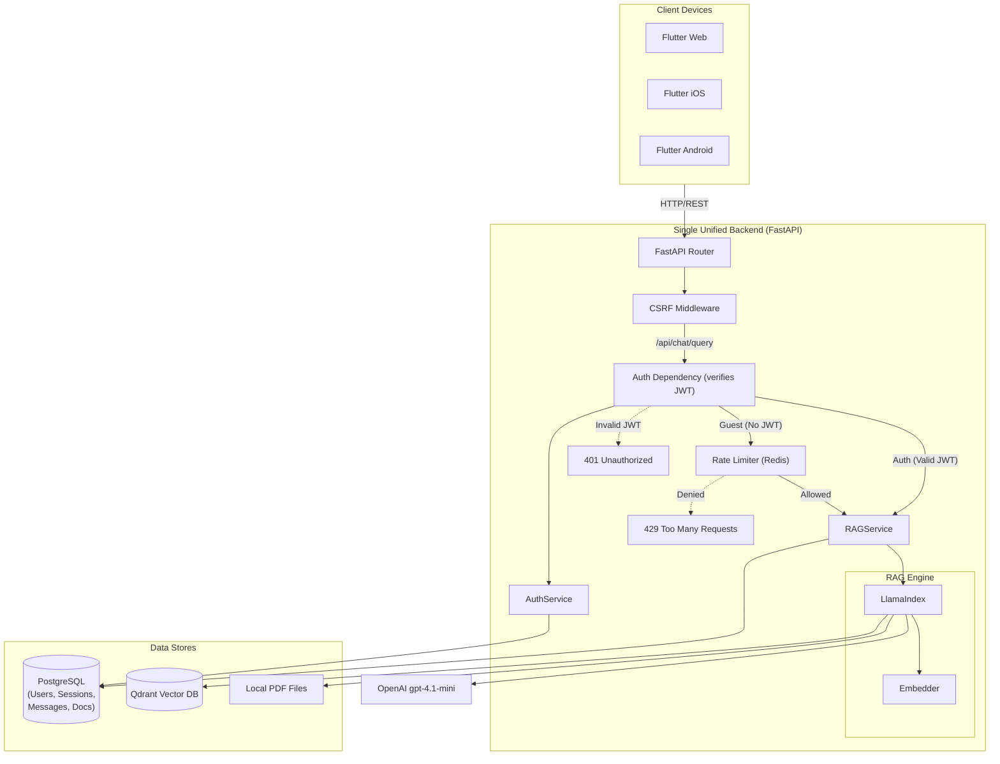
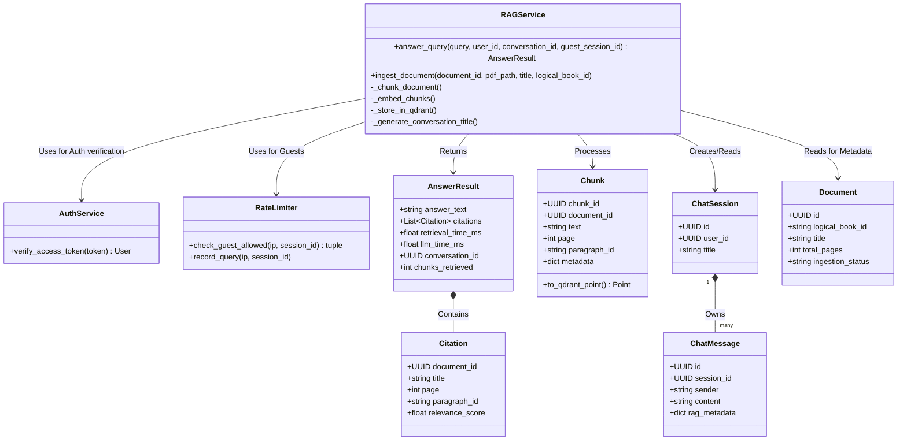
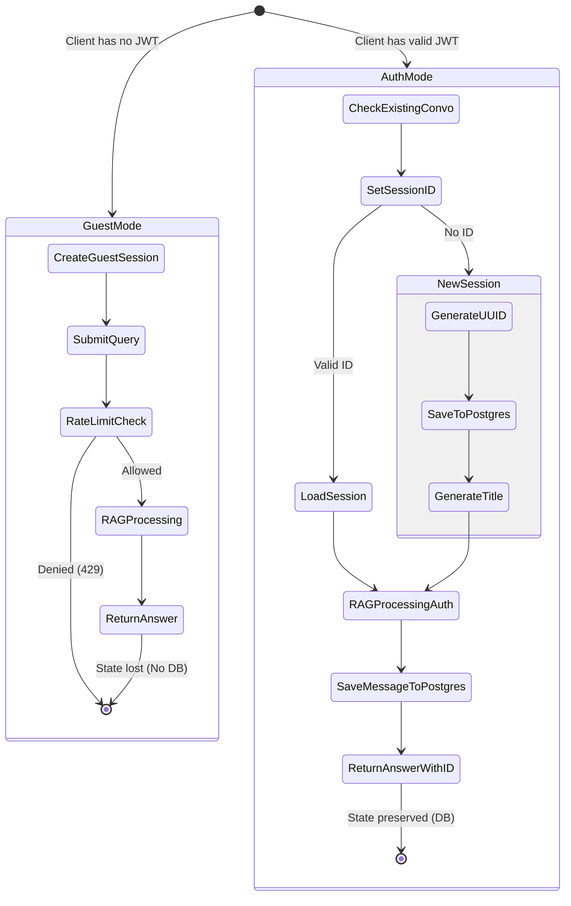

# User Story 1: Spiritual Guide Query (Core RAG) - Harmonized Spec

**As a** spiritual seeker (guest or authenticated),
**I want** to receive answers based strictly on the organization's proprietary texts
**so that** I get authentic philosophical guidance without internet noise.

---

## Architecture Diagram (Unified Backend)



### Harmonized Backend Context
*This specification assumes a single, unified backend powers both this RAG capability and the authentication system (Story 2). All endpoints are served by the same FastAPI application. The `RAGService` seamlessly integrates with the `AuthService` (for user ID extraction from JWTs) and shared PostgreSQL database (for persisting `chat_sessions` and `chat_messages` linked to `users`).*

---

## Where Components Run
*   **Client**: Flutter app in browser/iOS/Android (front-end only)
*   **Backend**: FastAPI app on a cloud VM/container, behind HTTPS and reverse proxy (serving both Chat and Auth APIs)
*   **Data**: Postgres, Qdrant, and local PDF storage on server/VM (Docker volumes)
*   **LLM**: OpenAI gpt-4.1-mini via Internet

## Information Flows
1.  **Client** → `POST /api/chat/query`: Sends `query`. Optional `conversation_id`, optional `JWT` (in Authorization header), optional `guest_session_id`. Includes CSRF token header (web).
2.  **Unified Backend**:
    *   Verifies JWT via `AuthService` (if present).
    *   For guests, checks rate limits via `RateLimiter` using IP + `guest_session_id` in Redis.
    *   Calls `RAGService` to execute RAG flow.
3.  **RAGService**:
    *   Uses LlamaIndex to retrieve chunks from Qdrant.
    *   Calls OpenAI gpt-4.1-mini with context.
    *   Constructs answer and citations.
4.  **Backend Data Persistence**:
    *   If authenticated: Persists session and messages to shared PostgreSQL database (linking to User records).
    *   Returns answer or error with consistent API shape.

## Class Diagram



## State Diagrams

### Chat Session Lifecycle (Authenticated Only)


*Note: Guest queries do not create persistent sessions; context is per-request only.*

## Chunking Strategy Details
*   **Method**: Sentence-based chunking with token counting
*   **Target chunk size**: 500 tokens (~375 words)
*   **Overlap**: 50 tokens between consecutive chunks
*   **Paragraph preservation**: Try to keep paragraphs together when possible
*   **Page boundaries**: Track page numbers for citation
*   **Paragraph IDs**: Assign sequential IDs (p1, p2, p3...) per page

## LLM Configuration & Prompt Template
*   **Model**: `gpt-4.1-mini`
*   **Retrieval Parameters**: `top_k: 5`, `similarity_threshold: 0.7`
*   **Prompt Template**:
    ```text
    You are a knowledgeable spiritual guide assistant for [Organization]. 
    Your role is to provide accurate answers based STRICTLY on the provided context 
    from our organization's sacred texts.

    Guidelines:
    1. Answer ONLY based on the provided context
    2. If the context lacks information, say: "I don't have enough information in our texts..."
    3. Maintain a respectful, contemplative tone
    4. Do not speculate. Reference specific passages when possible

    Context:
    {context_str}

    Question: {query_str}

    Answer:
    ```
*   **Conversation History Handling** (Authenticated users): Last 5 message pairs included in context.

## Citation Generation Logic
LlamaIndex returns `NodeWithScore` objects containing chunk text, score, and metadata.
Citations are generated by mapping metadata (`document_id`, `page`, `paragraph_id`), and duplicates are removed if multiple chunks come from the same page/paragraph. Ordered by relevance score.

## Development Risks and Failures
*   **OpenAI API rate limits or failures**: Mitigation - Implement retry logic with exponential backoff, show clear error messages.
*   **Qdrant performance degradation**: Mitigation - Index optimization, consider sharding.
*   **Guest rate limiting bypass**: Mitigation - Combine IP + session ID tracking in Redis.
*   **Citation accuracy**: Mitigation - Manual spot-checks of chunk boundaries during parsing.

## REST APIs (External Contracts)

**POST /api/chat/query**
Description: Submit a question to the RAG system and receive an answer with citations.

*   **Authentication**: Optional (JWT Bearer)
*   **Request Body**:
    ```json
    {
      "query": "What is the meaning of karma?",
      "conversation_id": "550e..." ,  // Optional
      "guest_session_id": "660e..."   // Required for guests
    }
    ```
*   **Success Response (200)**:
    ```json
    {
      "answer": "Karma refers to...",
      "citations": [
        {
          "document_id": "770e...",
          "title": "Bhagavad Gita Commentary",
          "page": 42,
          "paragraph_id": "p3",
          "relevance_score": 0.89
        }
      ],
      "conversation_id": "550e...",
      "metadata": { "retrieval_time_ms": 124.5, "chunks_retrieved": 5 }
    }
    ```
*   **Errors**: 400 Validation, 429 Rate Limit, 401 Unauthorized, 503 LLM Error.

**GET /api/chat/conversations**
Description: Returns list of conversations for authenticated user. Requires Authentication.

**POST /admin/documents/ingest**
Description: Upload PDF into RAG system. Requires Admin Role Authentication.

## PostgreSQL Data Schemas
*   **chat_sessions**: `id` (UUID), `user_id` (FK to users), `title`, `wrapped_conversation_key`, `created_at`, `updated_at`
*   **chat_messages**: `id` (UUID), `session_id` (FK to chat_sessions), `sender`, `content`, `rag_metadata` (JSONB), `created_at`
*   **documents**: `id` (UUID), `logical_book_id`, `title`, `file_path`, `total_pages`

*(Note: The corresponding `users`, `user_e2ee_keys`, and `revoked_tokens` tables live in the same PostgreSQL database, managed by the unified backend).*

## Security and Privacy
1.  **Guest Session Privacy**: No DB persistence. Used solely for rate limiting.
2.  **Document Access**: Public reading (via RAG), Admin-only ingestion.
3.  **Input Sanitization**: Block empty queries, enforce 2000 char max length.
4.  **LLM Security**: Protect against prompt injection via strict system prompts. Do not echo user input into instructions.
5.  **Database Security**: Shared PostgreSQL connection pool using parameterized SQL (via SQLAlchemy/Alembic).
