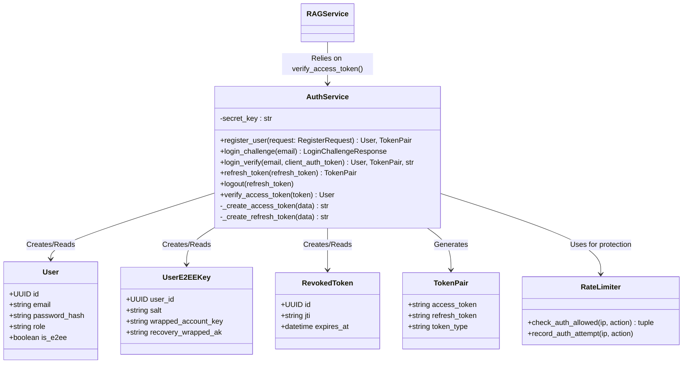
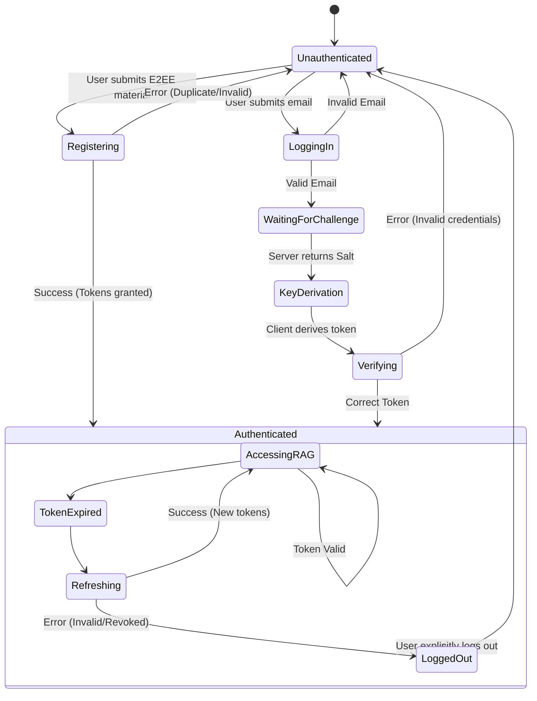

# User Story 2: User Registration & Onboarding - Harmonized Spec

**As a** new user,
**I want** to create an account and log in securely
**so that** I can save my Q&A history and receive personalized guidance over time.

---

## Architecture Diagram (Unified Backend)

```mermaid
flowchart TD
    %% Client Layer
    subgraph Client ["Client Devices"]
        FW["Flutter Web\n(Secure/HttpOnly Cookies)"]
        FM["Flutter Mobile (iOS/Android)\n(Secure Storage)"]
    end

    %% Unified Backend Layer
    subgraph UnifiedBackend ["Single Unified Backend (FastAPI)"]
        direction TB
        
        API_GW["FastAPI Router"]
        CSRF["CSRF Middleware"]
        RL["Rate Limiter (Redis)"]
        
        AuthSvc["AuthService\n(Client Key Verification,\nJWT Generation)"]
        RAGSvc["RAGService\n(Protected Routes)"]
        
        API_GW --> CSRF
        CSRF --> |"/auth/register", "/auth/login", "/auth/login/verify"| RL
        RL --> AuthSvc
        
        %% Demonstrating the unified nature
        AuthSvc -. "Validates Token for" .-> RAGSvc
    end

    %% Data Layer
    subgraph DataLayer ["Data Stores"]
        PG[("PostgreSQL\n(Users, RevokedTokens,\nChatSessions)")]
        Redis[("Redis\n(Rate Limiting)")]
    end

    %% Flow connections
    Client --> |"HTTPS"| API_GW
    AuthSvc --> |"Read/Write User"| PG
    RL --> |"Check limits"| Redis
    AuthSvc --> |"Read/Write Token"| PG
```

### Harmonized Backend Context
*This specification describes the authentication flow that exists within the **same** unified FastAPI backend as the RAG Chat system (Story 1). The `AuthService` handles registration, login, and JWT issuance. The tokens issued here are later passed to the `RAGService`'s protected routes (e.g., `/api/chat/query`) to identify users, allowing the unified backend to store chat history associated with the specific user in the shared PostgreSQL database.*

---

## Where Components Run
*   **Client**: Flutter app (Web, iOS, Android).
*   **Backend**: FastAPI application (unified with Chat services).
*   **Database**: PostgreSQL (shared with Chat services) and Redis.

## Information Flows
### Registration (E2EE)
1.  **Client** → `POST /api/auth/register`: Sends `email`, `client_auth_token`, `salt`, `wrapped_account_key`, and `recovery_wrapped_ak`.
2.  **API Gateway**: For Web, validates CSRF.
3.  **Rate Limiter**: Checks Redis if IP has exceeded registration limits.
4.  **AuthService**:
    *   Checks PostgreSQL if email exists.
    *   Creates User and E2EE key records in PostgreSQL.
    *   Generates Access (15m) and Refresh (7d) JWTs.
5.  **Response**:
    *   **Mobile**: Returns tokens in JSON body.
    *   **Web**: Returns 200 OK, sets `refresh_token` as Secure HttpOnly Cookie.

### Login (E2EE Two-Step)
1.  **Client** → `POST /api/auth/login` (Challenge): Sends `email`.
2.  **API Gateway**: For Web, validates CSRF.
3.  **Rate Limiter**: Checks Redis if IP has exceeded login attempt limits.
4.  **AuthService** (Challenge):
    *   Retrieves User and their `salt` from PostgreSQL by email.
    *   Returns the `salt` (and `recovery_wrapped_ak`) to the client.
5.  **Client**: Key Derivation. Derives local keys using password and `salt`.
6.  **Client** → `POST /api/auth/login/verify` (Verify): Sends `email` and derived `client_auth_token`.
7.  **AuthService** (Verify):
    *   Verifies `client_auth_token` matches expected backend hash.
    *   Generates new Access and Refresh JWTs.
8.  **Response**: Returns tokens plus the `wrapped_account_key` (so client can unwrap and access their vault).

### Token Refresh
1.  **Client** → `POST /auth/refresh`:
    *   **Mobile**: Sends `refresh_token` in JSON body.
    *   **Web**: Browser automatically sends `refresh_token` HttpOnly cookie.
2.  **AuthService**:
    *   Verifies Refresh JWT signature and expiration.
    *   Checks PostgreSQL `revoked_tokens` table to ensure token hasn't been reused.
    *   Saves the old `refresh_token` to `revoked_tokens` (Token Rotation).
    *   Generates new Access and Refresh JWTs.
3.  **Response**: Same as Registration.

## Class Diagram



## State Diagrams

### Unified Authentication Flow



## Security and Privacy
1.  **Password Storage**: Client-side key derivation (Scrypt/HKDF). The backend never sees the plaintext password. The backend stores another hash (Argon2) of the `client_auth_token`.
2.  **Token Storage**:
    *   **Mobile**: `flutter_secure_storage` (Keychain/Keystore).
    *   **Web**: `refresh_token` and `access_token` are `HttpOnly`, `Secure`, `SameSite=Strict` cookies.
3.  **Token Rotation**: Refresh tokens are single-use. The old token's JTI is saved to postgres upon refresh. If a revoked token is used, it indicates a potential breach.
4.  **Token Expiration**: Access tokens are short-lived (15 mins) to minimize the window of attack if intercepted.
5.  **Brute Force Protection**: Redis-backed rate limiter specifically on `/api/auth/login` and `/api/auth/register` endpoints.

## REST APIs (External Contracts)

**POST /api/auth/register**
Description: Register a new user with E2EE keys.
*   **Request Body**:
    ```json
    { 
      "email": "user@example.com", 
      "client_auth_token": "...",
      "salt": "...",
      "wrapped_account_key": "...",
      "recovery_wrapped_ak": "..."
    }
    ```
*   **Success Response (Web) (200)**: Sets HttpOnly secure cookies. JSON body shows tokens.
*   **Success Response (Mobile) (200)**: Returns tokens in JSON body.
*   **Errors**: 400 Validation, 400 Email already exists, 429 Rate Limit.

**POST /api/auth/login** (Challenge)
Description: Get user's salt for client-side key derivation.
*   **Request Body**: `{ "email": "user@example.com" }`
*   **Response (200)**: `{ "salt": "...", "recovery_wrapped_ak": "..." }`

**POST /api/auth/login/verify** (Verify)
Description: Verify derived token and authenticate.
*   **Request Body**: `{ "email": "user@example.com", "client_auth_token": "..." }`
*   **Response (200)**: Standard token pair + `wrapped_account_key`.
*   **Errors**: 401 Invalid Credentials, 429 Rate Limit.

**POST /api/auth/refresh**
Description: Get a new access token using a refresh token.
*   **Request (Mobile)**:
    ```json
    { "refresh_token": "..." }
    ```
*   **Request (Web)**: Automatically sends HttpOnly Cookie.
*   (Response shape identical to Registration).
*   **Errors**: 401 Unauthorized (Invalid/Expired/Revoked token).

**POST /api/auth/logout**
Description: Invalidate the user's refresh token.
*   **Authentication**: Required (JWT Bearer)
*   **Errors**: 401 Unauthorized.

## PostgreSQL Data Schemas
*   **users**: `id` (UUID), `email` (String, Unique), `password_hash` (String), `role` (String), `is_e2ee` (Boolean), `created_at` (Datetime), `updated_at` (Datetime).
*   **user_e2ee_keys**: `user_id` (UUID), `salt` (LargeBinary/Base64), `wrapped_account_key` (String), `recovery_wrapped_ak` (String), `created_at` (Datetime), `updated_at` (Datetime).
*   **revoked_tokens**: `id` (UUID), `jti` (String, Unique), `expires_at` (Datetime, used for periodic cleanup by the backend).

*(Note: The corresponding `chat_sessions` and `chat_messages` tables live in the same PostgreSQL database, managed by the unified backend).*
