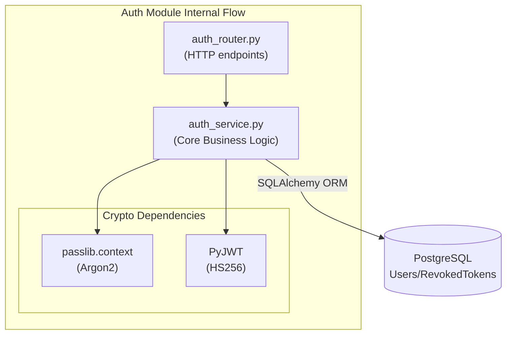
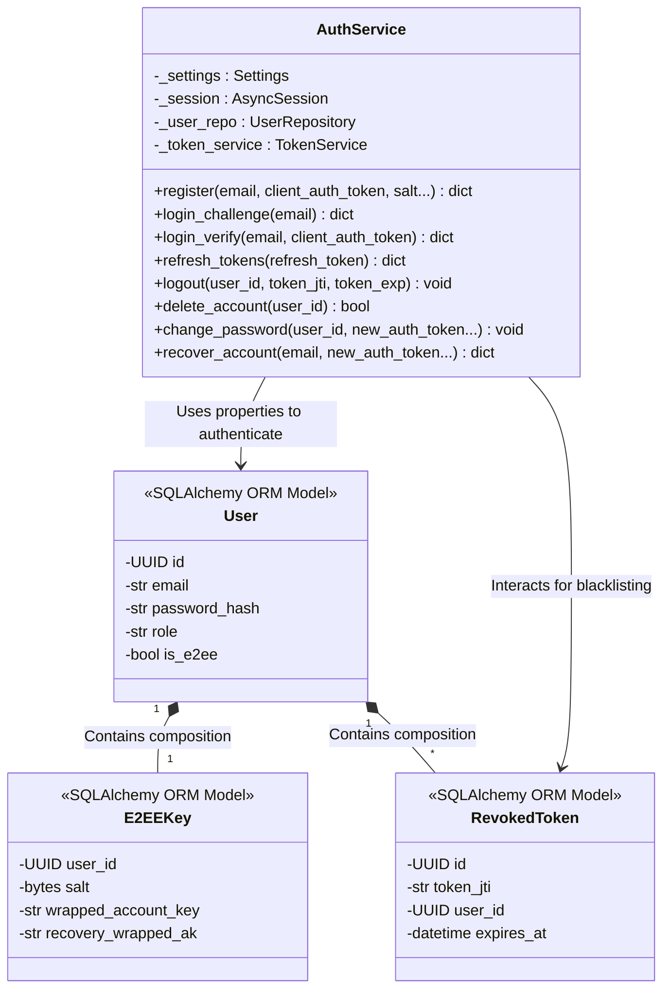

# Module Specification: Authentication (`AuthService`)

## Features
- **What it does:**
  - Registers new users, securely validating client-derived E2EE authentication tokens.
  - Authenticates existing users via a two-step challenge/verify mechanism (E2EE).
  - Generates secure stateless Access Tokens (JWTs) with a short lifespan (15 minutes).
  - Generates secure Refresh Tokens (JWTs) with a long lifespan (7 days).
  - Manages Token Rotation by recording used refresh tokens into a Postgres database to prevent replay attacks.
  - Provides a Python dependency (`get_current_user`) for other FastAPI routes to verify JWTs and extract the current user context.
- **What it does NOT do:**
  - Does not manage any user roles or dynamic permissions (authorization). Only basic authentication (verifying identity).
  - Does not handle session rate-limiting directly (handled by `RateLimiter`).

## Internal Architecture & Justification

The `AuthService` follows a clean architecture pattern separating the API routing layer (`auth_router.py`) from the business logic layer (`auth_service.py`). The router handles HTTP requests (e.g., extracting JSON bodies and cookies), while the service handles the cryptography and database transactions.

**Justification:**
This separation ensures that the core hashing logic and token generation are completely decoupled from FastAPI. This makes the `AuthService` highly testable via unit tests without needing to mock HTTP requests via `TestClient`. We implemented **End-to-End Encryption (E2EE)**, meaning the backend never sees plain passwords. Instead, it issues a `salt` challenge, verifies an HKDF-derived `client_auth_token` (hashed again on the server with Argon2 for storage), and returns a `wrapped_account_key`. We chose **JWTs** (JSON Web Tokens) instead of stateful server sessions so that the backend can scale horizontally without needing to sync a centralized session store. Token Rotation was implemented to mitigate the risks of refresh token theft.

## Data Abstraction

To formalize the data abstraction used in the module (referencing MIT’s 6.005 paradigms), we define the authentication system as an Abstract Data Type (ADT):

*   **Abstract State**: The abstract state consists of a set of registered identities (users and their E2EE credentials) and a list of invalidated/expired sessions.
*   **Representation (Rep)**: The representation uses a relational database pattern mapping to SQL models (`User`, `E2EEKey`, `RevokedToken`), plus stateless HMAC-signed JSON Web Tokens on the client.
*   **Representation Invariant (RI)**: Every `user_id` inside `E2EEKey` and `RevokedToken` must trace back to a valid, existing `id` in the `users` table. Email addresses must be strictly unique within the system. Revoked JWTs must have a unique `jti`.
*   **Abstraction Function (AF(Rep))**: Maps the physical database rows and valid cryptographic JWT signatures down to the logical set of authenticated platform users.

## Stable Storage

We determined that the stable storage mechanism for the module must be a robust relational database (PostgreSQL) accessed via SQLAlchemy ORM. Relying on an in-memory data structure (like Python dictionaries) is completely unacceptable; if the application process crashes or the Docker container restarts, all registered users and the token revocation blacklist would be instantly lost. Customers hate data loss, so writing transactions securely to Postgres guarantees data durability.

## Data Schemas

The following schemas define how data is structured to communicate with the PostgreSQL storage database:

1.  **`users` Table (User Accounts)**:
    *   `id`: UUID, Primary Key.
    *   `email`: String(255), Unique, Indexed.
    *   `password_hash`: String(255).
    *   `role`: String(50), default "user".
    *   `is_e2ee`: Boolean, default True.
    *   `created_at`: DateTime(timezone=True).
    *   `updated_at`: DateTime(timezone=True).

2.  **`user_e2ee_keys` Table (E2EE Key Material)**:
    *   `user_id`: UUID, Primary Key, Foreign Key to `users.id`.
    *   `salt`: LargeBinary.
    *   `wrapped_account_key`: String.
    *   `recovery_wrapped_ak`: String.
    *   `created_at`: DateTime(timezone=True).
    *   `updated_at`: DateTime(timezone=True).

3.  **`revoked_tokens` Table (Token Blacklist)**:
    *   `id`: UUID, Primary Key.
    *   `token_jti`: String(255), Unique, Indexed (the refresh token's unique ID).
    *   `user_id`: UUID, Foreign Key to `users.id`.
    *   `revoked_at`: DateTime(timezone=True).
    *   `expires_at`: DateTime(timezone=True), Indexed (used to purge expired rows).

## API for External Callers (REST Contract)

The module exposes a clear, unambiguous REST API for external web and mobile clients:

*   **`POST /api/auth/register`**
    *   *Body:* `{"email", "client_auth_token", "salt", "wrapped_account_key", "recovery_wrapped_ak"}`
    *   *Returns:* 200 OK with `{"user_id", "access_token", "refresh_token", "access_expires_at"}`
*   **`POST /api/auth/login`** (Challenge Step)
    *   *Body:* `{"email"}`
    *   *Returns:* 200 OK with `{"salt", "recovery_wrapped_ak"}`
*   **`POST /api/auth/login/verify`** (Verification Step)
    *   *Body:* `{"email", "client_auth_token"}`
    *   *Returns:* 200 OK with `{"user_id", "access_token", "refresh_token", "access_expires_at", "wrapped_account_key"}`
*   **`POST /api/auth/refresh`**
    *   *Body:* `{"refresh_token"}` (Web clients can optionally send this via secure cookies)
    *   *Returns:* 200 OK with new `{"access_token", "refresh_token", "access_expires_at"}`
*   **`POST /api/auth/logout`**
    *   *Headers:* Requires valid `Authorization: Bearer <access_token>`
    *   *Returns:* 200 OK (Revokes the current refresh token).

## Class & Method Declarations

Below is the list of all class, method, and field declarations, explicitly identifying whether they are externally visible (to other modules or routers) or strictly private to the auth module.

### `AuthService` (Core Business Logic)
*   **Fields**:
    *   `_settings` : Settings *(Private)*
    *   `_session` : AsyncSession *(Private)*
    *   `_user_repo` : UserRepository *(Private)*
    *   `_token_service` : TokenService *(Private)*
*   **Methods**:
    *   `register(email, client_auth_token, salt, wrapped_account_key, recovery_wrapped_ak)` -> dict *(Externally Visible)*
    *   `login_challenge(email)` -> dict *(Externally Visible)*
    *   `login_verify(email, client_auth_token)` -> dict *(Externally Visible)*
    *   `refresh_tokens(refresh_token)` -> dict *(Externally Visible)*
    *   `logout(user_id, token_jti, token_exp)` -> None *(Externally Visible)*
    *   `delete_account(user_id)` -> bool *(Externally Visible)*
    *   `change_password(user_id, new_auth_token, new_wrapped_account_key)` -> None *(Externally Visible)*
    *   `recover_account(email, new_auth_token, new_wrapped_account_key)` -> dict *(Externally Visible)*

### `User` (SQLAlchemy ORM Model)
*   **Fields** (Mapped to SQL Schema):
    *   `id` : UUID *(Private to module)*
    *   `email` : str *(Private to module)*
    *   `password_hash` : str *(Private to module)*
    *   `role` : str *(Private to module)*
    *   `is_e2ee` : bool *(Private to module)*
    *   `created_at` : datetime *(Private to module)*
    *   `updated_at` : datetime *(Private to module)*
    *   `e2ee_keys` : Relationship *(Private to module)*
    *   `sessions` : Relationship *(Private to module)*
    *   `revoked_tokens` : Relationship *(Private to module)*

### `RevokedToken` (SQLAlchemy ORM Model)
*   **Fields** (Mapped to SQL Schema):
    *   `id` : UUID *(Private to module)*
    *   `token_jti` : str *(Private to module)*
    *   `user_id` : UUID *(Private to module)*
    *   `revoked_at` : datetime *(Private to module)*
    *   `expires_at` : datetime *(Private to module)*
    *   `user` : Relationship *(Private to module)*

### `E2EEKey` (SQLAlchemy ORM Model)
*   **Fields** (Mapped to SQL Schema):
    *   `user_id` : UUID *(Private to module)*
    *   `salt` : bytes *(Private to module)*
    *   `wrapped_account_key` : str *(Private to module)*
    *   `recovery_wrapped_ak` : str *(Private to module)*

*(Note: ORM models are strictly restricted to the internal repository and service layers. They are completely sealed off from external callers, who only receive primitive dictionaries or Pydantic representations from the REST API.)*

## Class Hierarchy Diagram

The module-internal view of each class, mapping out dependencies and properties.

