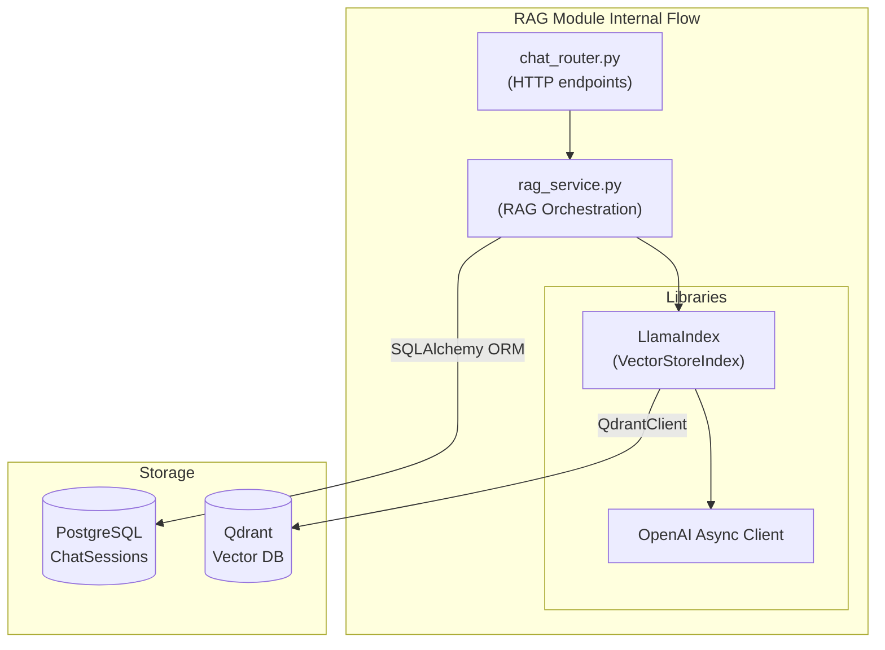
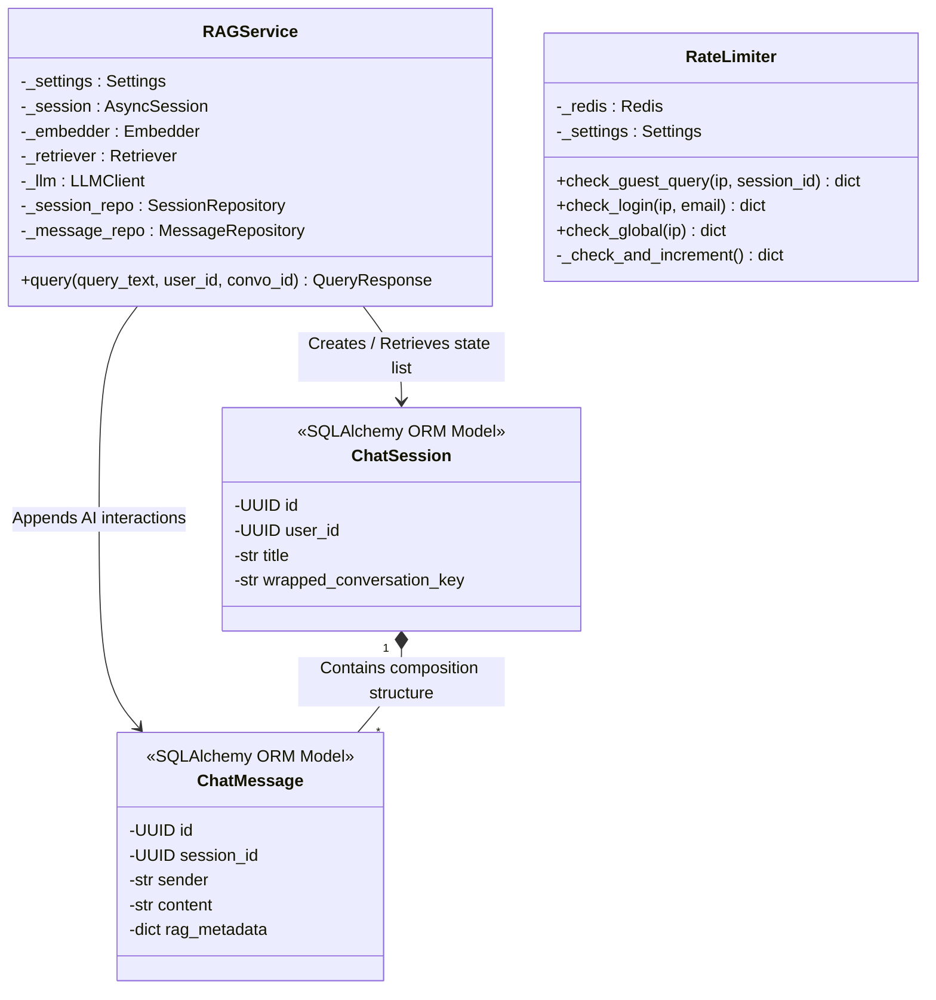

# Module Specification: RAG & Chat (`RAGService`)

## Features
- **What it does:**
  - Ingests PDF documents by chunking their text, preserving metadata (page numbers, titles), generating embeddings via SentenceTransformers, and storing them in Qdrant.
  - Answers user queries by finding semantically similar chunks in Qdrant and injecting them into a strict prompt template for an LLM (OpenAI `gpt-4.1-mini`).
  - Automatically extracts and formats exact citations (document title, page number) directly from the retrieved LlamaIndex nodes.
  - Persists entire chat conversations (Summarized Title, User history, AI history) into PostgreSQL if the user is authenticated.
  - Protects the `/api/chat/query` endpoint for guest users via a fast Redis-backed `RateLimiter`.
- **What it does NOT do:**
  - It does not generate or validate JWTs itself (it relies on `AuthService` dependencies).
  - It does not allow users to perform general-purpose chitchat (strict prompt framing forces the LLM to only answer from context).

## Internal Architecture & Justification

The `RAGService` encapsulates all interactions with vector databases and Large Language Models behind a clean, asynchronous service interface. It relies heavily on `LlamaIndex` to orchestrate the RAG pipeline.

**Justification:**
By abstracting the retrieval logic into `RAGService`, the FastAPI router (`chat_router.py`) only deals with HTTP requests and responses. We chose **LlamaIndex** because it is built specifically for document-centric external data ingestion, unlike LangChain which is more generic. LlamaIndex seamlessly handles the chunking, node creation, and metadata attachment required for our strict citation requirements. We utilize `async` calls for all LLM interactions (`llm.acomplete`) because network I/O to OpenAI is the single slowest part of the application, and async prevents worker thread starvation.

## Data Abstraction

To formalize the data abstraction used in the module (referencing MIT’s 6.005 paradigms), we define the RAG/Chat subsystem as an Abstract Data Type (ADT):

*   **Abstract State**: A growing set of user-owned conversational threads mapping plain-text queries to AI-generated analytical answers, grounded with verifiable citations.
*   **Representation (Rep)**: Dual-database architecture using relation mappings in PostgreSQL (`chat_sessions`, `chat_messages`) for continuous chat history and metadata, paired with high-dimensional floating-point arrays inside a Qdrant Vector Database `spiritual_docs` collection.
*   **Representation Invariant (RI)**: Every `session_id` stored within a `chat_message` must correspond to a valid primary key inside the `chat_sessions` boundary. Every document vector inserted into Qdrant must perfectly align with the embedding model's dimension space (e.g., exactly 1536 float elements) and must never lack `document_id` node metadata.
*   **Abstraction Function (AF(Rep))**: Transforms the union of relational message log tuples and high-dimensional document search vectors into the logical human concept of a continuous, intellectually-sourced AI tutor session.

## Stable Storage

We determined that the stable storage mechanism for the module requires two robust persistence layers: **PostgreSQL** (accessed via SQLAlchemy ORM) for structured relational chat history, and **Qdrant** for spatial vector embeddings. 

Relying strictly on memory-based storage patterns (such as standard arrays, python dicts, or ephemeral memory-mapped nodes) for either of these datasets is completely unacceptable. If the server process crashes or resets, all saved user chat continuity would be instantaneously erased, causing immense frustration. Even worse, if the RAG chunk nodes were only placed in volatile memory, the application would need to re-parse and re-embed all master PDF documents against the OpenAI API on every boot sequence, resulting in disastrous delays and unacceptable monetary costs. Storing them durably on disk mitigates this risk fully.

## Data Schemas

The following schemas define how data is structured to communicate with our storage databases:

**PostgreSQL Relational Schemas:**
1.  **`chat_sessions` Table (Conversation Threads)**:
    *   `id`: UUID, Primary Key.
    *   `user_id`: UUID, Foreign Key.
    *   `title`: String(500), Nullable.
    *   `wrapped_conversation_key`: Text, Nullable (E2EE usage).
    *   `created_at`: DateTime(timezone=True), Indexed.
    *   `updated_at`: DateTime(timezone=True), Indexed.

2.  **`chat_messages` Table (Individual Messages)**:
    *   `id`: UUID, Primary Key.
    *   `session_id`: UUID, Foreign Key to `chat_sessions.id`.
    *   `sender`: String(20) (e.g., 'user', 'assistant').
    *   `content`: Text.
    *   `rag_metadata`: JSONB (Stores JSON serialized citations, retrieval times, and chunk counts).
    *   `created_at`: DateTime(timezone=True), Indexed.

**Qdrant Search Schema (Collection: `spiritual_docs`)**:
*   **Vector**: 1536 dimensions (matching the default `text-embedding-3-small` shape). Distance Metric: `Cosine`.
*   **Payload (LlamaIndex Node metadata)**:
    *   `document_id`: UUID
    *   `title`: String
    *   `page`: Integer
    *   `paragraph_id`: String

## API for External Callers (REST Contract)

The module exposes a clear, unambiguous REST API for consumption by external applications over the web. All operational routes are mounted under `/api/chat`.

*   **`POST /api/chat/query`**
    *   *Description*: Primary endpoint for invoking the RAG pipeline.
    *   *Body:* `{"query": "User question", "conversation_id": "<UUID or null>", "guest_session_id": "<UUID or null>"}`
    *   *Returns:* 200 OK with fully hydrated `AnswerResult` containing the `answer` string, `conversation_id`, and a list of `citations`.
*   **`GET /api/chat/conversations`**
    *   *Headers:* Requires valid JWT `Authorization`.
    *   *Returns:* 200 OK with a summarized list of the authenticated user's past conversational queries.
*   **`GET /api/chat/conversations/{conversation_id}`**
    *   *Headers:* Requires valid JWT `Authorization`.
    *   *Returns:* 200 OK with the chronologically ordered list of `ChatMessage` objects for that thread.
*   **`DELETE /api/chat/conversations/{conversation_id}`**
    *   *Headers:* Requires valid JWT `Authorization`.
    *   *Returns:* 200 OK status. Cascade-deletes the session and associated logs.
*   **`POST /admin/documents`** (Admin Route)
    *   *Headers:* Requires Admin-role JWT `Authorization`.
    *   *Body:* `multipart/form-data` with raw PDF file upload bytes.
    *   *Returns:* 202 Accepted representing background chunking kickoff.

## Class & Method Declarations

Below is the list of all class, method, and field declarations, explicitly identifying whether they are externally visible (to other modules or routers) or strictly restricted to internal RAG module bounds.

### `RAGService` (Core RAG Orchestration)
*   **Fields**:
    *   `_settings` : Settings *(Private)*
    *   `_session` : AsyncSession *(Private)*
    *   `_embedder` : Embedder *(Private)*
    *   `_retriever` : Retriever *(Private)*
    *   `_llm` : LLMClient *(Private)*
    *   `_session_repo` : SessionRepository *(Private)*
    *   `_message_repo` : MessageRepository *(Private)*
*   **Methods**:
    *   `query(query_text, user_id, conversation_id)` -> QueryResponse *(Externally Visible)*

### `RateLimiter` (Access Control & Security)
*   **Fields**:
    *   `_redis` : Redis *(Private)*
    *   `_settings` : Settings *(Private)*
*   **Methods**:
    *   `check_login(ip, email)` -> dict *(Externally Visible)*
    *   `reset_login(ip, email)` -> None *(Externally Visible)*
    *   `check_register(ip)` -> dict *(Externally Visible)*
    *   `check_guest_query(ip, session_id)` -> dict *(Externally Visible)*
    *   `check_global(ip)` -> dict *(Externally Visible)*
    *   `get_guest_remaining(ip, session_id)` -> int *(Externally Visible)*
    *   `_check_and_increment(key, max_count, window_seconds, action)` -> dict *(Private)*

### `ChatSession` (SQLAlchemy ORM Model)
*   **Fields** (Mapped to rel-schema):
    *   `id` : UUID *(Private to module)*
    *   `user_id` : UUID *(Private to module)*
    *   `title` : str *(Private to module)*
    *   `wrapped_conversation_key` : str *(Private to module)*
    *   `created_at` : datetime *(Private to module)*
    *   `updated_at` : datetime *(Private to module)*
    *   `user` : Relationship *(Private to module)*
    *   `messages` : Relationship *(Private to module)*

### `ChatMessage` (SQLAlchemy ORM Model)
*   **Fields** (Mapped to rel-schema):
    *   `id` : UUID *(Private to module)*
    *   `session_id` : UUID *(Private to module)*
    *   `sender` : str *(Private to module)*
    *   `content` : str *(Private to module)*
    *   `rag_metadata` : dict *(Private to module)*
    *   `created_at` : datetime *(Private to module)*
    *   `session` : Relationship *(Private to module)*

*(Note: Data boundary ORM classes are inherently protected elements that do not leak outwards. Web controllers interface with these through standardized generic representations generated by the Service facade).*

## Class Hierarchy Diagram

The module-internal scope showing component linkages, state bindings, and field aggregations for the system:

