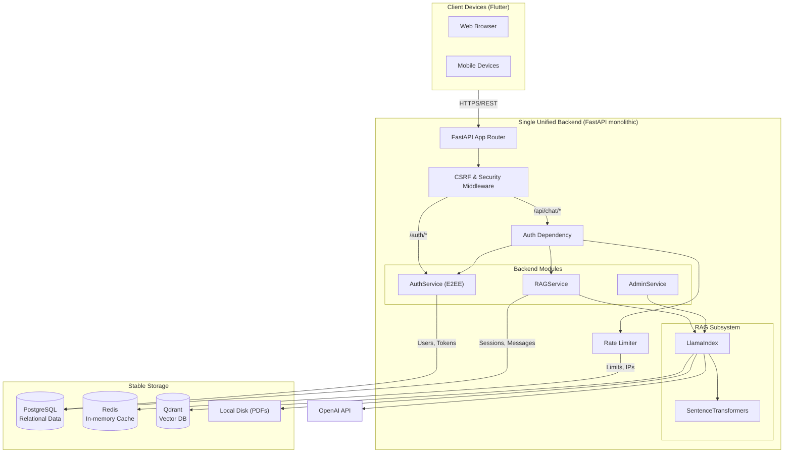

# Unified Backend Architecture

## Global Architecture Description

The backend system is designed as a monolithic service built with **FastAPI**. This single service provides all endpoints necessary for the operation of the Flutter applications (Web, iOS, and Android), seamlessly handling both the user authentication process (Story 2, now featuring End-to-End Encryption) and the core AI-driven RAG chat flow (Story 1). 

When a client application makes a request, it first hits the FastAPI application gateway. The gateway applies mandatory security middlewares (such as CSRF protection and size limiting) before passing the request to the target router (`/auth` or `/api/chat`). The unified backend uses Python's asynchronous dependency injection to efficiently verify JWTs via the `AuthService` and enforce rate limits via the `RateLimiter` using a Redis instance. Verified requests are then processed by the `RAGService`. State is stored centrally in a relational **PostgreSQL** database (for users, active sessions, message history, and token revolution records) while large vectorized text embeddings representing the organization's spiritual documents are stored in a dedicated **Qdrant** database. A background task cleans up expired tokens periodically.

## Architecture Diagram

## Justification of Design Choices

**1. Why FastAPI instead of Flask/Django?**
The core feature of this application relies heavily on making network calls to external LLM providers (OpenAI) and querying Vector Databases (Qdrant). These operations are inherently high-latency I/O tasks. We chose **FastAPI** because of its native support for Python's `asyncio`. When waiting for a 2-second response from OpenAI, a sync framework like Flask would block the worker thread, severely limiting scalability considering our 10-concurrent-user requirement. FastAPI allows the worker to pause execution and handle other incoming requests (such as rate-limiting checks or serving another user) while waiting for the LLM response. Furthermore, FastAPI's built-in support for Pydantic validation ensures type safety and automatic OpenAPI generation.

**2. Why PostgreSQL instead of NoSQL (MongoDB)?**
While NoSQL databases are excellent for unstructured chat data, this application has strict relational requirements between entities. We require strong ACID guarantees when registering users alongside their initial sessions, and we need to strictly track revoked tokens against specific user accounts for security. **PostgreSQL** enforces relational integrity via foreign keys (`AuthService`'s `Users` link directly to `RAGService`'s `ChatSessions`), preventing orphaned messages and ensuring consistent cascade deletion. `JSONB` columns in Postgres provide sufficient flexibility for storing arbitrary RAG metadata (like citations) without sacrificing relational benefits.

**3. Why Qdrant instead of FAISS or Pinecone?**
We need a stable storage system for semantic embeddings that scales independently of the relational database. Pinecone is a cloud-only service that introduces external cost overheads and limits local development. FAISS is a library, not a persistent database server, making containerized deployments brittle. **Qdrant** was chosen because it provides a dedicated vector database service with a robust API, can be easily spun up locally via Docker (crucial for local testing), and is widely supported by our RAG orchestration library (LlamaIndex).

**4. Why Monolithic over Microservices?**
The application encapsulates two stories (Auth and RAG), but they are heavily intertwined (chat history depends exclusively on auth identity). Building them as separated microservices would introduce unnecessary complexity in managing distributed transactions and HTTP latency between the Auth and Chat services. A single unified backend simplifies deployment, database connection pooling, and cross-cutting concerns like logging and rate limiting for the scale of this project.
