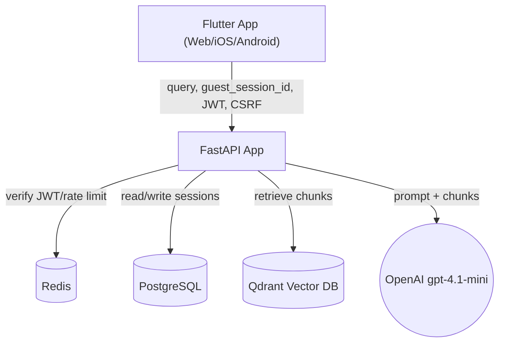
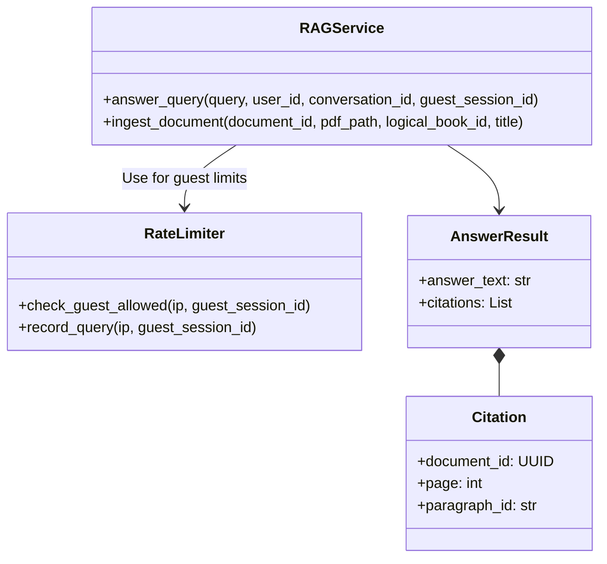
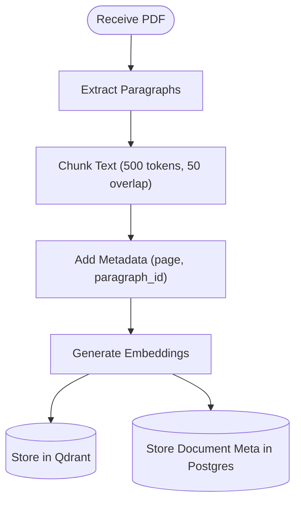

# Issue #1: Guest & Authenticated Chat RAG Pipeline

As a spiritual seeker (guest or authenticated), I want to receive answers based strictly on the organization's proprietary texts so that I get authentic philosophical guidance without internet noise.

## Architecture Diagram



### Where Components Run
- **Client:** Flutter app in browser/iOS/Android (front-end only)
- **Backend:** FastAPI app on a cloud VM/container, behind HTTPS and reverse proxy
- **Data:** Postgres, Qdrant, and local PDF storage on server/VM (Docker volumes)
- **LLM:** OpenAI `gpt-4.1-mini` via Internet

### Information Flows
- **Client → `/api/chat/query`:** Submits `query`, optional `conversation_id`, optional `JWT` (in Authorization header), optional `guest_session_id`, and `CSRF token` header (web).
- **Backend:**
  - Verifies JWT (if present).
  - For guests, checks rate limits using IP + `guest_session_id` in Redis/in-memory.
  - Calls `RAGService` to execute the complete RAG flow.
- **RAGService:**
  - Uses `LlamaIndex` to retrieve semantically similar chunks from Qdrant and construct a prompt for OpenAI `gpt-4.1-mini`.
  - Returns the generated answer + mapped citations.
- **Backend (Post-Generation):**
  - Persists only authenticated sessions/messages to Postgres.
  - Returns the final answer or error with a consistent JSON error shape.

---

## Class Diagram



### List of Classes
- **`RAGService`:** Core service for document ingestion and query answering.
- **`AnswerResult`:** Response object containing the answer and fully hydrated citations.
- **`Citation`:** Reference to source document location (document ID, page, paragraph).
- **`Chunk`:** Document chunk with metadata optimized for vector storage.
- **`RateLimiter`:** Guest query rate limiting service backed by Redis.
- **`ChatSession`:** Persistent conversation state (for authenticated users only).
- **`ChatMessage`:** Individual query/response messages within a conversation.
- **`Document`:** Metadata about ingested PDF documents stored relationally.

---

## State Diagrams

### Chat Session Lifecycle (Authenticated Only)
*Note: Guest queries do not create persistent sessions; their context is strictly per-request only.*
- **Session Title Generation:** Auto-generated from the first 50 characters of the very first user query.

---

## Flow Chart



### Document Ingestion Pipeline
1. **Method:** Sentence-based chunking with strict token counting.
2. **Target chunk size:** 500 tokens (~375 words).
3. **Overlap:** 50 tokens between consecutive chunks.
4. **Paragraph preservation:** Try to keep paragraphs together when possible.
5. **Page boundaries:** Track page numbers for citation accuracy.
6. **Paragraph IDs:** Assign sequential logically-named IDs (`p1`, `p2`, `p3`, etc.) per page.

```python
# Pseudo-code Implementation
for page in pdf_pages:
    paragraphs = extract_paragraphs(page)
    for para_idx, paragraph in enumerate(paragraphs):
        chunks = chunk_text(text=paragraph, target_tokens=500, overlap_tokens=50)
        for chunk in chunks:
            chunk.metadata = {
                "page": page.number,
                "paragraph_id": f"p{para_idx + 1}",
                "document_id": document.id,
                "logical_book_id": document.logical_book_id
            }
```

### Prompts and Configuration
- **Index Type:** `VectorStoreIndex` via LlamaIndex mapping to Qdrant backend.
- **Retrieval:** `top_k: 5`, minimum `similarity_threshold: 0.7`, response mode `compact`.
- **System Prompt:**
  > You are a knowledgeable spiritual guide assistant for [Organization Name]. Your role is to provide accurate answers based STRICTLY on the provided context from our organization's sacred texts. If the context doesn't contain sufficient information, say: "I don't have enough information in our texts to answer that question fully." Maintain a respectful, contemplative tone.

### Citation Generation Logic
- Extracts metadata (`document_id`, `page`, `paragraph_id`) from LlamaIndex `NodeWithScore` objects.
- **Deduplication:** Repeated page/paragraph chunks are collapsed into single citations.
- **Ordering:** Citations are explicitly ordered by relevance score.

### Guest Session ID Management
- **Client-Side:** Generated on first app launch (UUID v4), persisted in `SharedPreferences` or `localStorage`. Resets on cache clear or uninstall.
- **Server-Side:** Exists solely for Redis rate limiting. It is **NOT** stored in PostgreSQL. Limit is 10 queries per guest session per 24-hours.

---

## Development Risks and Failures

1. **OpenAI API rate limits or failures**
   - **Risk:** LLM service unavailable, impacting user experience.
   - **Mitigation:** Implement retry logic with exponential backoff, fallback to cached responses, show clear user error messages.
2. **Qdrant vector DB performance degradation**
   - **Risk:** Slow retrieval times (> 2 seconds).
   - **Mitigation:** Index optimization, query profiling, structure collections optimally.
3. **Guest rate limiting bypass**
   - **Risk:** Abuse via IP rotation or session ID regeneration.
   - **Mitigation:** Combine IP + session ID rate limiting, implement progressive delays over offenses, monitor anomalies.
4. **Citation accuracy**
   - **Risk:** Wrong page numbers or missing citations based off chunking errors.
   - **Mitigation:** Comprehensive testing of PDF parsing bounds, validate chunk metadata, manual spot-checks.
5. **LlamaIndex configuration drift**
   - **Risk:** Framework upgrades break existing configuration chains.
   - **Mitigation:** Pin versions strictly, test upgrades in staging.

---

## Technology Stack

- **Backend:** `FastAPI 0.110+` (async web framework).
- **Orchestration:** `LlamaIndex 0.10+` + `tiktoken` (token counting).
- **Core LLM:** `OpenAI Python SDK 1.12+` (Accessing `gpt-4.1-mini`, Max Tokens `1024`, Temp `0.7`, Embeddings `text-embedding-ada-002`).
- **Vector DB:** `Qdrant Client 1.7+` (Cosine similarity, 1536 dimension size).
- **Relational DB:** `PostgreSQL 14+`.
- **In-Memory Cache:** `Redis` (rate limiting storage).
- **PDF Parse:** `PyPDF2` / `pdfplumber`.

---

## APIs

### REST APIs (External Contracts)

**1. `POST /api/chat/query`**
Submit a question to the RAG system and receive an AI-generated answer with citations.
- **Auth:** Optional. Accepts `Authorization: Bearer <token>` or `guest_session_id`.
- **Validation:** Query string 1-2000 characters.
- **Success (200):** Returns `answer`, `citations` (List of objects w/ document_id, title, page), `conversation_id`, and timing `metadata`.

**2. `GET /api/chat/conversations`**
Returns a list of all conversations for the authenticated user.
- **Auth:** Required `Bearer` token.
- **Success (200):** Array of localized `Conversation` objects.

**3. `DELETE /auth/account`**
Permanently delete the user's account and all associated conversational data.
- **Auth:** Required `Bearer` token.

**4. `POST /admin/documents/ingest`**
Upload and ingest a newly parsed PDF document into the RAG system.
- **Auth:** Required (Admin role exclusively).
- **Format:** `multipart/form-data` expecting `file`, `logical_book_id`, `title`, and optional metadata.
- **Success (201):** Returns full parsing tracking metrics (`total_pages`, `chunks_created`).

**Standard API Error Shapes:**
- `400 Validation Error`: Query too long / File corrupted.
- `401 Unauthorized`: Bad Token.
- `403 Forbidden`: Lacking privileges (Admin).
- `429 Rate Limit Exceeded`: Remaining attempts empty, provides `retry_after`.
- `500/503`: Retrieval/LLM Service availability faults.

---

## Public Interfaces

**1. `RAGService.answer_query(query, user_id, conversation_id, guest_session_id) -> AnswerResult`**
Contract:
- Authenticated Users: `conversation_id` is automatically linked or created.
- Guests: `conversation_id` is always `None`.
- Thread-safe logic for massive concurrent queries.

**2. `RAGService.ingest_document(...)`**
Contract:
- Idempotent and transactional. Retries forcefully replace existing chunks without duplication leaks.

**3. `RateLimiter.check_guest_allowed(ip_address, guest_session_id) -> Tuple[bool, int]`**
Contract:
- Imposes 10 queries per rolling 24-hours using Redis atomic locks.

---

## Data Schemas

### PostgreSQL Tables

**`documents`**
```sql
CREATE TABLE documents (
    id UUID PRIMARY KEY DEFAULT gen_random_uuid(),
    logical_book_id VARCHAR(255) NOT NULL,
    title VARCHAR(500) NOT NULL,
    ...
    created_at TIMESTAMPTZ DEFAULT CURRENT_TIMESTAMP
);
CREATE INDEX idx_documents_logical_book_id ON documents(logical_book_id);
```

**`chat_sessions` & `chat_messages`**
```sql
CREATE TABLE chat_sessions (
    id UUID PRIMARY KEY DEFAULT gen_random_uuid(),
    user_id UUID NOT NULL REFERENCES users(id) ON DELETE CASCADE,
    title VARCHAR(500) NOT NULL
);

CREATE TABLE chat_messages (
    id UUID PRIMARY KEY DEFAULT gen_random_uuid(),
    session_id UUID NOT NULL REFERENCES chat_sessions(id) ON DELETE CASCADE,
    sender VARCHAR(50) NOT NULL,
    content TEXT NOT NULL,
    rag_metadata JSONB
);
```

### Qdrant Collection Schema (`spiritual_docs`)
- **Vector Configuration:** Size `1536`, Distance `Cosine`.
- **Payload Schema:** Requires `"document_id"`, `"logical_book_id"`, `"title"`, `"page"`, `"paragraph_id"`, `"text"`, `"chunk_index"`.

---

## Security and Privacy

1. **Guest Session Privacy:** No relational persistence. Queries are NOT saved to the database. Identifiers are random/opaque and solely used for rate protection.
2. **Document Access Control:** Only users rigorously verified as `admin` role can ingest records. Read-mode is strictly public domain.
3. **Input Sanitization:** Reject empty string payloads. Parameterize fully to avoid script injections. Validate PyPDF structure bounds to prevent zip-bombs.
4. **LLM Security (Prompt Injection):** Clear system instructions constrain derivation purely to context window limits.
5. **Database Security:** Connections over highly validated SSL/TLS environments.

---

## Risks to Completion

- **LlamaIndex API changes:** Mitigation is pinning versions actively and thoroughly tracking dependency impacts. (+3 Days Impact).
- **OpenAI rate limits:** Requesting quota increases ahead of time and integrating internal fallback delays natively. (+1 Week Impact).
- **Qdrant scaling issues:** Heavy testing over production-grade indices needed to circumvent retrieval degradations. (+5 Days Impact).
- **Citation accuracy edge cases:** Chunk bleeding natively causes complex page references requiring rigorous spot testing. (+3 Days Impact).
