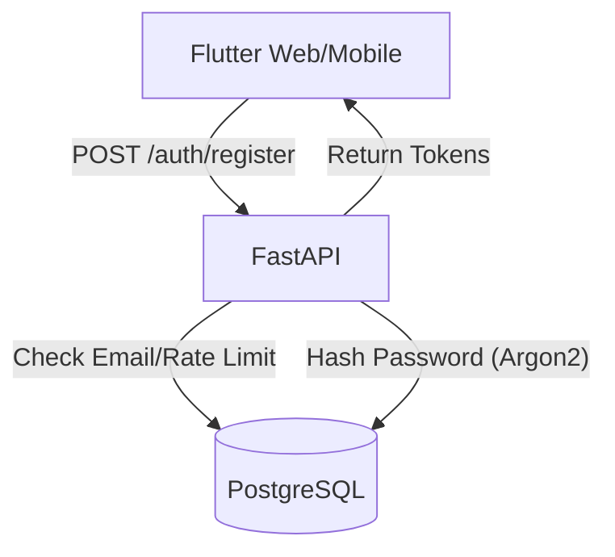
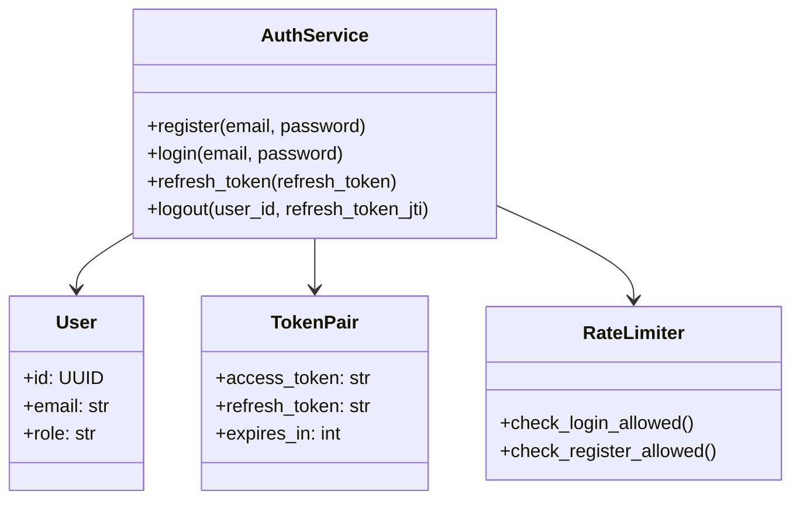
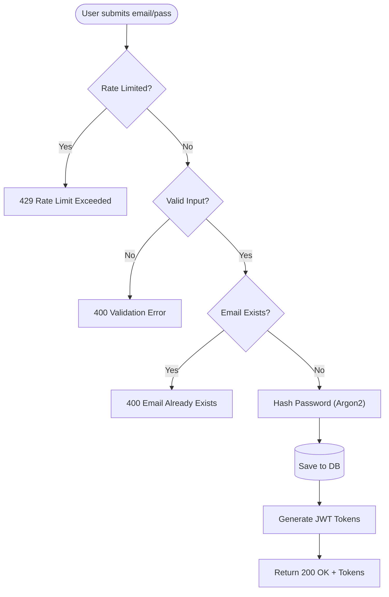
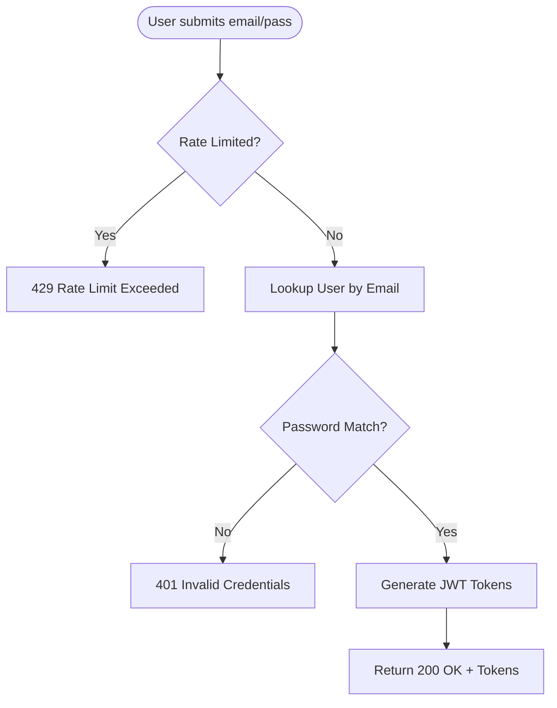

# Issue #2: Secure Account Registration and Authentication

As a new visitor, I want to create a secure account so that my access to the proprietary knowledge base is authorized and personalized.

## Architecture Diagram



### Where Components Run
- **Client:** Flutter app deployed on the web (using HttpOnly cookies + CSRF) and mobile (using secure storage).
- **Backend:** FastAPI auth endpoints running on a cloud VM/container, managing rate limiting and security.
- **Data:** PostgreSQL database storing `users` and `revoked_tokens` tables.

### Information Flows

**1. Registration Flow**
- User submits email + password to `/auth/register`.
- Backend checks rate limit (3 registrations per hour per IP).
- AuthService validates input (Email RFC 5322 format; Password complexity).
- Checks if the email already exists in `users` table.
- Hashes password with Argon2 (time cost=2, memory cost=100MB, parallelism=8).
- Creates user record in PostgreSQL.
- Generates JWT tokens (Access token: 15 min TTL; Refresh token: 7 days TTL).
- **Web:** Tokens returned as HttpOnly cookies + CSRF token sent to client.
- **Mobile:** Tokens returned directly in JSON response body.
- Client stores tokens and transitions to authenticated mode.

**2. Login Flow**
- User submits email + password to `/auth/login`.
- Backend checks rate limit (5 attempts per 15 minutes per IP).
- AuthService queries `users` table by email.
- Verifies password hash using Argon2.
- On success: Generates and returns tokens (same delivery mechanism as registration).
- On failure: Returns `INVALID_CREDENTIALS` error without revealing which field failed.

**3. Token Refresh Flow**
- **Web:** Refresh token automatically read from HttpOnly cookie.
- **Mobile:** Client sends refresh token in the JSON request body.
- Backend verifies refresh token signature, expiration, and checks if JTI is in `revoked_tokens`.
- Generates a new access token (15 min TTL) and a new refresh token (7 days TTL).
- Revokes the old refresh token by adding its JTI to `revoked_tokens`.
- Returns new token pair.

**4. Logout Flow**
- Client sends logout request with the active access token.
- Backend verifies the access token, extracts the refresh token JTI from the user's session.
- Adds the refresh token JTI to the `revoked_tokens` table.
- **Web:** Clears HttpOnly cookies.
- **Mobile:** Client deletes tokens from local secure storage.

---

## Class Diagram



### List of Classes
- **`AuthService`:** Core authentication logic (registration, login, token management).
- **`User`:** User entity representing the database record.
- **`TokenPair`:** Container for access and refresh tokens with metadata.
- **`RevokedToken`:** Tracks invalidated refresh tokens.
- **`RateLimiter`:** Controls login/registration attempts.
- **`PasswordValidator`:** Validates password complexity.
- **`EmailValidator`:** Validates email format.

---

## State Diagrams

*Auth state flow relies heavily on Token handling, primarily jumping between `Unauthenticated`, `Authenticated`, and `Token Refresh` states.*

---

## Flow Chart

### Flow Chart (Registration)



### Flow Chart (Login)



---

## Development Risks and Failures

1. **Incorrect token rotation or refresh logic**
   - **Risk:** Users logged out unexpectedly, security vulnerabilities.
   - **Mitigation:** Comprehensive unit tests for token lifecycle, E2E tests for refresh scenarios.
2. **Misconfiguring CSRF protection on web**
   - **Risk:** Blocked legitimate requests or CSRF vulnerabilities.
   - **Mitigation:** Test CSRF with different origin scenarios, follow OWASP guidelines.
3. **Password hashing misconfiguration**
   - **Risk:** Weak password security, brute force attacks.
   - **Mitigation:** Use well-tested library (passlib with Argon2), verify configuration against OWASP.
4. **Token storage leakage on mobile**
   - **Risk:** Token theft if insecure storage used.
   - **Mitigation:** Use `flutter_secure_storage`, test on rooted/jailbroken devices.
5. **Rate limiting bypass**
   - **Risk:** Brute force attacks via multiple IPs or session rotation.
   - **Mitigation:** Combine IP + email rate limiting, implement progressive delays.
6. **JWT token size bloat**
   - **Risk:** Large tokens increase bandwidth and cookie storage issues.
   - **Mitigation:** Keep claims minimal (user_id, role, exp, iat only).

---

## Technology Stack

- **Backend:** `FastAPI`, `slowapi` (Rate limiting), `pydantic`.
- **Security Validation:** `passlib[argon2]`, `python-jose[cryptography]`, `argon2-cffi`, `email-validator`.
- **Database:** `PostgreSQL 14+`.
- **Frontend:** `Flutter`, `flutter_secure_storage` (iOS Keychain / Android KeyStore), `dio` (HTTP client with interceptors for token refresh), State Management (`Riverpod` or `Bloc`).

---

## APIs

### REST APIs (External Contracts)

**1. `POST /auth/register`**
Create a new user account with email and password.
- **Auth:** None required.
- **Validation:** 
  - Email: RFC 5322 format, max 255 characters, case-insensitive.
  - Password: >8 chars, 1 uppercase, 1 lowercase, 1 digit, 1 special character.
- **Success (200):** Platform-dependent token delivery (HttpOnly cookies + CSRF for web, JSON for mobile).

**2. `POST /auth/login`**
Authenticate a user with email and password.
- **Auth:** None required.
- **Success (200):** Same format as register.
- **Error (401):** `INVALID_CREDENTIALS` (Vague for security).

**3. `POST /auth/refresh`**
Obtain a new access token using a valid refresh token. Implements token rotation.
- **Auth:** Refresh token required.
- **Success (200):** New access token and refresh token, old token revoked.
- **Error (401):** `INVALID_REFRESH_TOKEN` (Expired, revoked, or invalid).

**4. `POST /auth/logout`**
Invalidate the current refresh token and log out the user.
- **Auth:** Access token required.
- **Success (200):** Backend adds refresh token to `revoked_tokens`. Web clears cookies.

---

## Public Interfaces

**1. `AuthService`**
- `register(email, password) -> Tuple[User, TokenPair]`
- `login(email, password) -> Tuple[User, TokenPair]`
- `refresh_token(refresh_token) -> TokenPair`
- `logout(user_id, refresh_token_jti) -> None`
- `delete_account(user_id) -> None`
- `verify_access_token(access_token) -> User`
- `hash_password(password) -> str`
- `verify_password(password, password_hash) -> bool`

**2. `RateLimiter`**
- `check_login_allowed(ip, email) -> Tuple[bool, int]` (Limit: 5 attempts / 15 mins)
- `check_register_allowed(ip) -> Tuple[bool, int]` (Limit: 3 attempts / 1 hr)
- `record_login_attempt(ip, email, success) -> None`

**3. `PasswordValidator` & `EmailValidator`**
- Handle internal system logic for RFC 5322 and password strength criteria.

---

## Data Schemas

### PostgreSQL Tables

**`users`**
```sql
CREATE TABLE users (
    id UUID PRIMARY KEY DEFAULT gen_random_uuid(),
    email VARCHAR(255) UNIQUE NOT NULL,
    password_hash VARCHAR(255) NOT NULL,
    role VARCHAR(50) NOT NULL DEFAULT 'user',
    created_at TIMESTAMPTZ DEFAULT CURRENT_TIMESTAMP,
    updated_at TIMESTAMPTZ DEFAULT CURRENT_TIMESTAMP
);
```

**`revoked_tokens`**
```sql
CREATE TABLE revoked_tokens (
    id UUID PRIMARY KEY DEFAULT gen_random_uuid(),
    token_jti VARCHAR(255) UNIQUE NOT NULL,
    user_id UUID NOT NULL REFERENCES users(id) ON DELETE CASCADE,
    revoked_at TIMESTAMPTZ DEFAULT CURRENT_TIMESTAMP,
    expires_at TIMESTAMPTZ NOT NULL
);
```

### JWT Token Structure

**Access Token Claims (15m TTL)**
```json
{
  "sub": "550e8400-e29b-41d4-a716-446655440000",
  "role": "user",
  "exp": 1708046629,
  "iat": 1708045729,
  "type": "access"
}
```

**Refresh Token Claims (7d TTL)**
```json
{
  "sub": "550e8400-e29b-41d4-a716-446655440000",
  "jti": "a1b2c3d4-e5f6-7890-abcd-ef1234567890",
  "exp": 1708650529,
  "iat": 1708045729,
  "type": "refresh"
}
```

---

## Security and Privacy

1. **Password Security:**
    - Hashing Algorithm: Argon2id (`time_cost=2`, `memory_cost=100MB`, `parallelism=8`).
    - Use constant-time comparisons.
2. **Token Security:**
    - Short-Lived Access Tokens (15m) and Rotating Refresh Tokens (7d).
    - JWT signing securely executed via HS256 (RS256 recommended production).
3. **Platform-Specific Security:**
    - **Web:** Double-submit cookie pattern for CSRF protection. Secure, HttpOnly, SameSite=Strict cookies. Validated CORS allowed origins.
    - **Mobile:** Secure Storage (flutter_secure_storage backed by iOS Keychain & Android KeyStore).
4. **Data Protection & Authorization:**
    - HTTPS only (TLS 1.2+) w/ HSTS header. Database isolated, connections encrypted.
    - Role-Based Access Control (`user` vs `admin`).
    - Audit Logging sanitization: NEVER log passwords, tokens, or PII.

---

## Risks to Completion

- **Edge cases around token expiry and refresh across platforms**
  - **Mitigation:** Comprehensive E2E tests for token lifecycle; properly mock and simulate access token expiry.
- **CSRF and CORS configuration errors**
  - **Mitigation:** Rely heavily on FastAPI built-in security middleware. Test consistently against local web runner.
- **Handling expired tokens during active sessions**
  - **Mitigation:** Implement `dio` interceptor to gracefully lock the queue, refresh the token silently, and execute stacked API requests.
- **Rate limit bypass via distributed IPs**
  - **Mitigation:** Email-based rate limiting logic must securely pair with IP logic.
