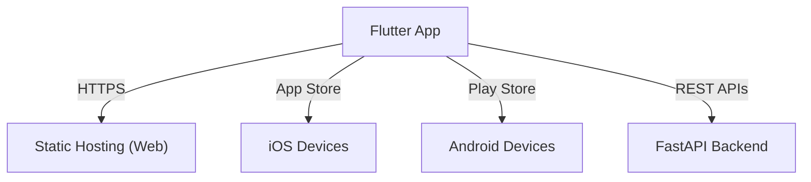
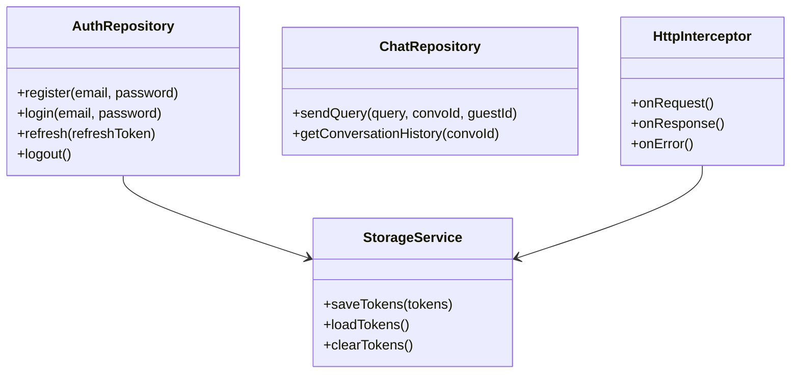
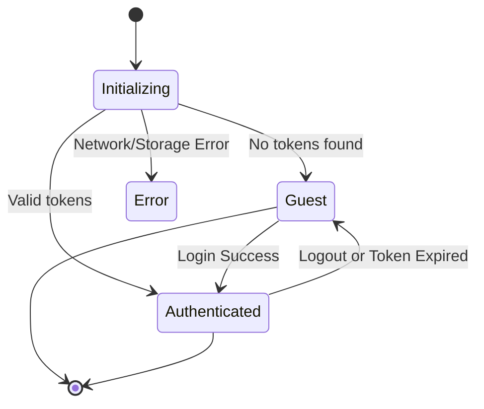
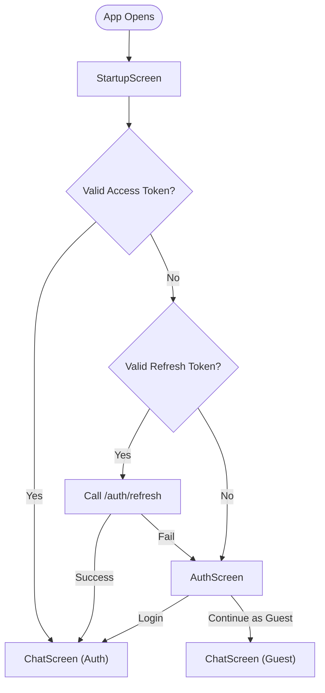

# Issue #3: Mobile/Web Chat Interface and Session Management

As a commuter, I want to access the chat interface via a responsive mobile web or native view so that I can consume the content on the go instead of carrying physical books.

## Architecture Diagram



### Where Components Run
- **Flutter:** Single codebase built and deployed natively across web, iOS, and Android clients.
- **Backend:** The same FastAPI application providing Chat and Authentication APIs (from Stories 1 and 2).
- **Deployment:** 
  - **Web:** Hosted on a CDN/static hosting, HTTPS required.
  - **iOS:** Distributed via the Apple App Store.
  - **Android:** Distributed via the Google Play Store.

### Information Flows

**1. App Startup Flow**
- User opens the app on any platform.
- `StartupScreen` displays a loading indicator.
- `StorageService` attempts to load tokens:
  - **Web:** HttpOnly cookies check (automatic via browser), reads CSRF token from localStorage.
  - **Mobile:** Reads implicitly from `flutter_secure_storage`.
- If a valid access token is found: Navigate to `ChatScreen` in authenticated mode.
- If expired but a refresh token exists: Attempt `/auth/refresh`. Navigate to `ChatScreen` if successful, else `AuthScreen`.
- If no tokens exist: Load or generate a `guest_session_id`, navigate to `AuthScreen`.

**2. Guest Mode Flow**
- User selects "Continue as Guest".
- `StorageService` saves `guest_session_id` locally (localStorage / SharedPreferences).
- Navigates to `ChatScreen` explicitly displaying a Guest Banner outlining query limits.
- Submissions omit `Authorization` headers but carry `guest_session_id`.
- On `RATE_LIMIT_EXCEEDED` error, a modal prompts the user to "Sign In".

**3. Authentication Flow**
- User clicks "Sign In" or "Register" from Guest mode.
- Inputs credentials safely on the `AuthScreen`.
- `AuthRepository` executes login/register APIs.
- Updates local token storage (web vs mobile nuances).
- Progresses to authenticated `ChatScreen`.

**4. Authenticated Chat Flow**
- Loads conversation history gracefully.
- Queries inject the HTTP `Authorization` header holding the bearer token.
- `HttpInterceptor` strictly evaluates token lifespans prior to execution; dynamically pauses queues, fires `/auth/refresh` when expiring, unwinds queues, and replays requests seamlessly.

**5. Logout Flow**
- App Drawer prompts verification "Are you sure you want to log out?".
- API call executed to `/auth/logout`.
- Client purges all stored token details and returns to the `AuthScreen`.

---

## Class Diagram



### List of Classes

**Repository Layer**
- **`AuthRepository`:** Translates application workflows into API interactions spanning `/auth/*`.
- **`ChatRepository`:** API interactions mapping directly against `/api/chat/*`.

**Controller / State Management Layer**
- **`AuthController`:** Globally scopes Authentication states across the Widget Tree (Riverpod `StateNotifier`).
- **`ChatController`:** Tracks chat message lists, loading status, and conversational context logic.

**Service Layer**
- **`StorageService`:** Polymorphic interface abstracting platform capabilities:
  - `MobileStorageService`: Employs `flutter_secure_storage`.
  - `WebStorageService`: Employs `universal_html` and Browser Cookie mechanics.
- **`HttpInterceptor`:** Custom `dio` component managing asynchronous retry queues, JWT expiries, and session expiration redirects.

**Model Layer**
- **`TokenPair`:** DTO encompassing tokens + timestamps.
- **`Message`:** Internal tracking bridging user entries versus assistant citations.
- **`AnswerResult` / `Citation`:** Type-safe abstractions binding the API payloads.

---

## State Diagrams

### Authentication State Machine



---

## Flow Chart

### Flow Chart (Complete Startup to Chat)



---

## Development Risks and Failures

1. **Ensuring guest vs auth flows work identically across platforms**
   - **Risk:** Variations in Web Cookie behaviors versus Mobile Secure Enclaves.
   - **Mitigation:** Abstract storage entirely behind `StorageService` interface. Mock heavily.
2. **Handling Keyboard & UI Safespaces**
   - **Risk:** On-screen keyboards overlapping text fields, gesture conflicts, differing native `WillPopScope` implementations.
   - **Mitigation:** Utilize dynamic padding and responsive Flutter Layout structures dynamically reading screen dimensions.
3. **Token refresh integrated into App Lifecycles**
   - **Risk:** Resuming backgrounds apps where tokens expire quietly.
   - **Mitigation:** Introduce `WidgetsBindingObserver` to re-validate tokens dynamically on foregrounding.
4. **State Management Complexity**
   - **Risk:** Out of sync UI behaviors (i.e. Chat implies Signed In, while Nav Drawer thinks Guest).
   - **Mitigation:** Unidirectional Data Flow using `Riverpod`, strictly subscribing chat logic based entirely on core Auth states.

---

## Technology Stack

- **Frontend Framework:** `Flutter 3.19+` (Dart 3.3+).
- **State Management:** `Riverpod 2.x`.
- **HTTP Client:** `dio 5.x` with heavy use of Custom Interceptors.
- **Storage Libraries:** `flutter_secure_storage 9.x`, `shared_preferences 2.x`.
- **UI Libraries:** `flutter_markdown` (for rendering structured LLM output), `url_launcher` (citations).
- **Routing:** `go_router 13.x` (enables Deep Linking).

---

## APIs

*(Consumes existing endpoints from backend)*
- `POST /auth/register`
- `POST /auth/login`
- `POST /auth/refresh`
- `POST /auth/logout`
- `POST /api/chat/query`
- `GET /api/chat/conversations`
- `DELETE /auth/account`

---

## Public Interfaces

**1. `StorageService`**
- `saveTokens(TokenPair)` & `loadTokens()` & `clearTokens()`
- `saveGuestSessionId(String)` & `loadGuestSessionId()`
- `saveCsrfToken(String)` (Web only behavior)

**2. `HttpInterceptor`**
- Intercepts requests internally to attach `Authorization`, evaluates JWT expiries, locks simultaneous requests targeting `/auth/refresh`, processes, retries failed payloads transparently.

**3. State Controllers**
- `AuthController.init() / login() / register() / logout()`
- `ChatController.sendMessage() / loadConversation()`

---

## Data Schemas

### Client-Side Storage Schemas

**Mobile (Secure Storage)**
```json
// Encrypted KeyStore / Keychain
{
  "access_token": "eyJhbGciOi...",
  "refresh_token": "eyJhbGciOi...",
  "access_expires_at": "2026-02-15T22:15:00Z"
}
```

**Mobile (SharedPreferences)**
```json
{
  "guest_session_id": "550e8400-e29b-41d4-a716-446655440000",
  "theme_mode": "dark"
}
```

**Web Storage**
- `access_token` and `refresh_token` are managed entirely by the Browser via **HttpOnly** cookies.
- **`localStorage`:** Stores purely anonymous UI data and `csrf_token` keys. XSS safe structure.

---

## Security and Privacy

1. **Token Storage Security:**
   - **Mobile:** NEVER commit tokens to file systems or unencrypted preferences. Strict enforcement of `flutter_secure_storage`.
   - **Web:** Avoid `localStorage` completely for JWT data due to XSS vulnerability. Relegated exclusively to `HttpOnly` configurations.
2. **Network Security:**
   - `HTTPS` mandatory.
   - Employ `Certificate Pinning` explicitly rejecting tampered root certificates on Mobile targets.
3. **Payload Sanitization:**
   - Input fields implement complex validation thresholds pre-transmission.
   - Flutter UI strictly renders Markdown via verified HTML AST builders, avoiding raw interpretation.
4. **Data Privacy / Analytics:**
   - Exclude sensitive identifiers. Avoid logging any PII or Prompt history out of the client. Only track UI events (e.g. `user_tapped_send_button`).

---

## Risks to Completion

- **CSRF Token Handling on Web:** Highly vulnerable to mismatching headers causing sudden 403s on web boundaries if the architecture drift happens between backend domains. Mitigation applies strict testing.
- **Deep Linking state reconstruction:** Re-opening a conversation deep-link mandates dynamic loading and potentially mid-flight Authentication sequences which might fail asynchronously. Ensure Routing handles Guards robustly.
