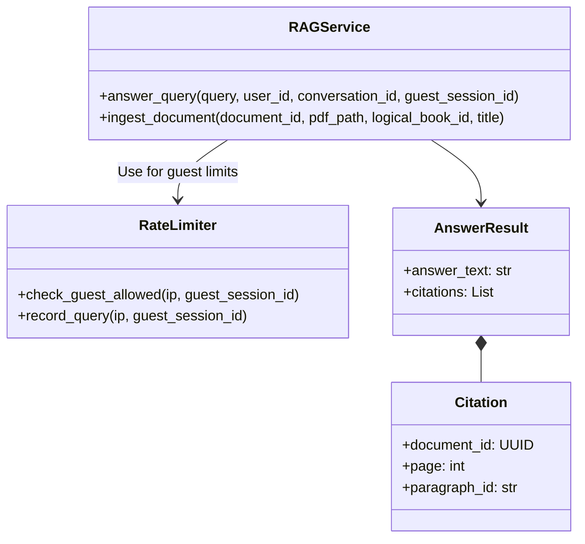

Header

As a spiritual seeker (guest or authenticated), I want to receive answers based strictly on the organization's proprietary texts so that I get authentic philosophical guidance without internet noise.


## Architecture Diagram

```mermaid
flowchart TD
    Client[Flutter App (Web/iOS/Android)] -->|query, guest_session_id,
JWT, CSRF| Backend[FastAPI App]
    Backend -->|verify JWT/rate limit| Redis[(Redis)]
    Backend -->|read/write sessions| Postgres[(PostgreSQL)]
    Backend -->|retrieve chunks| Qdrant[(Qdrant Vector DB)]
    Backend -->|prompt + chunks| LLM((OpenAI gpt-4.1-mini))
```


Where Components Run

Client: Flutter app in browser/iOS/Android (front-end only)

Backend: FastAPI app on a cloud VM/container, behind HTTPS and reverse proxy

Data: Postgres, Qdrant, and local PDF storage on server/VM (Docker volumes)

LLM: OpenAI gpt-4.1-mini via Internet

Information Flows

Client → /api/chat/query: query, optional conversation_id, optional JWT (in Authorization header), optional guest_session_id, CSRF token header (web)


Backend:


Verifies JWT (if present)

For guests, checks rate limits using IP + guest_session_id in Redis/in-memory

Calls RAGService to execute RAG flow

RAGService:


Uses LlamaIndex to retrieve from Qdrant and call OpenAI gpt-4.1-mini

Returns answer + citations

Backend:


Persists only authenticated sessions/messages to Postgres

Returns answer or error with consistent error shape

## Class Diagram




List of Classes

RAGService: Core service for document ingestion and query answering

AnswerResult: Response object containing answer and citations

Citation: Reference to source document location

Chunk: Document chunk with metadata for vector storage

RateLimiter: Guest query rate limiting service

ChatSession: Persistent conversation for authenticated users only

ChatMessage: Individual messages in a conversation

Document: Metadata about ingested PDF documents

State Diagrams

Chat Session Lifecycle (Authenticated Only)


Note: Guest queries do not create persistent sessions; context is per-request only.


Session Title Generation: Auto-generated from first 50 characters of first user query.


## Flow Chart

```mermaid
flowchart TD
    Start([Receive PDF]) --> Extract[Extract Paragraphs]
    Extract --> Chunk[Chunk Text (500 tokens, 50 overlap)]
    Chunk --> Meta[Add Metadata (page, paragraph_id)]
    Meta --> Embed[Generate Embeddings]
    Embed --> Qdrant[(Store in Qdrant)]
    Embed --> PG[(Store Document Meta in Postgres)]
```


Document Ingestion Pipeline

Ingestion Flow


Chunking Strategy Details

Method: Sentence-based chunking with token counting


Target chunk size: 500 tokens (~375 words)

Overlap: 50 tokens between consecutive chunks

Paragraph preservation: Try to keep paragraphs together when possible

Page boundaries: Track page numbers for citation

Paragraph IDs: Assign sequential IDs (p1, p2, p3...) per page

Implementation:


# Pseudo-code

for page in pdf_pages:

    paragraphs = extract_paragraphs(page)

    for para_idx, paragraph in enumerate(paragraphs):

        chunks = chunk_text(

            text=paragraph,

            target_tokens=500,

            overlap_tokens=50

        )

        for chunk in chunks:

            chunk.metadata = {

                "page": page.number,

                "paragraph_id": f"p{para_idx + 1}",

                "document_id": document.id,

                "logical_book_id": document.logical_book_id

            }

LlamaIndex Configuration

Index Configuration

Index Type: VectorStoreIndex with Qdrant backend


Retrieval Parameters:


top_k: 5 (retrieve top 5 most relevant chunks)

similarity_threshold: 0.7 (minimum cosine similarity)

reranking: None for MVP (consider later)

Query Engine Settings:


from llama_index.core import VectorStoreIndex

from llama_index.vector_stores.qdrant import QdrantVectorStore

from llama_index.llms.openai import OpenAI


# Configure LLM

llm = OpenAI(

    model="gpt-4.1-mini",

    temperature=0.7,

    max_tokens=1024

)


# Configure index

index = VectorStoreIndex.from_vector_store(

    vector_store=qdrant_store,

    llm=llm

)


# Configure query engine

query_engine = index.as_query_engine(

    similarity_top_k=5,

    response_mode="compact",  # More concise responses

    verbose=False

)

Prompt Template

System Prompt:


You are a knowledgeable spiritual guide assistant for [Organization Name]. 

Your role is to provide accurate answers based STRICTLY on the provided context 

from our organization's sacred texts and publications.


Guidelines:

1. Answer ONLY based on the provided context

2. If the context doesn't contain sufficient information, say: "I don't have enough information in our texts to answer that question fully."

3. Maintain a respectful, contemplative tone

4. Do not speculate or add information not present in the context

5. Reference specific passages when possible


Context:

{context_str}


Question: {query_str}


Answer:

Conversation History Handling (Authenticated users):


Last 5 message pairs (10 messages total) included in context

Format: "User: {query}\nAssistant: {answer}\n"

Prepended before current context

Token budget: Reserve 2000 tokens for history, 4000 for retrieved chunks, 1024 for response

Citation Generation Logic

Mapping Retrieved Chunks to Citations

Process:


LlamaIndex returns NodeWithScore objects containing:


Retrieved chunk text

Relevance score

Metadata (document_id, page, paragraph_id)

Extract citation information:


def generate_citations(retrieved_nodes: List[NodeWithScore]) -> List[Citation]:

    citations = []

    for node in retrieved_nodes:

        citation = Citation(

            document_id=node.metadata["document_id"],

            title=get_document_title(node.metadata["document_id"]),

            page=node.metadata["page"],

            paragraph_id=node.metadata["paragraph_id"],

            relevance_score=node.score

        )

        citations.append(citation)

    return deduplicate_citations(citations)  # Remove duplicate page refs

Deduplication: If multiple chunks from same page/paragraph, show citation once


Ordering: Citations ordered by relevance score (highest first)


Edge Cases:


Chunk spans multiple pages: Use starting page number in citation

No relevant chunks found: Return empty citations array + generic answer or "no information" message

Guest Session Lifecycle

Guest Session ID Management

Client-Side (Story 3 responsibility):


Generated on first app launch (UUID v4)

Stored in SharedPreferences (mobile) or localStorage (web)

Persists across app restarts

Reset only on app uninstall or cache clear

Server-Side:


NOT stored in PostgreSQL (guest sessions not persisted)

Used ONLY for rate limiting (Redis key: rate_limit:{ip}:{guest_session_id})

Tracks query count per 24-hour rolling window

Limit: 10 queries per guest session per day

Development Risks and Failures

OpenAI API rate limits or failures


Risk: LLM service unavailable, impacting user experience

Mitigation: Implement retry logic with exponential backoff, fallback to cached responses, show clear error messages

Qdrant vector DB performance degradation


Risk: Slow retrieval times (> 2 seconds) impacting UX

Mitigation: Index optimization, query profiling, consider sharding for large document sets

Guest rate limiting bypass


Risk: Abuse via IP rotation or session ID regeneration

Mitigation: Combine IP + session ID rate limiting, implement progressive delays, monitor anomalies

Citation accuracy


Risk: Wrong page numbers or missing citations

Mitigation: Comprehensive testing of PDF parsing, validate chunk metadata, manual spot-checks

LlamaIndex configuration drift


Risk: Upgrades break existing configuration

Mitigation: Pin versions, test upgrades in staging, document configuration rationale

Technology Stack

Backend

FastAPI 0.110+: Web framework with async support

LlamaIndex 0.10+: RAG orchestration

OpenAI Python SDK 1.12+: GPT-4.1-mini access

Qdrant Client 1.7+: Vector DB client

PostgreSQL 14+: Relational data storage

PyPDF2 / pdfplumber: PDF parsing

tiktoken: Token counting

Redis: Rate limiting storage (production)

LLM

Model: gpt-4.1-mini

Max Tokens: 1024 (answer generation)

Temperature: 0.7 (balanced creativity/consistency)

Embedding Model: text-embedding-ada-002

Vector Database

Qdrant: 1.7+ (self-hosted or cloud)

Collection: spiritual_docs

Distance Metric: Cosine similarity

Dimension: 1536 (OpenAI ada-002)

APIs / Public Interfaces

REST APIs (External Contracts)

Purpose: HTTP endpoints that external clients (Flutter app, web clients) call over the network. These define the public API surface of the backend service.


POST /api/chat/query

Description: Submit a question to the RAG system and receive an AI-generated answer with citations.


Authentication: Optional (accepts both guest and authenticated requests)


Request Headers:


Content-Type: application/json

Authorization: Bearer <access_token>  # Optional, for authenticated users

X-CSRF-Token: <csrf_token>  # Required for web clients only

Request Body:


{

  "query": "What is the meaning of karma?",

  "conversation_id": "550e8400-e29b-41d4-a716-446655440000",  // Optional, for continuing conversation

  "guest_session_id": "660e8400-e29b-41d4-a716-446655440001"  // Required for guest users

}

Field Validation:


query: Required, string, 1-2000 characters, non-empty after trimming

conversation_id: Optional, valid UUID v4 format

guest_session_id: Required if no JWT, valid UUID v4 format

Success Response (200):


{

  "answer": "Karma refers to the principle of cause and effect...",

  "citations": [

    {

      "document_id": "770e8400-e29b-41d4-a716-446655440002",

      "title": "Bhagavad Gita Commentary",

      "page": 42,

      "paragraph_id": "p3",

      "relevance_score": 0.89

    }

  ],

  "conversation_id": "550e8400-e29b-41d4-a716-446655440000",

  "metadata": {

    "retrieval_time_ms": 124.5,

    "llm_time_ms": 1832.3,

    "chunks_retrieved": 5

  }

}


GET /api/chat/conversations

Description: Returns a list of all conversations for the authenticated user.

Authentication: Required

Success Response (200): Array of Conversation objects


DELETE /auth/account

Description: Permanently delete the user's account and all associated data.

Authentication: Required

Success Response (200): { "message": "Account deleted successfully" }


Error Responses:


Validation Error (400):


{

  "error_code": "VALIDATION_ERROR",

  "message": "Query exceeds maximum length of 2000 characters.",

  "details": {

    "field": "query",

    "current_length": 2150,

    "max_length": 2000

  }

}

Rate Limit Exceeded (429) - Guest only:


{

  "error_code": "RATE_LIMIT_EXCEEDED",

  "message": "You have reached your daily limit of 10 queries. Please sign in for unlimited access.",

  "details": {

    "limit": 10,

    "window": "24 hours",

    "retry_after": 43200,

    "remaining": 0

  }

}

Unauthorized (401):


{

  "error_code": "UNAUTHORIZED",

  "message": "Access token is invalid or expired.",

  "details": null

}

LLM Error (503):


{

  "error_code": "LLM_ERROR",

  "message": "The AI service is temporarily unavailable. Please try again shortly.",

  "details": {

    "retry_after": 30

  }

}

Retrieval Error (500):


{

  "error_code": "RETRIEVAL_ERROR",

  "message": "Failed to retrieve relevant documents. Please try again.",

  "details": null

}

POST /admin/documents/ingest

Description: Upload and ingest a PDF document into the RAG system.


Authentication: Required (admin role only)


Request Headers:


Content-Type: multipart/form-data

Authorization: Bearer <access_token>

Request Body (multipart/form-data):


file: <binary_pdf_data>

logical_book_id: "bhagavad-gita"  # Logical identifier for grouping editions

title: "Bhagavad Gita Commentary"

author: "Swami Prabhupada"  # Optional

edition: "1972 First Edition"  # Optional

Success Response (201):


{

  "document_id": "770e8400-e29b-41d4-a716-446655440002",

  "title": "Bhagavad Gita Commentary",

  "total_pages": 856,

  "chunks_created": 2145,

  "status": "ingested",

  "created_at": "2026-02-15T22:30:00Z"

}

Error Responses:


Invalid File (400):


{

  "error_code": "INVALID_FILE",

  "message": "Uploaded file is not a valid PDF or is corrupted.",

  "details": {

    "file_type": "application/octet-stream",

    "expected": "application/pdf"

  }

}

Forbidden (403):


{

  "error_code": "FORBIDDEN",

  "message": "You do not have permission to ingest documents. Admin role required.",

  "details": null

}

Document Parsing Error (422):


{

  "error_code": "DOCUMENT_PARSING_ERROR",

  "message": "Failed to extract text from PDF. The file may be scanned images without OCR.",

  "details": {

    "pages_parsed": 0,

    "total_pages": 856

  }

}

Public Interfaces (Internal Contracts)

Purpose: Stable Python classes and methods that other backend modules depend on. These define the internal API surface between backend components. Private methods and implementation details are excluded.


RAGService

Module: app/services/rag_service.py


Responsibility: Core RAG pipeline execution, document ingestion, and answer generation.


Public Methods:


class RAGService:

    def answer_query(

        self,

        query: str,

        user_id: Optional[UUID] = None,

        conversation_id: Optional[UUID] = None,

        guest_session_id: Optional[UUID] = None

    ) -> AnswerResult:

        """

        Process a user query using the RAG pipeline.

        

        Args:

            query: User's question (1-2000 chars)

            user_id: Authenticated user ID (None for guests)

            conversation_id: Existing conversation ID (None for new)

            guest_session_id: Guest session ID (None for authenticated)

        

        Returns:

            AnswerResult with answer text, citations, and timing metadata

        

        Raises:

            QueryTooLongError: Query exceeds 2000 characters

            LLMError: OpenAI API failure

            RetrievalError: Qdrant query failure

        

        Contract:

            - For authenticated users: conversation_id is always returned (created if None)

            - For guests: conversation_id is always None

            - Citations array may be empty if no relevant documents found

            - Thread-safe for concurrent queries

        """

    

    def ingest_document(

        self,

        document_id: UUID,

        pdf_path: str,

        logical_book_id: str,

        title: str,

        author: Optional[str] = None,

        edition: Optional[str] = None

    ) -> None:

        """

        Ingest a PDF document into the RAG system.

        

        Args:

            document_id: Unique identifier for this document

            pdf_path: Absolute path to PDF file on disk

            logical_book_id: Logical identifier for grouping editions

            title: Human-readable document title

            author: Document author (optional)

            edition: Specific edition identifier (optional)

        

        Raises:

            DocumentParsingError: PDF is invalid or corrupt

            EmbeddingError: Embedding generation failed

            StorageError: Qdrant or PostgreSQL write failed

        

        Contract:

            - Idempotent: Safe to retry with same document_id

            - On retry, existing chunks are replaced

            - Transactional: All-or-nothing (rollback on error)

            - Blocks until ingestion complete (may take 30-60s for large PDFs)

        """

Data Transfer Objects:


@dataclass

class AnswerResult:

    """Result from RAGService.answer_query()"""

    answer_text: str

    citations: List[Citation]

    retrieval_time_ms: float

    llm_time_ms: float

    conversation_id: Optional[UUID] = None  # None for guests

    chunks_retrieved: int = 0


@dataclass

class Citation:

    """Source citation for an answer"""

    document_id: UUID

    title: str

    page: int

    paragraph_id: str

    relevance_score: float

Internal Methods (not part of public interface):


_chunk_document(): Private chunking logic

_embed_chunks(): Private embedding generation

_store_in_qdrant(): Private Qdrant storage

_generate_conversation_title(): Private title generation

RateLimiter

Module: app/services/rate_limiter.py


Responsibility: Rate limiting for guest queries to prevent abuse.


Public Methods:


class RateLimiter:

    def check_guest_allowed(

        self,

        ip_address: str,

        guest_session_id: UUID

    ) -> Tuple[bool, int]:

        """

        Check if guest can make a query.

        

        Args:

            ip_address: Client IP address

            guest_session_id: Guest session UUID

        

        Returns:

            Tuple of (allowed: bool, remaining_queries: int)

            - allowed: True if query is allowed

            - remaining_queries: Number of queries left in 24h window

        

        Contract:

            - Limit: 10 queries per 24-hour rolling window

            - Key: rate_limit:{ip}:{guest_session_id}

            - Window starts from first query

            - Thread-safe (uses Redis atomic operations)

        """

    

    def record_query(

        self,

        ip_address: str,

        guest_session_id: UUID

    ) -> None:

        """

        Record a successful guest query.

        

        Args:

            ip_address: Client IP address

            guest_session_id: Guest session UUID

        

        Contract:

            - Increments counter with 24-hour TTL

            - TTL set on first query, preserved on subsequent queries

            - Must be called AFTER check_guest_allowed() succeeds

        """

    

    def get_remaining_queries(

        self,

        ip_address: str,

        guest_session_id: UUID

    ) -> int:

        """

        Get remaining queries for guest session.

        

        Args:

            ip_address: Client IP address

            guest_session_id: Guest session UUID

        

        Returns:

            Number of queries remaining (0-10)

        """

Configuration:


# Rate limit configuration

GUEST_QUERY_LIMIT = 10

GUEST_WINDOW_SECONDS = 86400  # 24 hours

RATE_LIMIT_KEY_PREFIX = "rate_limit"

Chunk (Data Transfer Object)

Module: app/models/schemas.py


@dataclass

class Chunk:

    """Document chunk for vector storage"""

    chunk_id: UUID

    document_id: UUID

    text: str

    page: int

    paragraph_id: str

    metadata: Dict[str, Any]

    

    def to_qdrant_point(self, embedding: List[float]) -> Point:

        """Convert to Qdrant point for storage"""

Contract: Immutable after creation; safe to pass between services.


Data Schemas

PostgreSQL Tables

documents

CREATE TABLE documents (

    id UUID PRIMARY KEY DEFAULT gen_random_uuid(),

    logical_book_id VARCHAR(255) NOT NULL,

    title VARCHAR(500) NOT NULL,

    author VARCHAR(255),

    edition VARCHAR(255),

    file_path VARCHAR(1000) NOT NULL,

    total_pages INTEGER NOT NULL,

    embedding_model VARCHAR(100) NOT NULL DEFAULT 'text-embedding-ada-002',

    created_at TIMESTAMPTZ DEFAULT CURRENT_TIMESTAMP,

    updated_at TIMESTAMPTZ DEFAULT CURRENT_TIMESTAMP

);


CREATE INDEX idx_documents_logical_book_id ON documents(logical_book_id);

chat_sessions

CREATE TABLE chat_sessions (

    id UUID PRIMARY KEY DEFAULT gen_random_uuid(),

    user_id UUID NOT NULL REFERENCES users(id) ON DELETE CASCADE,

    title VARCHAR(500) NOT NULL,

    created_at TIMESTAMPTZ DEFAULT CURRENT_TIMESTAMP,

    updated_at TIMESTAMPTZ DEFAULT CURRENT_TIMESTAMP

);


CREATE INDEX idx_chat_sessions_user_id ON chat_sessions(user_id);

CREATE INDEX idx_chat_sessions_updated_at ON chat_sessions(updated_at DESC);

chat_messages

CREATE TABLE chat_messages (

    id UUID PRIMARY KEY DEFAULT gen_random_uuid(),

    session_id UUID NOT NULL REFERENCES chat_sessions(id) ON DELETE CASCADE,

    sender VARCHAR(50) NOT NULL,  -- 'user' or 'assistant'

    content TEXT NOT NULL,

    rag_metadata JSONB,  -- citations, retrieval_time, llm_time

    created_at TIMESTAMPTZ DEFAULT CURRENT_TIMESTAMP,

    updated_at TIMESTAMPTZ DEFAULT CURRENT_TIMESTAMP

);


CREATE INDEX idx_chat_messages_session_id ON chat_messages(session_id);

CREATE INDEX idx_chat_messages_created_at ON chat_messages(created_at);

Qdrant Collection Schema

Collection Name: spiritual_docs


Vector Configuration:


{

    "size": 1536,  # OpenAI text-embedding-ada-002 dimension

    "distance": "Cosine"

}

Point Payload Schema:


{

  "document_id": "770e8400-e29b-41d4-a716-446655440002",

  "logical_book_id": "bhagavad-gita",

  "title": "Bhagavad Gita Commentary",

  "page": 42,

  "paragraph_id": "p3",

  "text": "Full chunk text here...",

  "chunk_index": 125,

  "author": "Swami Prabhupada",

  "edition": "1972"

}

Security and Privacy

1. Guest Session Privacy

No persistence: Guest queries are NOT saved to the database

Opaque IDs: guest_session_id is a random UUID with no personally identifying information

Rate limiting only: Used solely to enforce the 10 queries/day limit

No logging: Never log guest session IDs in application logs or analytics

2. Document Access Control

Admin-only ingestion: Only users with admin role can upload documents

Public read access: All authenticated and guest users can query the knowledge base

No document deletion by users: Only admins can remove documents (future enhancement)

3. Input Sanitization

Query Validation:


Strip leading/trailing whitespace

Reject empty queries

Enforce 2000 character limit

No HTML/script injection risk (plain text only)

PDF Validation:


Check file type (application/pdf)

Verify PDF structure with PyPDF2

Reject encrypted or password-protected PDFs

Scan for malicious content (production: use antivirus)

4. LLM Security

Prompt Injection Prevention:


System prompt clearly instructs LLM to answer only from context

User queries are NOT used to modify system instructions

LlamaIndex handles context separation

API Key Protection:


OpenAI API key stored in environment variables

Never exposed in API responses or logs

Rotate keys periodically (90 days)

5. Database Security

Query Parameterization:


All SQL queries use parameterized statements (SQLAlchemy ORM)

No string concatenation for query building

Protects against SQL injection

Connection Security:


PostgreSQL connections over SSL/TLS

Qdrant connections over HTTPS (production)

Credentials stored in environment variables

Success Criteria

✅ Guests can send up to 10 queries per day

✅ Authenticated users have unlimited queries

✅ Average response time < 3 seconds (retrieval + LLM)

✅ Citation accuracy > 95% (correct page numbers)

✅ Rate limiting prevents abuse (10 queries/day/guest)

✅ LLM answers are grounded in retrieved context (no hallucinations)

✅ Conversation history works for authenticated users

✅ 90%+ unit test coverage for RAGService and RateLimiter

✅ Integration tests pass for query endpoint

✅ Load testing: 100 concurrent users, < 5 second p99 latency

Risks to Completion

LlamaIndex API changes


Mitigation: Pin version, test upgrades thoroughly

Timeline Impact: +3 days if major breaking changes

OpenAI rate limits


Mitigation: Request limit increase, implement queueing

Timeline Impact: +1 week if limit increase needed

Qdrant scaling issues


Mitigation: Optimize index configuration, consider sharding

Timeline Impact: +5 days for performance tuning

Citation accuracy edge cases


Mitigation: Comprehensive testing, manual validation

Timeline Impact: +3 days for edge case handling

Story Status: Ready for Implementation

Estimated Effort: 3 weeks (1 backend developer)

Dependencies: PostgreSQL setup, Qdrant deployed, OpenAI API key

Next Steps: Begin implementation of RAGService and document ingestion pipeline

