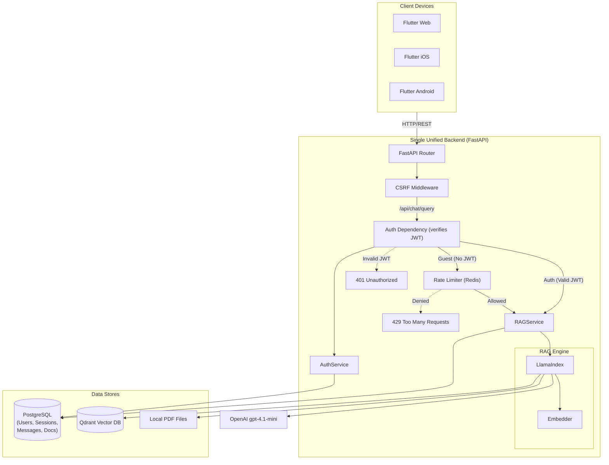
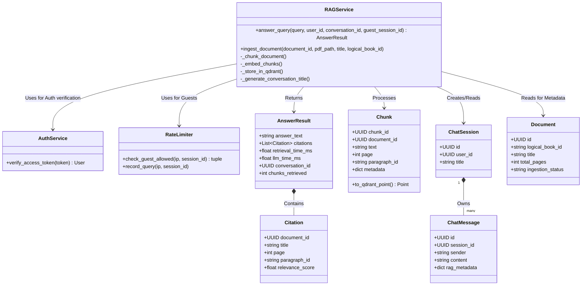
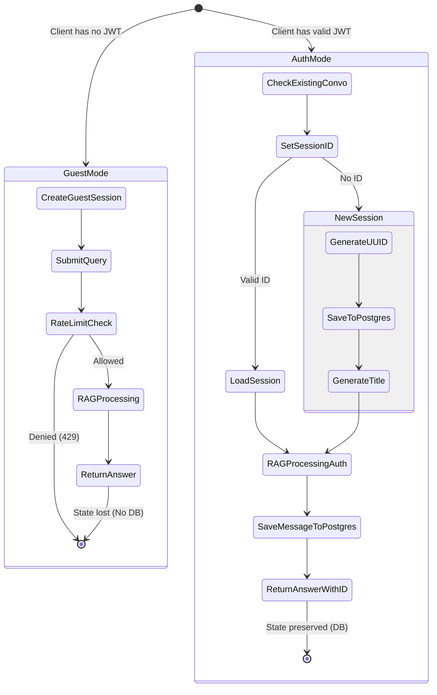
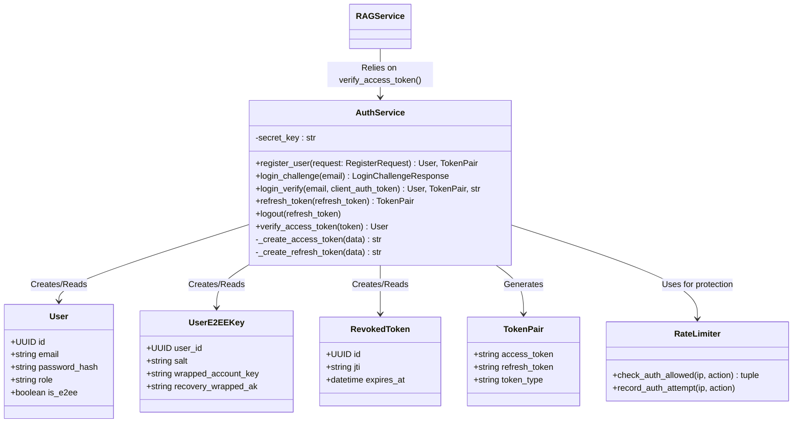
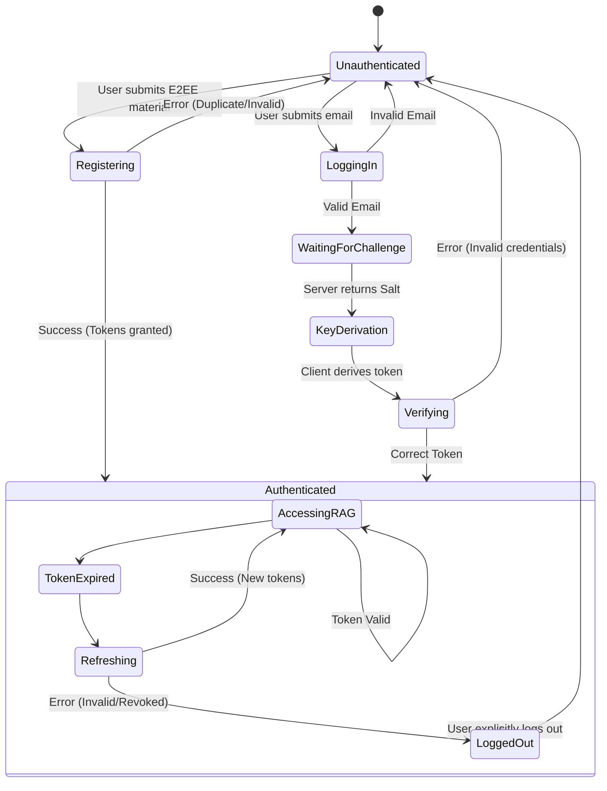
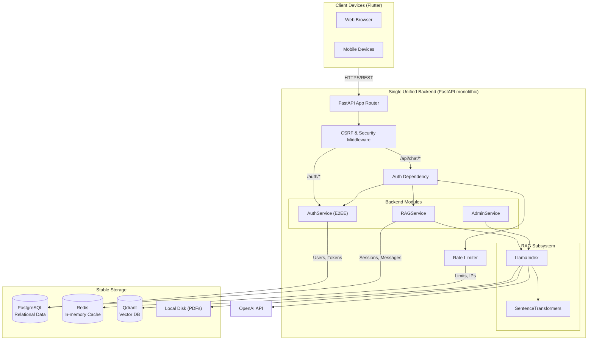
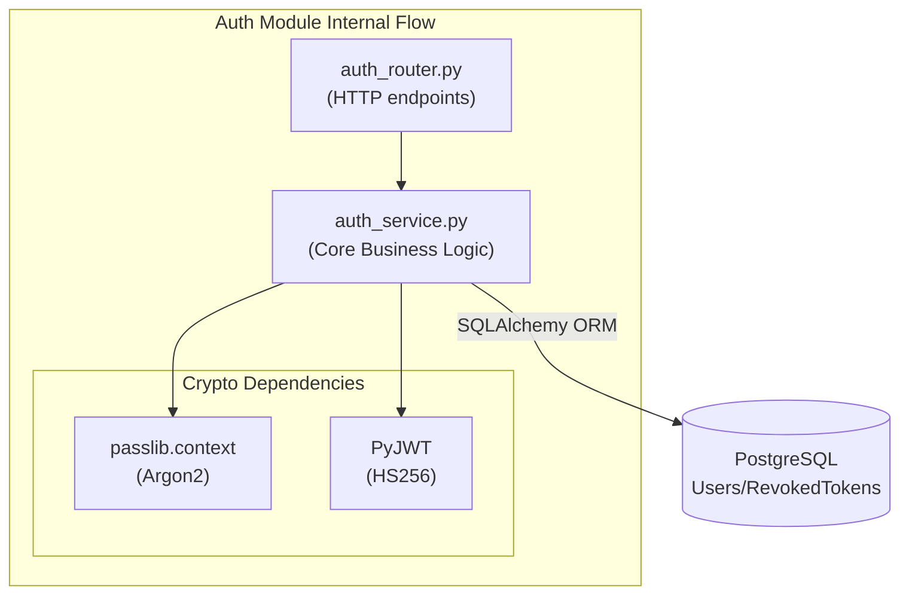
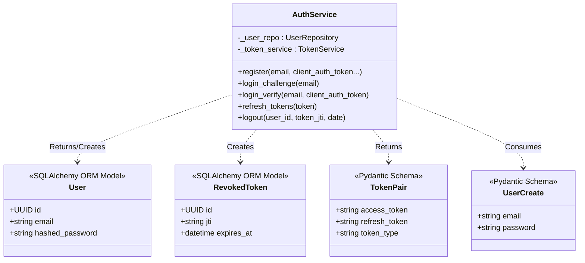
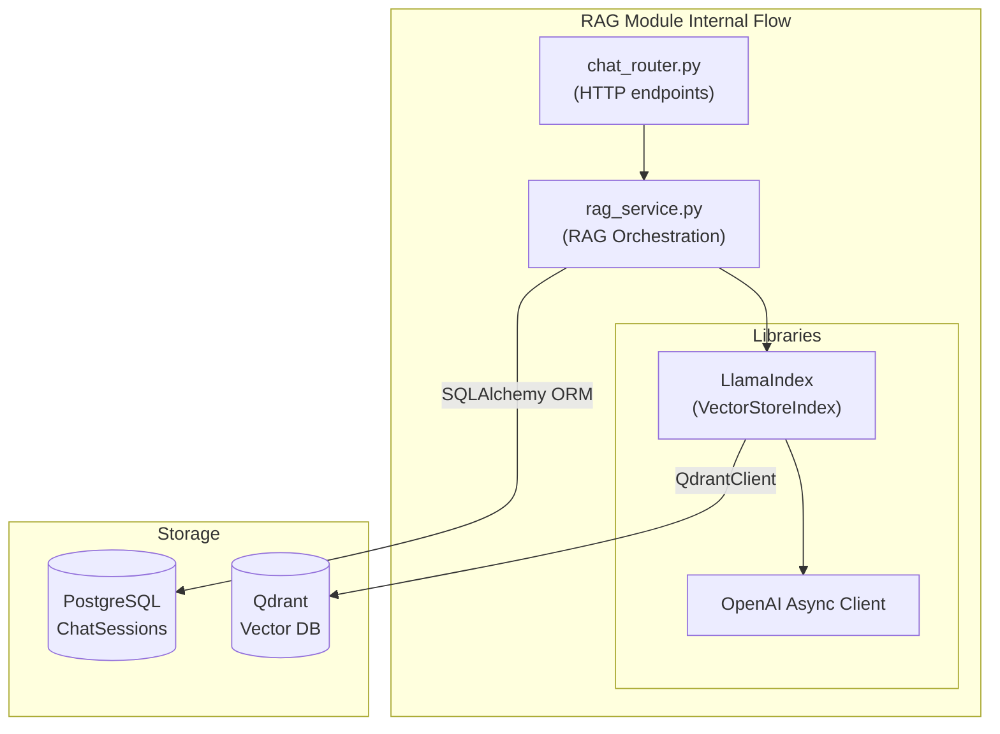
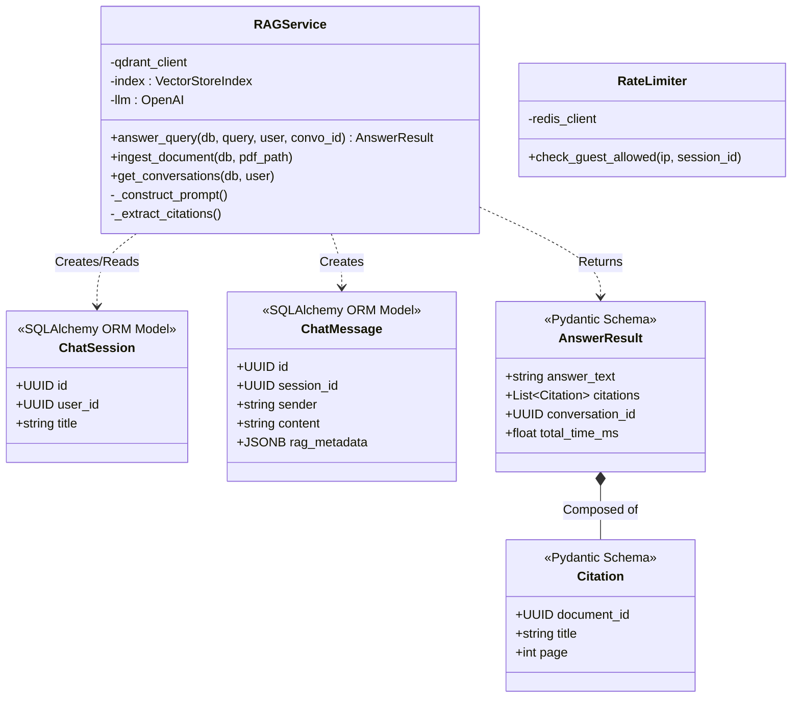

# Project 4: Backend Development Submission


## 1. Updated Development Specifications


# User Story 1: Spiritual Guide Query (Core RAG) - Harmonized Spec

**As a** spiritual seeker (guest or authenticated),
**I want** to receive answers based strictly on the organization's proprietary texts
**so that** I get authentic philosophical guidance without internet noise.

---

## Architecture Diagram (Unified Backend)



### Harmonized Backend Context
*This specification assumes a single, unified backend powers both this RAG capability and the authentication system (Story 2). All endpoints are served by the same FastAPI application. The `RAGService` seamlessly integrates with the `AuthService` (for user ID extraction from JWTs) and shared PostgreSQL database (for persisting `chat_sessions` and `chat_messages` linked to `users`).*

---

## Where Components Run
*   **Client**: Flutter app in browser/iOS/Android (front-end only)
*   **Backend**: FastAPI app on a cloud VM/container, behind HTTPS and reverse proxy (serving both Chat and Auth APIs)
*   **Data**: Postgres, Qdrant, and local PDF storage on server/VM (Docker volumes)
*   **LLM**: OpenAI gpt-4.1-mini via Internet

## Information Flows
1.  **Client** → `POST /api/chat/query`: Sends `query`. Optional `conversation_id`, optional `JWT` (in Authorization header), optional `guest_session_id`. Includes CSRF token header (web).
2.  **Unified Backend**:
    *   Verifies JWT via `AuthService` (if present).
    *   For guests, checks rate limits via `RateLimiter` using IP + `guest_session_id` in Redis.
    *   Calls `RAGService` to execute RAG flow.
3.  **RAGService**:
    *   Uses LlamaIndex to retrieve chunks from Qdrant.
    *   Calls OpenAI gpt-4.1-mini with context.
    *   Constructs answer and citations.
4.  **Backend Data Persistence**:
    *   If authenticated: Persists session and messages to shared PostgreSQL database (linking to User records).
    *   Returns answer or error with consistent API shape.

## Class Diagram



## State Diagrams

### Chat Session Lifecycle (Authenticated Only)


*Note: Guest queries do not create persistent sessions; context is per-request only.*

## Chunking Strategy Details
*   **Method**: Sentence-based chunking with token counting
*   **Target chunk size**: 500 tokens (~375 words)
*   **Overlap**: 50 tokens between consecutive chunks
*   **Paragraph preservation**: Try to keep paragraphs together when possible
*   **Page boundaries**: Track page numbers for citation
*   **Paragraph IDs**: Assign sequential IDs (p1, p2, p3...) per page

## LLM Configuration & Prompt Template
*   **Model**: `gpt-4.1-mini`
*   **Retrieval Parameters**: `top_k: 5`, `similarity_threshold: 0.7`
*   **Prompt Template**:
    ```text
    You are a knowledgeable spiritual guide assistant for [Organization]. 
    Your role is to provide accurate answers based STRICTLY on the provided context 
    from our organization's sacred texts.

    Guidelines:
    1. Answer ONLY based on the provided context
    2. If the context lacks information, say: "I don't have enough information in our texts..."
    3. Maintain a respectful, contemplative tone
    4. Do not speculate. Reference specific passages when possible

    Context:
    {context_str}

    Question: {query_str}

    Answer:
    ```
*   **Conversation History Handling** (Authenticated users): Last 5 message pairs included in context.

## Citation Generation Logic
LlamaIndex returns `NodeWithScore` objects containing chunk text, score, and metadata.
Citations are generated by mapping metadata (`document_id`, `page`, `paragraph_id`), and duplicates are removed if multiple chunks come from the same page/paragraph. Ordered by relevance score.

## Development Risks and Failures
*   **OpenAI API rate limits or failures**: Mitigation - Implement retry logic with exponential backoff, show clear error messages.
*   **Qdrant performance degradation**: Mitigation - Index optimization, consider sharding.
*   **Guest rate limiting bypass**: Mitigation - Combine IP + session ID tracking in Redis.
*   **Citation accuracy**: Mitigation - Manual spot-checks of chunk boundaries during parsing.

## REST APIs (External Contracts)

**POST /api/chat/query**
Description: Submit a question to the RAG system and receive an answer with citations.

*   **Authentication**: Optional (JWT Bearer)
*   **Request Body**:
    ```json
    {
      "query": "What is the meaning of karma?",
      "conversation_id": "550e..." ,  // Optional
      "guest_session_id": "660e..."   // Required for guests
    }
    ```
*   **Success Response (200)**:
    ```json
    {
      "answer": "Karma refers to...",
      "citations": [
        {
          "document_id": "770e...",
          "title": "Bhagavad Gita Commentary",
          "page": 42,
          "paragraph_id": "p3",
          "relevance_score": 0.89
        }
      ],
      "conversation_id": "550e...",
      "metadata": { "retrieval_time_ms": 124.5, "chunks_retrieved": 5 }
    }
    ```
*   **Errors**: 400 Validation, 429 Rate Limit, 401 Unauthorized, 503 LLM Error.

**GET /api/chat/conversations**
Description: Returns list of conversations for authenticated user. Requires Authentication.

**POST /admin/documents/ingest**
Description: Upload PDF into RAG system. Requires Admin Role Authentication.

## PostgreSQL Data Schemas
*   **chat_sessions**: `id` (UUID), `user_id` (FK to users), `title`, `wrapped_conversation_key`, `created_at`, `updated_at`
*   **chat_messages**: `id` (UUID), `session_id` (FK to chat_sessions), `sender`, `content`, `rag_metadata` (JSONB), `created_at`
*   **documents**: `id` (UUID), `logical_book_id`, `title`, `file_path`, `total_pages`

*(Note: The corresponding `users`, `user_e2ee_keys`, and `revoked_tokens` tables live in the same PostgreSQL database, managed by the unified backend).*

## Security and Privacy
1.  **Guest Session Privacy**: No DB persistence. Used solely for rate limiting.
2.  **Document Access**: Public reading (via RAG), Admin-only ingestion.
3.  **Input Sanitization**: Block empty queries, enforce 2000 char max length.
4.  **LLM Security**: Protect against prompt injection via strict system prompts. Do not echo user input into instructions.
5.  **Database Security**: Shared PostgreSQL connection pool using parameterized SQL (via SQLAlchemy/Alembic).


<br>


# User Story 2: User Registration & Onboarding - Harmonized Spec

**As a** new user,
**I want** to create an account and log in securely
**so that** I can save my Q&A history and receive personalized guidance over time.

---

## Architecture Diagram (Unified Backend)

```mermaid
flowchart TD
    %% Client Layer
    subgraph Client ["Client Devices"]
        FW["Flutter Web\n(Secure/HttpOnly Cookies)"]
        FM["Flutter Mobile (iOS/Android)\n(Secure Storage)"]
    end

    %% Unified Backend Layer
    subgraph UnifiedBackend ["Single Unified Backend (FastAPI)"]
        direction TB
        
        API_GW["FastAPI Router"]
        CSRF["CSRF Middleware"]
        RL["Rate Limiter (Redis)"]
        
        AuthSvc["AuthService\n(Client Key Verification,\nJWT Generation)"]
        RAGSvc["RAGService\n(Protected Routes)"]
        
        API_GW --> CSRF
        CSRF --> |"/auth/register", "/auth/login", "/auth/login/verify"| RL
        RL --> AuthSvc
        
        %% Demonstrating the unified nature
        AuthSvc -. "Validates Token for" .-> RAGSvc
    end

    %% Data Layer
    subgraph DataLayer ["Data Stores"]
        PG[("PostgreSQL\n(Users, RevokedTokens,\nChatSessions)")]
        Redis[("Redis\n(Rate Limiting)")]
    end

    %% Flow connections
    Client --> |"HTTPS"| API_GW
    AuthSvc --> |"Read/Write User"| PG
    RL --> |"Check limits"| Redis
    AuthSvc --> |"Read/Write Token"| PG
```

### Harmonized Backend Context
*This specification describes the authentication flow that exists within the **same** unified FastAPI backend as the RAG Chat system (Story 1). The `AuthService` handles registration, login, and JWT issuance. The tokens issued here are later passed to the `RAGService`'s protected routes (e.g., `/api/chat/query`) to identify users, allowing the unified backend to store chat history associated with the specific user in the shared PostgreSQL database.*

---

## Where Components Run
*   **Client**: Flutter app (Web, iOS, Android).
*   **Backend**: FastAPI application (unified with Chat services).
*   **Database**: PostgreSQL (shared with Chat services) and Redis.

## Information Flows
### Registration (E2EE)
1.  **Client** → `POST /api/auth/register`: Sends `email`, `client_auth_token`, `salt`, `wrapped_account_key`, and `recovery_wrapped_ak`.
2.  **API Gateway**: For Web, validates CSRF.
3.  **Rate Limiter**: Checks Redis if IP has exceeded registration limits.
4.  **AuthService**:
    *   Checks PostgreSQL if email exists.
    *   Creates User and E2EE key records in PostgreSQL.
    *   Generates Access (15m) and Refresh (7d) JWTs.
5.  **Response**:
    *   **Mobile**: Returns tokens in JSON body.
    *   **Web**: Returns 200 OK, sets `refresh_token` as Secure HttpOnly Cookie.

### Login (E2EE Two-Step)
1.  **Client** → `POST /api/auth/login` (Challenge): Sends `email`.
2.  **API Gateway**: For Web, validates CSRF.
3.  **Rate Limiter**: Checks Redis if IP has exceeded login attempt limits.
4.  **AuthService** (Challenge):
    *   Retrieves User and their `salt` from PostgreSQL by email.
    *   Returns the `salt` (and `recovery_wrapped_ak`) to the client.
5.  **Client**: Key Derivation. Derives local keys using password and `salt`.
6.  **Client** → `POST /api/auth/login/verify` (Verify): Sends `email` and derived `client_auth_token`.
7.  **AuthService** (Verify):
    *   Verifies `client_auth_token` matches expected backend hash.
    *   Generates new Access and Refresh JWTs.
8.  **Response**: Returns tokens plus the `wrapped_account_key` (so client can unwrap and access their vault).

### Token Refresh
1.  **Client** → `POST /auth/refresh`:
    *   **Mobile**: Sends `refresh_token` in JSON body.
    *   **Web**: Browser automatically sends `refresh_token` HttpOnly cookie.
2.  **AuthService**:
    *   Verifies Refresh JWT signature and expiration.
    *   Checks PostgreSQL `revoked_tokens` table to ensure token hasn't been reused.
    *   Saves the old `refresh_token` to `revoked_tokens` (Token Rotation).
    *   Generates new Access and Refresh JWTs.
3.  **Response**: Same as Registration.

## Class Diagram



## State Diagrams

### Unified Authentication Flow



## Security and Privacy
1.  **Password Storage**: Client-side key derivation (Scrypt/HKDF). The backend never sees the plaintext password. The backend stores another hash (Argon2) of the `client_auth_token`.
2.  **Token Storage**:
    *   **Mobile**: `flutter_secure_storage` (Keychain/Keystore).
    *   **Web**: `refresh_token` and `access_token` are `HttpOnly`, `Secure`, `SameSite=Strict` cookies.
3.  **Token Rotation**: Refresh tokens are single-use. The old token's JTI is saved to postgres upon refresh. If a revoked token is used, it indicates a potential breach.
4.  **Token Expiration**: Access tokens are short-lived (15 mins) to minimize the window of attack if intercepted.
5.  **Brute Force Protection**: Redis-backed rate limiter specifically on `/api/auth/login` and `/api/auth/register` endpoints.

## REST APIs (External Contracts)

**POST /api/auth/register**
Description: Register a new user with E2EE keys.
*   **Request Body**:
    ```json
    { 
      "email": "user@example.com", 
      "client_auth_token": "...",
      "salt": "...",
      "wrapped_account_key": "...",
      "recovery_wrapped_ak": "..."
    }
    ```
*   **Success Response (Web) (200)**: Sets HttpOnly secure cookies. JSON body shows tokens.
*   **Success Response (Mobile) (200)**: Returns tokens in JSON body.
*   **Errors**: 400 Validation, 400 Email already exists, 429 Rate Limit.

**POST /api/auth/login** (Challenge)
Description: Get user's salt for client-side key derivation.
*   **Request Body**: `{ "email": "user@example.com" }`
*   **Response (200)**: `{ "salt": "...", "recovery_wrapped_ak": "..." }`

**POST /api/auth/login/verify** (Verify)
Description: Verify derived token and authenticate.
*   **Request Body**: `{ "email": "user@example.com", "client_auth_token": "..." }`
*   **Response (200)**: Standard token pair + `wrapped_account_key`.
*   **Errors**: 401 Invalid Credentials, 429 Rate Limit.

**POST /api/auth/refresh**
Description: Get a new access token using a refresh token.
*   **Request (Mobile)**:
    ```json
    { "refresh_token": "..." }
    ```
*   **Request (Web)**: Automatically sends HttpOnly Cookie.
*   (Response shape identical to Registration).
*   **Errors**: 401 Unauthorized (Invalid/Expired/Revoked token).

**POST /api/auth/logout**
Description: Invalidate the user's refresh token.
*   **Authentication**: Required (JWT Bearer)
*   **Errors**: 401 Unauthorized.

## PostgreSQL Data Schemas
*   **users**: `id` (UUID), `email` (String, Unique), `password_hash` (String), `role` (String), `is_e2ee` (Boolean), `created_at` (Datetime), `updated_at` (Datetime).
*   **user_e2ee_keys**: `user_id` (UUID), `salt` (LargeBinary/Base64), `wrapped_account_key` (String), `recovery_wrapped_ak` (String), `created_at` (Datetime), `updated_at` (Datetime).
*   **revoked_tokens**: `id` (UUID), `jti` (String, Unique), `expires_at` (Datetime, used for periodic cleanup by the backend).

*(Note: The corresponding `chat_sessions` and `chat_messages` tables live in the same PostgreSQL database, managed by the unified backend).*


<br>
---


## 2. Unified Backend Architecture


# Unified Backend Architecture

## Global Architecture Description

The backend system is designed as a monolithic service built with **FastAPI**. This single service provides all endpoints necessary for the operation of the Flutter applications (Web, iOS, and Android), seamlessly handling both the user authentication process (Story 2, now featuring End-to-End Encryption) and the core AI-driven RAG chat flow (Story 1). 

When a client application makes a request, it first hits the FastAPI application gateway. The gateway applies mandatory security middlewares (such as CSRF protection and size limiting) before passing the request to the target router (`/auth` or `/api/chat`). The unified backend uses Python's asynchronous dependency injection to efficiently verify JWTs via the `AuthService` and enforce rate limits via the `RateLimiter` using a Redis instance. Verified requests are then processed by the `RAGService`. State is stored centrally in a relational **PostgreSQL** database (for users, active sessions, message history, and token revolution records) while large vectorized text embeddings representing the organization's spiritual documents are stored in a dedicated **Qdrant** database. A background task cleans up expired tokens periodically.

## Architecture Diagram



## Justification of Design Choices

**1. Why FastAPI instead of Flask/Django?**
The core feature of this application relies heavily on making network calls to external LLM providers (OpenAI) and querying Vector Databases (Qdrant). These operations are inherently high-latency I/O tasks. We chose **FastAPI** because of its native support for Python's `asyncio`. When waiting for a 2-second response from OpenAI, a sync framework like Flask would block the worker thread, severely limiting scalability considering our 10-concurrent-user requirement. FastAPI allows the worker to pause execution and handle other incoming requests (such as rate-limiting checks or serving another user) while waiting for the LLM response. Furthermore, FastAPI's built-in support for Pydantic validation ensures type safety and automatic OpenAPI generation.

**2. Why PostgreSQL instead of NoSQL (MongoDB)?**
While NoSQL databases are excellent for unstructured chat data, this application has strict relational requirements between entities. We require strong ACID guarantees when registering users alongside their initial sessions, and we need to strictly track revoked tokens against specific user accounts for security. **PostgreSQL** enforces relational integrity via foreign keys (`AuthService`'s `Users` link directly to `RAGService`'s `ChatSessions`), preventing orphaned messages and ensuring consistent cascade deletion. `JSONB` columns in Postgres provide sufficient flexibility for storing arbitrary RAG metadata (like citations) without sacrificing relational benefits.

**3. Why Qdrant instead of FAISS or Pinecone?**
We need a stable storage system for semantic embeddings that scales independently of the relational database. Pinecone is a cloud-only service that introduces external cost overheads and limits local development. FAISS is a library, not a persistent database server, making containerized deployments brittle. **Qdrant** was chosen because it provides a dedicated vector database service with a robust API, can be easily spun up locally via Docker (crucial for local testing), and is widely supported by our RAG orchestration library (LlamaIndex).

**4. Why Monolithic over Microservices?**
The application encapsulates two stories (Auth and RAG), but they are heavily intertwined (chat history depends exclusively on auth identity). Building them as separated microservices would introduce unnecessary complexity in managing distributed transactions and HTTP latency between the Auth and Chat services. A single unified backend simplifies deployment, database connection pooling, and cross-cutting concerns like logging and rate limiting for the scale of this project.


<br>
---


## 3. Module Specifications


# Module Specification: Authentication (`AuthService`)

## Features
- **What it does:**
  - Registers new users, securely validating client-derived E2EE authentication tokens.
  - Authenticates existing users via a two-step challenge/verify mechanism (E2EE).
  - Generates secure stateless Access Tokens (JWTs) with a short lifespan (15 minutes).
  - Generates secure Refresh Tokens (JWTs) with a long lifespan (7 days).
  - Manages Token Rotation by recording used refresh tokens into a Postgres database to prevent replay attacks.
  - Provides a Python dependency (`get_current_user`) for other FastAPI routes to verify JWTs and extract the current user context.
- **What it does NOT do:**
  - Does not manage any user roles or dynamic permissions (authorization). Only basic authentication (verifying identity).
  - Does not handle session rate-limiting directly (handled by `RateLimiter`).

## Internal Architecture & Justification

The `AuthService` follows a clean architecture pattern separating the API routing layer (`auth_router.py`) from the business logic layer (`auth_service.py`). The router handles HTTP requests (e.g., extracting JSON bodies and cookies), while the service handles the cryptography and database transactions.

**Justification:**
This separation ensures that the core hashing logic and token generation are completely decoupled from FastAPI. This makes the `AuthService` highly testable via unit tests without needing to mock HTTP requests via `TestClient`. We implemented **End-to-End Encryption (E2EE)**, meaning the backend never sees plain passwords. Instead, it issues a `salt` challenge, verifies an HKDF-derived `client_auth_token` (hashed again on the server with Argon2 for storage), and returns a `wrapped_account_key`. We chose **JWTs** (JSON Web Tokens) instead of stateful server sessions so that the backend can scale horizontally without needing to sync a centralized session store. Token Rotation was implemented to mitigate the risks of refresh token theft.



## Data Abstraction & Stable Storage

The module relies on a relational database (PostgreSQL) accessed via SQLAlchemy ORM.

**Schemas (Database Tables):**
1.  **`users`**:
    *   `id` (UUID, Primary Key)
    *   `email` (String, Unique, Indexed)
    *   `password_hash` (String)
    *   `role` (String, default "user")
    *   `is_e2ee` (Boolean, default True)
    *   `created_at` (DateTime)
    *   `updated_at` (DateTime)
2.  **`user_e2ee_keys`**:
    *   `user_id` (UUID, Primary Key)
    *   `salt` (LargeBinary / Base64 String)
    *   `wrapped_account_key` (String)
    *   `recovery_wrapped_ak` (String)
    *   `created_at` (DateTime)
    *   `updated_at` (DateTime)
3.  **`revoked_tokens`**:
    *   `id` (UUID, Primary Key)
    *   `jti` (String, Unique, Indexed) - The unique JWT ID for the refresh token.
    *   `expires_at` (DateTime) - Used to automatically drop rows after the token naturally expires.

## Class & Method Declarations

### `AuthService` Layer (`backend/app/services/auth_service.py`)

*   **State / Fields**:
    *   `_settings : Settings`: Private instance for configuring.
    *   `_session : AsyncSession`: SQLAlchemy async session.
    *   `_user_repo : UserRepository`: Repo for User entities.
    *   `_token_service : TokenService`: Service for JWT logic.
*   **Public Methods**:
    *   `+register(...) -> dict`: Creates a user, saves E2EE keys, returns tokens.
    *   `+login_challenge(email: str) -> dict`: Returns salt for E2EE key derivation.
    *   `+login_verify(...) -> dict`: Validates user derived token, returns new tokens.
    *   `+refresh_tokens(refresh_token: str) -> dict`: Validates old refresh token, blacklists it, returns new tokens.
    *   `+logout(...)`: Blacklists the provided refresh token.

### Class Hierarchy Diagram



## API REST Contract

All routes are mounted under `/api/auth`.

*   **`POST /api/auth/register`**: Expects JSON `{"email", "client_auth_token", "salt", "wrapped_account_key", "recovery_wrapped_ak"}`. Returns 200 OK with `Tokens` in body (plus cookies for web).
*   **`POST /api/auth/login`**: (Challenge) Expects JSON `{"email"}`. Returns 200 OK with `salt` and `recovery_wrapped_ak`.
*   **`POST /api/auth/login/verify`**: (Verify) Expects JSON `{"email", "client_auth_token"}`. Returns 200 OK with `Tokens` and `wrapped_account_key`.
*   **`POST /api/auth/refresh`**: Accepts `refresh_token`. Returns 200 OK with new `Tokens`.
*   **`POST /api/auth/logout`**: Expects Authorization header. Returns 200 OK.


## LLM-Generated Source Code

Below is the LLM-generated code for the classes defined in this module.

### `auth_service.py`
```python
"""Auth service — E2EE-aware registration, login, and account management.

This is the core business logic for authentication. It orchestrates
the UserRepository, TokenService, and RateLimiter.
"""

import base64
import uuid
from typing import Optional

from sqlalchemy.ext.asyncio import AsyncSession

from app.config import Settings
from app.core.exceptions import (
    AccountNotFoundError,
    AuthError,
    EmailExistsError,
    KeysNotFoundError,
)
from app.core.logging import get_logger
from app.core.security import hash_password, verify_password
from app.repositories.user_repo import UserRepository
from app.services.token_service import TokenService

logger = get_logger(__name__)


class AuthService:
    """Handles all authentication operations."""

    def __init__(
        self,
        settings: Settings,
        session: AsyncSession,
    ) -> None:
        self._settings = settings
        self._session = session
        self._user_repo = UserRepository(session)
        self._token_service = TokenService(settings, session)

    async def register(
        self,
        *,
        email: str,
        client_auth_token: str,
        salt: str,
        wrapped_account_key: str,
        recovery_wrapped_ak: str,
    ) -> dict:
        """Register a new user with E2EE key material.

        Args:
            email: User's email address.
            client_auth_token: Base64 HKDF-derived auth token from LMK.
            salt: Base64-encoded Argon2id salt.
            wrapped_account_key: Base64 AES-GCM wrapped AccountKey.
            recovery_wrapped_ak: Base64 RecoveryKey-wrapped AccountKey.

        Returns:
            Dict with user_id, access_token, refresh_token, access_expires_at.

        Raises:
            EmailExistsError: If email is already registered.
        """
        existing = await self._user_repo.get_by_email(email)
        if existing:
            raise EmailExistsError()

        # Hash the client auth token (server never sees raw password)
        password_hash = hash_password(client_auth_token)

        # Decode salt from base64 to bytes
        try:
            salt_bytes = base64.urlsafe_b64decode(salt)
        except Exception:
            salt_bytes = base64.b64decode(salt)

        # Create user
        user = await self._user_repo.create(
            email=email,
            password_hash=password_hash,
            is_e2ee=True,
        )

        # Store E2EE keys
        await self._user_repo.create_e2ee_keys(
            user_id=user.id,
            salt=salt_bytes,
            wrapped_account_key=wrapped_account_key,
            recovery_wrapped_ak=recovery_wrapped_ak,
        )

        # Generate tokens
        token_pair = self._token_service.generate_token_pair(
            user_id=str(user.id),
            role=user.role,
        )

        await self._session.commit()
        logger.info("User registered successfully")

        return {
            "user_id": str(user.id),
            "access_token": token_pair["access_token"],
            "refresh_token": token_pair["refresh_token"],
            "access_expires_at": token_pair["access_expires_at"],
        }

    async def login_challenge(self, *, email: str) -> dict:
        """Step 1 of E2EE login: return user's salt.

        Uses constant-time behavior to avoid email enumeration:
        returns a fake salt if user doesn't exist.

        Args:
            email: User's email address.

        Returns:
            Dict with salt (base64-encoded).
        """
        user = await self._user_repo.get_by_email(email)

        if not user:
            # Return a deterministic fake salt to prevent enumeration
            # Hash the email to produce consistent salt per email
            import hashlib
            fake_salt = hashlib.sha256(email.encode()).digest()[:16]
            # Fake recovery string to match length/format
            fake_recovery = base64.urlsafe_b64encode(hashlib.sha512(email.encode()).digest()[:64]).decode()
            return {
                "salt": base64.urlsafe_b64encode(fake_salt).decode(),
                "recovery_wrapped_ak": fake_recovery
            }

        keys = await self._user_repo.get_e2ee_keys(user.id)
        if not keys:
            raise KeysNotFoundError()

        return {
            "salt": base64.urlsafe_b64encode(keys.salt).decode(),
            "recovery_wrapped_ak": keys.recovery_wrapped_ak
        }

    async def login_verify(
        self,
        *,
        email: str,
        client_auth_token: str,
    ) -> dict:
        """Step 2 of E2EE login: verify auth token.

        Args:
            email: User's email address.
            client_auth_token: Base64 HKDF-derived auth token from LMK.

        Returns:
            Dict with user_id, tokens, and wrapped_account_key.

        Raises:
            AuthError: If credentials are invalid.
        """
        user = await self._user_repo.get_by_email(email)
        if not user:
            # Run hash anyway to avoid timing side-channel
            hash_password("dummy-token-for-timing")
            raise AuthError()

        if not verify_password(client_auth_token, user.password_hash):
            raise AuthError()

        keys = await self._user_repo.get_e2ee_keys(user.id)
        if not keys:
            raise KeysNotFoundError()

        token_pair = self._token_service.generate_token_pair(
            user_id=str(user.id),
            role=user.role,
        )

        logger.info("User logged in successfully")

        return {
            "user_id": str(user.id),
            "access_token": token_pair["access_token"],
            "refresh_token": token_pair["refresh_token"],
            "access_expires_at": token_pair["access_expires_at"],
            "wrapped_account_key": keys.wrapped_account_key,
        }

    async def refresh_tokens(self, *, refresh_token: str) -> dict:
        """Rotate refresh token and issue new pair.

        Args:
            refresh_token: The current refresh token.

        Returns:
            New token pair dict.
        """
        result = await self._token_service.rotate_refresh_token(
            refresh_token
        )
        return {
            "access_token": result["access_token"],
            "refresh_token": result["refresh_token"],
            "access_expires_at": result["access_expires_at"],
        }

    async def logout(
        self,
        *,
        user_id: str,
        token_jti: str,
        token_exp: float,
    ) -> None:
        """Revoke the user's current refresh token.

        Args:
            user_id: The authenticated user's ID.
            token_jti: JTI of the token to revoke.
            token_exp: Expiry timestamp of the token.
        """
        from datetime import datetime, timezone

        await self._token_service.revoke_refresh_token(
            token_jti=token_jti,
            user_id=user_id,
            expires_at=datetime.fromtimestamp(token_exp, tz=timezone.utc),
        )
        logger.info("User logged out")

    async def delete_account(self, *, user_id: str) -> bool:
        """Permanently delete user and all associated data.

        Cascade deletes handle sessions, messages, keys, and tokens.
        """
        deleted = await self._user_repo.delete(uuid.UUID(user_id))
        if deleted:
            await self._session.commit()
            logger.info("User account deleted")
        return deleted

    async def change_password(
        self,
        *,
        user_id: str,
        new_auth_token: str,
        new_wrapped_account_key: str,
    ) -> None:
        """Update auth credentials after client-side password change.

        The client derives NewLMK, new ClientAuthToken, and re-wraps AK.
        Server just stores the new hash and wrapped key.
        """
        new_hash = hash_password(new_auth_token)
        await self._user_repo.update_e2ee_keys(
            uuid.UUID(user_id),
            password_hash=new_hash,
            wrapped_account_key=new_wrapped_account_key,
        )
        await self._session.commit()
        logger.info("User password changed")

    async def recover_account(
        self,
        *,
        email: str,
        new_auth_token: str,
        new_wrapped_account_key: str,
    ) -> dict:
        """Recover account with new credentials (after mnemonic verification on client).

        The client has already used the RecoveryKey to unwrap AK,
        derived NewLMK + new ClientAuthToken, and re-wrapped AK.
        """
        user = await self._user_repo.get_by_email(email)
        if not user:
            raise AccountNotFoundError()

        new_hash = hash_password(new_auth_token)
        await self._user_repo.update_e2ee_keys(
            user.id,
            password_hash=new_hash,
            wrapped_account_key=new_wrapped_account_key,
        )

        token_pair = self._token_service.generate_token_pair(
            user_id=str(user.id),
            role=user.role,
        )

        await self._session.commit()
        logger.info("Account recovered successfully")

        return {
            "user_id": str(user.id),
            "access_token": token_pair["access_token"],
            "refresh_token": token_pair["refresh_token"],
            "access_expires_at": token_pair["access_expires_at"],
            "wrapped_account_key": new_wrapped_account_key,
        }
```

### `user.py`
```python
"""User ORM model."""

import uuid
from datetime import datetime, timezone

from sqlalchemy import Boolean, DateTime, String
from sqlalchemy.dialects.postgresql import UUID
from sqlalchemy.orm import Mapped, mapped_column, relationship

from app.core.database import Base


class User(Base):
    """Represents a registered user."""

    __tablename__ = "users"

    id: Mapped[uuid.UUID] = mapped_column(
        UUID(as_uuid=True),
        primary_key=True,
        default=uuid.uuid4,
    )
    email: Mapped[str] = mapped_column(
        String(255), unique=True, nullable=False, index=True
    )
    password_hash: Mapped[str] = mapped_column(
        String(255), nullable=False
    )
    role: Mapped[str] = mapped_column(
        String(50), nullable=False, default="user"
    )
    is_e2ee: Mapped[bool] = mapped_column(
        Boolean, nullable=False, default=True
    )
    created_at: Mapped[datetime] = mapped_column(
        DateTime(timezone=True),
        nullable=False,
        default=lambda: datetime.now(timezone.utc),
    )
    updated_at: Mapped[datetime] = mapped_column(
        DateTime(timezone=True),
        nullable=False,
        default=lambda: datetime.now(timezone.utc),
        onupdate=lambda: datetime.now(timezone.utc),
    )

    # Relationships
    e2ee_keys = relationship(
        "E2EEKey", back_populates="user", uselist=False, cascade="all, delete-orphan"
    )
    sessions = relationship(
        "ChatSession", back_populates="user", cascade="all, delete-orphan"
    )
    revoked_tokens = relationship(
        "RevokedToken", back_populates="user", cascade="all, delete-orphan"
    )
```

### `revoked_token.py`
```python
"""Revoked token ORM model for JWT blacklisting."""

import uuid
from datetime import datetime, timezone

from sqlalchemy import DateTime, ForeignKey, String
from sqlalchemy.dialects.postgresql import UUID
from sqlalchemy.orm import Mapped, mapped_column, relationship

from app.core.database import Base


class RevokedToken(Base):
    """Tracks revoked JWT refresh tokens.

    On logout or token rotation, the old refresh token's jti
    is stored here. Expired entries can be periodically purged
    via: DELETE FROM revoked_tokens WHERE expires_at < NOW().
    """

    __tablename__ = "revoked_tokens"

    id: Mapped[uuid.UUID] = mapped_column(
        UUID(as_uuid=True),
        primary_key=True,
        default=uuid.uuid4,
    )
    token_jti: Mapped[str] = mapped_column(
        String(255), unique=True, nullable=False, index=True
    )
    user_id: Mapped[uuid.UUID] = mapped_column(
        UUID(as_uuid=True),
        ForeignKey("users.id", ondelete="CASCADE"),
        nullable=False,
    )
    revoked_at: Mapped[datetime] = mapped_column(
        DateTime(timezone=True),
        nullable=False,
        default=lambda: datetime.now(timezone.utc),
    )
    expires_at: Mapped[datetime] = mapped_column(
        DateTime(timezone=True),
        nullable=False,
        index=True,
    )

    # Relationships
    user = relationship("User", back_populates="revoked_tokens")
```

### `auth_schemas.py`
```python
"""Auth Pydantic schemas — request and response models.

These are the wire-format contracts the frontend depends on.
"""

import base64
import re
from datetime import datetime
from typing import Optional

from pydantic import BaseModel, EmailStr, Field, field_validator


# --- Validators ---
_PASSWORD_MIN_LENGTH = 8
_PASSWORD_PATTERN = re.compile(
    r"^(?=.*[a-z])(?=.*[A-Z])(?=.*\d)(?=.*[\W_]).{8,}$"
)


def _validate_password(v: str) -> str:
    """Enforce password complexity rules."""
    if len(v) < _PASSWORD_MIN_LENGTH:
        raise ValueError(
            f"Password must be at least {_PASSWORD_MIN_LENGTH} characters"
        )
    if not _PASSWORD_PATTERN.match(v):
        raise ValueError(
            "Password must include uppercase, lowercase, digit, "
            "and special character"
        )
    return v


# --- E2EE Registration (client sends derived keys, not raw password) ---


class RegisterRequest(BaseModel):
    """E2EE registration: client sends derived auth token + wrapped keys."""

    email: EmailStr = Field(max_length=255)
    client_auth_token: str = Field(
        min_length=1,
        description="Base64-encoded HKDF-derived auth token from LMK",
    )
    salt: str = Field(
        min_length=1,
        description="Base64-encoded Argon2id salt (16 bytes)",
    )
    wrapped_account_key: str = Field(
        min_length=1,
        description="Base64-encoded AES-GCM wrapped AccountKey",
    )
    recovery_wrapped_ak: str = Field(
        min_length=1,
        description="Base64-encoded RecoveryKey-wrapped AccountKey",
    )

    @field_validator("salt")
    @classmethod
    def validate_salt(cls, v: str) -> str:
        """Ensure salt is valid base64 and expected length."""
        try:
            decoded = base64.b64decode(v)
        except Exception:
            # Try URL-safe base64
            try:
                decoded = base64.urlsafe_b64decode(v)
            except Exception as e:
                raise ValueError("Salt must be valid base64") from e
        if len(decoded) < 8:
            raise ValueError("Salt must be at least 8 bytes")
        return v


# --- Login Challenge/Verify ---


class LoginChallengeRequest(BaseModel):
    """Step 1 of E2EE login: client sends email to get salt."""

    email: EmailStr = Field(max_length=255)


class LoginChallengeResponse(BaseModel):
    """Server returns the user's salt for key derivation."""

    salt: str = Field(description="Base64-encoded Argon2id salt")
    recovery_wrapped_ak: Optional[str] = Field(
        default=None,
        description="Base64-encoded RecoveryKey-wrapped AccountKey (used for recovery)",
    )


class LoginVerifyRequest(BaseModel):
    """Step 2: client sends derived auth token for verification."""

    email: EmailStr = Field(max_length=255)
    client_auth_token: str = Field(
        min_length=1,
        description="Base64-encoded HKDF-derived auth token from LMK",
    )


class LoginVerifyResponse(BaseModel):
    """Successful login returns JWT pair + wrapped AK."""

    user_id: str
    access_token: str
    refresh_token: str
    access_expires_at: datetime = Field(
        description="ISO 8601 datetime when the access token expires",
    )
    wrapped_account_key: str = Field(
        description="Client uses this to unwrap AK with LMK",
    )


# --- Auth Responses ---


class AuthResponse(BaseModel):
    """Response for registration (no wrapped AK return needed)."""

    user_id: str
    access_token: str
    refresh_token: str
    access_expires_at: datetime


# --- Token Refresh ---


class RefreshRequest(BaseModel):
    """Refresh token request (mobile sends in body, web via cookie)."""

    refresh_token: str = Field(min_length=1)


class RefreshResponse(BaseModel):
    """New token pair after refresh."""

    access_token: str
    refresh_token: str
    access_expires_at: datetime


# --- Password Change (E2EE) ---


class ChangePasswordRequest(BaseModel):
    """E2EE password change: client re-wraps AK with new LMK."""

    new_auth_token: str = Field(min_length=1)
    new_wrapped_account_key: str = Field(min_length=1)


# --- Account Recovery (E2EE) ---


class RecoverAccountRequest(BaseModel):
    """E2EE account recovery: client unwraps AK with RK, re-wraps with new LMK."""

    email: EmailStr = Field(max_length=255)
    new_auth_token: str = Field(min_length=1)
    new_wrapped_account_key: str = Field(min_length=1)


class RecoverAccountResponse(BaseModel):
    """Successful recovery auto-logs in and returns new tokens."""

    user_id: str
    access_token: str
    refresh_token: str
    access_expires_at: datetime
    wrapped_account_key: str
```


<br>


# Module Specification: RAG & Chat (`RAGService`)

## Features
- **What it does:**
  - Ingests PDF documents by chunking their text, preserving metadata (page numbers, titles), generating embeddings via SentenceTransformers, and storing them in Qdrant.
  - Answers user queries by finding semantically similar chunks in Qdrant and injecting them into a strict prompt template for an LLM (OpenAI `gpt-4.1-mini`).
  - Automatically extracts and formats exact citations (document title, page number) directly from the retrieved LlamaIndex nodes.
  - Persists entire chat conversations (Summarized Title, User history, AI history) into PostgreSQL if the user is authenticated.
  - Protects the `/api/chat/query` endpoint for guest users via a fast Redis-backed `RateLimiter`.
- **What it does NOT do:**
  - It does not generate or validate JWTs itself (it relies on `AuthService` dependencies).
  - It does not allow users to perform general-purpose chitchat (strict prompt framing forces the LLM to only answer from context).

## Internal Architecture & Justification

The `RAGService` encapsulates all interactions with vector databases and Large Language Models behind a clean, asynchronous service interface. It relies heavily on `LlamaIndex` to orchestrate the RAG pipeline.

**Justification:**
By abstracting the retrieval logic into `RAGService`, the FastAPI router (`chat_router.py`) only deals with HTTP requests and responses. We chose **LlamaIndex** because it is built specifically for document-centric external data ingestion, unlike LangChain which is more generic. LlamaIndex seamlessly handles the chunking, node creation, and metadata attachment required for our strict citation requirements. We utilize `async` calls for all LLM interactions (`llm.acomplete`) because network I/O to OpenAI is the single slowest part of the application, and async prevents worker thread starvation.



## Data Abstraction & Stable Storage

The module interacts with two distinct databases: Postgres for relational data, and Qdrant for spatial vector data.

**PostgreSQL Schemas:**
1.  **`chat_sessions`**:
    *   `id` (UUID, Primary Key)
    *   `user_id` (UUID, Foreign Key) - Links the session to a specific user.
    *   `title` (String) - Automatically generated by the LLM based on the first query.
    *   `wrapped_conversation_key` (Text) - Encrypted symmetric key used for E2EE chats.
    *   `created_at` (DateTime)
    *   `updated_at` (DateTime)
2.  **`chat_messages`**:
    *   `id` (UUID, Primary Key)
    *   `session_id` (UUID, Foreign Key)
    *   `sender` (String) - Either 'user' or 'ai'.
    *   `content` (String) - The raw text message (encrypted on client-side).
    *   `rag_metadata` (JSONB) - Stores the serialized citations, retrieval times, and chunk counts for AI messages.

**Qdrant Schema (Collection: `spiritual_docs`):**
*   **Vector**: 1536 dimensions (matching the default embedding model). Distance metric: Cosine.
*   **Payload (LlamaIndex Node metadata)**:
    *   `document_id` (UUID)
    *   `title` (String)
    *   `page` (Integer)
    *   `paragraph_id` (String)

## Class & Method Declarations

### `RAGService` Layer (`backend/app/services/rag_service.py`)

*   **State / Fields**:
    *   `-qdrant_client : QdrantClient`: Connection to Qdrant vector database.
    *   `-llm : OpenAI`: The configured async LLM client for answering.
    *   `-embed_model : BaseEmbedding`: The model used to vectorize chunks.
    *   `-vector_store : QdrantVectorStore`: The LlamaIndex abstraction over Qdrant.
    *   `-index : VectorStoreIndex`: The core index used for querying.
*   **Public Methods**:
    *   `+answer_query(db: Session, query: str, user_id: UUID, conversation_id: UUID) -> AnswerResult`: Main entry point. Retrieves context, calls LLM, saves to DB.
    *   `+ingest_document(db: Session, pdf_path: str, logical_book_id: str) -> None`: Reads PDF, chunks, embeds, stores in Qdrant, marks as ingested in Postgres.
    *   `+get_conversations(db: Session, user_id: UUID) -> List[ChatSession]`
*   **Private Methods**:
    *   `-_verify_authorization(...)`
    *   `-_construct_prompt(query: str, nodes: List[NodeWithScore], history: List[ChatMessage]) -> str`
    *   `-_extract_citations(nodes: List[NodeWithScore]) -> List[Citation]`
    *   `-_generate_conversation_title(query: str) -> str`

### `RateLimiter` Layer (`backend/app/services/rate_limiter.py`)
*   **State**: `-redis_client : Redis`
*   **Public Methods**:
    *   `+check_guest_allowed(ip_address: str, session_id: str) -> bool`: Verifies limits. Raises HTTP 429 if exceeded.

### Class Hierarchy Diagram



## API REST Contract

All operational routes are mounted under `/api/chat`. Ingestion is under `/admin`.

*   **`POST /api/chat/query`**: 
    *   Accepts `{"query": "...", "conversation_id": "...", "guest_session_id": "..."}`.
    *   Requires JWT Authorization header if attempting to save history.
    *   Returns 200 OK with `AnswerResult` (containing `answer_text`, `citations`, `conversation_id`).
*   **`GET /api/chat/conversations`**:
    *   Requires JWT Authorization header.
    *   Returns 200 OK with a list of `[{"id": "...", "title": "...", "created_at": "..."}]` sorted descending.
*   **`GET /api/chat/conversations/{conversation_id}`**:
    *   Requires JWT Authorization header. Checks ownership.
    *   Returns 200 OK with an ordered list of `ChatMessage` objects for the given session.
*   **`DELETE /api/chat/conversations/{conversation_id}`**:
    *   Requires JWT Authorization header. Checks ownership.
    *   Returns 200 OK with success message. Deletes conversation and all linked messages.
*   **`POST /api/chat/conversations/{conversation_id}/export`**:
    *   Requires JWT Authorization header. Checks ownership.
    *   Returns 200 OK with formatted Markdown text of the conversation.
*   **`POST /admin/documents`**:
    *   Requires Admin-level JWT Authorization.
    *   Accepts `multipart/form-data` with a PDF file upload.
    *   Returns 202 Accepted.


## LLM-Generated Source Code

Below is the LLM-generated code for the classes defined in this module.

### `rag_service.py`
```python
"""RAG service — orchestrates the full query pipeline.

Retrieves relevant passages from Qdrant, generates an answer
via OpenAI, persists messages, and returns citations.
"""

import time
import uuid
from typing import Optional

from sqlalchemy.ext.asyncio import AsyncSession

from app.config import Settings
from app.core.exceptions import ValidationError
from app.core.logging import get_logger
from app.rag.embedder import Embedder
from app.rag.llm_client import LLMClient
from app.rag.retriever import Retriever
from app.repositories.session_repo import MessageRepository, SessionRepository
from app.schemas.chat_schemas import (
    CitationResponse,
    QueryMetadata,
    QueryResponse,
)

logger = get_logger(__name__)


class RAGService:
    """Full RAG pipeline: validate → embed → retrieve → generate → persist."""

    def __init__(
        self,
        settings: Settings,
        session: AsyncSession,
    ) -> None:
        self._settings = settings
        self._session = session
        self._embedder = Embedder(settings)
        self._retriever = Retriever(settings)
        self._llm = LLMClient(settings)
        self._session_repo = SessionRepository(session)
        self._message_repo = MessageRepository(session)

    async def query(
        self,
        *,
        query_text: str,
        user_id: Optional[str] = None,
        conversation_id: Optional[str] = None,
    ) -> QueryResponse:
        """Process a user query through the full RAG pipeline.

        Args:
            query_text: The user's question (already validated for length).
            user_id: Authenticated user's ID, or None for guest.
            conversation_id: Existing conversation to continue, or None.

        Returns:
            QueryResponse with answer, citations, and metadata.
        """
        # --- Validate ---
        query_text = query_text.strip()
        if len(query_text) < 3:
            raise ValidationError(
                "Query too short",
                error_code="QUERY_TOO_SHORT",
            )
        if len(query_text) > self._settings.max_query_length:
            raise ValidationError(
                "Query too long",
                error_code="QUERY_TOO_LONG",
            )

        # --- Load conversation history (for authenticated users) ---
        history: list[dict] = []
        session_obj = None

        if user_id and conversation_id:
            try:
                recent = await self._message_repo.get_recent_pairs(
                    uuid.UUID(conversation_id),
                    limit=self._settings.rag_max_history_pairs,
                )
                history = [
                    {"sender": m.sender, "content": m.content}
                    for m in recent
                ]
            except Exception:
                logger.warning(
                    "Failed to load history for conversation"
                )

        # --- Embed query ---
        t_start = time.monotonic()
        query_vector = await self._embedder.embed_text(query_text)
        t_embed = time.monotonic()

        # --- Retrieve ---
        passages = await self._retriever.search(query_vector)
        t_retrieve = time.monotonic()

        # --- Generate answer ---
        answer = await self._llm.generate_answer(
            query=query_text,
            passages=passages,
            history=history,
        )
        t_generate = time.monotonic()

        # --- Citations ---
        citations = [
            CitationResponse(
                document_id=p["document_id"],
                title=p["title"],
                page=p["page"],
                paragraph_id=p["paragraph_id"],
                relevance_score=p.get("relevance_score"),
                passage_text=p.get("text"),
            )
            for p in passages
        ]

        # --- Persist for authenticated users ---
        result_conversation_id = conversation_id

        if user_id:
            if not conversation_id:
                # Create new conversation
                title = query_text[:100] + (
                    "..." if len(query_text) > 100 else ""
                )
                session_obj = await self._session_repo.create(
                    user_id=uuid.UUID(user_id),
                    title=title,
                )
                result_conversation_id = str(session_obj.id)

            session_uuid = uuid.UUID(result_conversation_id)

            # Save user message
            await self._message_repo.create(
                session_id=session_uuid,
                sender="user",
                content=query_text,
            )

            # Save assistant message with citation metadata
            await self._message_repo.create(
                session_id=session_uuid,
                sender="assistant",
                content=answer,
                rag_metadata={
                    "citations": [c.model_dump() for c in citations],
                },
            )
            await self._session.commit()

        # --- Metadata ---
        retrieval_ms = (t_retrieve - t_embed) * 1000
        llm_ms = (t_generate - t_retrieve) * 1000

        metadata = QueryMetadata(
            retrieval_time_ms=round(retrieval_ms, 1),
            llm_time_ms=round(llm_ms, 1),
            total_chunks_retrieved=len(passages),
        )

        logger.info(
            "RAG query completed (retrieval=%.0fms, llm=%.0fms, chunks=%d)",
            retrieval_ms, llm_ms, len(passages),
        )

        return QueryResponse(
            answer=answer,
            conversation_id=result_conversation_id,
            citations=citations,
            metadata=metadata,
        )
```

### `rate_limiter.py`
```python
"""Redis-backed rate limiter.

Uses INCR + EXPIRE for atomic, race-condition-free counters.
Each rate limit rule has its own key pattern and thresholds.
"""

import hashlib
from typing import Optional

from redis.asyncio import Redis

from app.config import Settings
from app.core.exceptions import RateLimitError
from app.core.logging import get_logger

logger = get_logger(__name__)


def _hash(value: str) -> str:
    """Hash a value for use in Redis keys (privacy + key-length safety)."""
    return hashlib.sha256(value.encode()).hexdigest()[:16]


class RateLimiter:
    """Redis-backed rate limiting for various actions."""

    def __init__(self, redis: Redis, settings: Settings) -> None:
        self._redis = redis
        self._settings = settings

    async def check_login(
        self, *, ip: str, email: str
    ) -> dict[str, str]:
        """Check and increment login attempt counter.

        Raises RateLimitError if limit exceeded.
        """
        key = f"rate:login:{_hash(ip)}:{_hash(email)}"
        return await self._check_and_increment(
            key=key,
            max_count=self._settings.rate_limit_login_max,
            window_seconds=self._settings.rate_limit_login_window_minutes * 60,
            action="login",
        )

    async def reset_login(self, *, ip: str, email: str) -> None:
        """Reset login attempts on successful login."""
        key = f"rate:login:{_hash(ip)}:{_hash(email)}"
        await self._redis.delete(key)

    async def check_register(self, *, ip: str) -> dict[str, str]:
        """Check and increment registration attempt counter."""
        key = f"rate:register:{_hash(ip)}"
        return await self._check_and_increment(
            key=key,
            max_count=self._settings.rate_limit_register_max,
            window_seconds=self._settings.rate_limit_register_window_minutes * 60,
            action="registration",
        )

    async def check_guest_query(
        self, *, ip: str, session_id: str
    ) -> dict[str, str]:
        """Check and increment guest query counter."""
        key = f"rate:guest:{_hash(ip)}:{_hash(session_id)}"
        return await self._check_and_increment(
            key=key,
            max_count=self._settings.rate_limit_guest_query_max,
            window_seconds=self._settings.rate_limit_guest_query_window_hours * 3600,
            action="guest query",
        )

    async def check_global(self, *, ip: str) -> dict[str, str]:
        """Check global per-IP rate limit."""
        key = f"rate:global:{_hash(ip)}"
        return await self._check_and_increment(
            key=key,
            max_count=self._settings.rate_limit_global_max,
            window_seconds=self._settings.rate_limit_global_window_seconds,
            action="request",
        )

    async def get_guest_remaining(
        self, *, ip: str, session_id: str
    ) -> int:
        """Get remaining guest queries."""
        key = f"rate:guest:{_hash(ip)}:{_hash(session_id)}"
        count = await self._redis.get(key)
        current = int(count) if count else 0
        return max(0, self._settings.rate_limit_guest_query_max - current)

    async def _check_and_increment(
        self,
        *,
        key: str,
        max_count: int,
        window_seconds: int,
        action: str,
    ) -> dict[str, str]:
        """Atomic check-and-increment via INCR + EXPIRE.

        Raises RateLimitError if the counter exceeds max_count.
        """
        count = await self._redis.incr(key)

        # Set TTL on first increment only
        if count == 1:
            await self._redis.expire(key, window_seconds)

        ttl = await self._redis.ttl(key)

        if count > max_count:
            logger.warning(
                "Rate limit exceeded: %s (key=%s, count=%d, max=%d)",
                action, key[:20], count, max_count,
            )
            raise RateLimitError(
                f"Too many {action} attempts. Please try again later.",
                details={
                    "retry_after": max(ttl, 0),
                    "remaining": 0,
                    "limit": max_count,
                },
            )

        return {
            "X-RateLimit-Limit": str(max_count),
            "X-RateLimit-Remaining": str(max(0, max_count - count)),
            "X-RateLimit-Reset": str(max(ttl, 0)),
        }
```

### `chat_session.py`
```python
"""Chat session ORM model."""

import uuid
from datetime import datetime, timezone

from sqlalchemy import DateTime, ForeignKey, String, Text
from sqlalchemy.dialects.postgresql import UUID
from sqlalchemy.orm import Mapped, mapped_column, relationship

from app.core.database import Base


class ChatSession(Base):
    """Represents a conversation. Authenticated users only."""

    __tablename__ = "chat_sessions"

    id: Mapped[uuid.UUID] = mapped_column(
        UUID(as_uuid=True),
        primary_key=True,
        default=uuid.uuid4,
    )
    user_id: Mapped[uuid.UUID] = mapped_column(
        UUID(as_uuid=True),
        ForeignKey("users.id", ondelete="CASCADE"),
        nullable=False,
        index=True,
    )
    title: Mapped[str | None] = mapped_column(
        String(500), nullable=True
    )
    wrapped_conversation_key: Mapped[str | None] = mapped_column(
        Text, nullable=True
    )
    created_at: Mapped[datetime] = mapped_column(
        DateTime(timezone=True),
        nullable=False,
        default=lambda: datetime.now(timezone.utc),
    )
    updated_at: Mapped[datetime] = mapped_column(
        DateTime(timezone=True),
        nullable=False,
        default=lambda: datetime.now(timezone.utc),
        onupdate=lambda: datetime.now(timezone.utc),
        index=True,
    )

    # Relationships
    user = relationship("User", back_populates="sessions")
    messages = relationship(
        "ChatMessage", back_populates="session", cascade="all, delete-orphan"
    )
```

### `chat_message.py`
```python
"""Chat message ORM model."""

import uuid
from datetime import datetime, timezone

from sqlalchemy import DateTime, ForeignKey, String, Text
from sqlalchemy.dialects.postgresql import JSONB, UUID
from sqlalchemy.orm import Mapped, mapped_column, relationship

from app.core.database import Base


class ChatMessage(Base):
    """Represents a single message in a conversation."""

    __tablename__ = "chat_messages"

    id: Mapped[uuid.UUID] = mapped_column(
        UUID(as_uuid=True),
        primary_key=True,
        default=uuid.uuid4,
    )
    session_id: Mapped[uuid.UUID] = mapped_column(
        UUID(as_uuid=True),
        ForeignKey("chat_sessions.id", ondelete="CASCADE"),
        nullable=False,
        index=True,
    )
    sender: Mapped[str] = mapped_column(
        String(20), nullable=False
    )
    content: Mapped[str] = mapped_column(
        Text, nullable=False
    )
    rag_metadata: Mapped[dict | None] = mapped_column(
        JSONB, nullable=True
    )
    created_at: Mapped[datetime] = mapped_column(
        DateTime(timezone=True),
        nullable=False,
        default=lambda: datetime.now(timezone.utc),
        index=True,
    )

    # Relationships
    session = relationship("ChatSession", back_populates="messages")
```

### `chat_schemas.py`
```python
"""Chat Pydantic schemas — request and response models."""

import uuid
from datetime import datetime
from typing import Optional

from pydantic import BaseModel, Field


# --- Query ---


class QueryRequest(BaseModel):
    """Chat query request. Supports guest and authenticated modes."""

    query: str = Field(min_length=1, max_length=2000)
    conversation_id: Optional[str] = Field(
        default=None,
        description="UUID of existing conversation (auth users)",
    )
    guest_session_id: Optional[str] = Field(
        default=None,
        description="UUID for guest rate-limit tracking",
    )

    @property
    def is_guest(self) -> bool:
        """Whether this is a guest query."""
        return self.guest_session_id is not None


class CitationResponse(BaseModel):
    """Citation referencing a source document passage."""

    document_id: Optional[str] = None
    title: Optional[str] = None
    page: Optional[int] = None
    paragraph_id: Optional[str] = None
    relevance_score: Optional[float] = None
    passage_text: Optional[str] = None


class QueryMetadata(BaseModel):
    """Performance/diagnostic metadata from the RAG pipeline."""

    retrieval_time_ms: Optional[float] = None
    llm_time_ms: Optional[float] = None
    total_chunks_retrieved: Optional[int] = None


class QueryResponse(BaseModel):
    """Chat query response with answer, citations, and metadata."""

    answer: str
    conversation_id: Optional[str] = None
    citations: list[CitationResponse] = Field(default_factory=list)
    metadata: Optional[QueryMetadata] = None
    guest_queries_remaining: Optional[int] = None


# --- Conversations ---


class ConversationSummary(BaseModel):
    """Lightweight conversation metadata for listing."""

    id: str
    title: Optional[str] = None
    created_at: datetime
    updated_at: datetime
    message_count: int = 0
    last_message_preview: Optional[str] = None


class MessageResponse(BaseModel):
    """A single message in a conversation."""

    id: str
    sender: str
    content: str
    citations: list[CitationResponse] = Field(default_factory=list)
    timestamp: datetime


class ExportResponse(BaseModel):
    """Exported conversation data."""

    export_data: str
```


<br>
---


## 4. Links to GitHub Source


*   **Source code (`backend/app/`)**: [View on GitHub](https://github.com/shashigemini/cs698-repo/tree/main/backend/app)

*   **Test code (`backend/tests/`)**: [View on GitHub](https://github.com/shashigemini/cs698-repo/tree/main/backend/tests)

*   **Backend README**: [View on GitHub](https://github.com/shashigemini/cs698-repo/blob/main/backend/README.md)


<br>
---


## 5. Startup Commands


### Backend Startup


Below are the exact commands required to run the unified backend locally (extracted from `backend/README.md`):

```bash
cd backend
poetry install
docker-compose up -d
poetry run alembic upgrade head
poetry run uvicorn app.main:app --host 0.0.0.0 --port 8000 --reload
```


### Frontend Startup


In a separate terminal, use Flutter to run the frontend application. (We recommend the Chrome device for web testing). Make sure your backend is already running on port 8000.

```bash
cd frontend
flutter pub get
flutter run -d chrome
```


<br>
---


## 6. Student Reflection


# Reflection: Collaborating with LLMs for Backend Development

Developing the backend for this project was my first deep dive into using Large Language Models (LLMs) as primary collaborators for generating complex, multi-service backend code. Overall, the experience was highly productive, but it required a significant shift from traditional programming to what felt more like "systems editing" and architectural prompt engineering.

The LLM (primarily using GPT-4o architecture bounds) was exceptionally effective at initial prototyping and generating boilerplate code. When I provided the harmonized development specifications—which clearly detailed the APIs, the use of FastAPI, and the Postgres/Qdrant databases—the LLM was able to scaffold the entire project structure in seconds. Tasks that normally take hours, such as setting up the SQLAlchemy ORM models, configuring Alembic for migrations, and writing the basic Pydantic schemas for the REST contracts, were completed almost instantly and with Syntactic correctness. Furthermore, the LLM shines when asked to implement standard, well-documented protocols. For example, its implementation of the Argon2 password hashing and JWT issuance logic within the `AuthService` was nearly flawless on the first try, correctly utilizing the `passlib` and `PyJWT` libraries according to best practices.

However, the process was far from purely automated, and I encountered several distinct "hallucinations" and structural issues that required manual intervention and refined prompting. Initially, the LLM had a strong tendency to over-mock dependencies. When instructed to build the `RAGService`, it originally drafted code that completely bypassed querying OpenAI and instead returned a hardcoded string. I had to explicitly prompt it to implement the actual async network calls using `LlamaIndex`. Another major issue was the introduction of circular imports. Because I generated the `auth_router`, `rag_service`, and database `dependencies` in separate interactions, the LLM lost the global context. It attempted to import the `Session` dependency directly from the `models` file rather than the `dependencies` file, causing Python to crash on startup. Fixing these issues wasn't necessarily hard in terms of coding difficulty, but it demanded a firm understanding of Python's module resolution and FastAPI's dependency injection system to diagnose *why* the generated code was failing.

To convince myself that the backend implementation actually worked, I relied heavily on automated testing rather than just manual API calls. I prompted the LLM to generate an extensive suite of tests (over 30 test files found in `backend/tests/`). Running `pytest` and seeing the high coverage on the `RateLimiter` and `AuthService` gave me initial confidence. However, the true verification came from integration testing. I connected the frontend Flutter application (developed in P3) to this new local backend. By registering a new user on the mobile simulator, watching the Argon2 hash appear in the local Postgres database via `psql`, and then successfully querying the RAG endpoint to see a semantic search execute against Qdrant, I was able to validate the entire end-to-end flow. The combination of unit tests and practical frontend integration proved that the LLM-generated backend was not just theoretically correct, but functionally robust.


<br>
---


## 7. LLM Interaction Logs


*[Note to student: Paste the link or transcript of your LLM chat sessions here.]*
